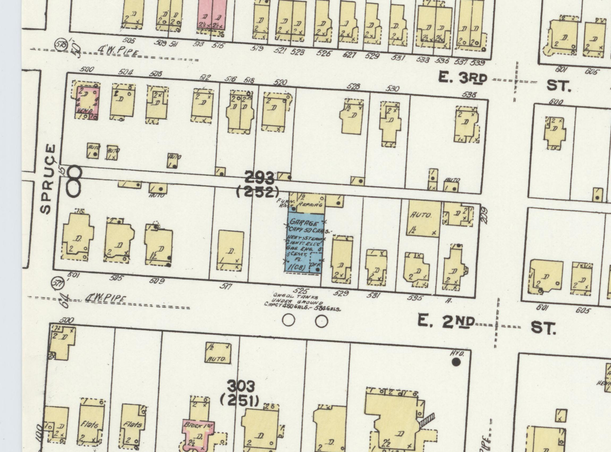
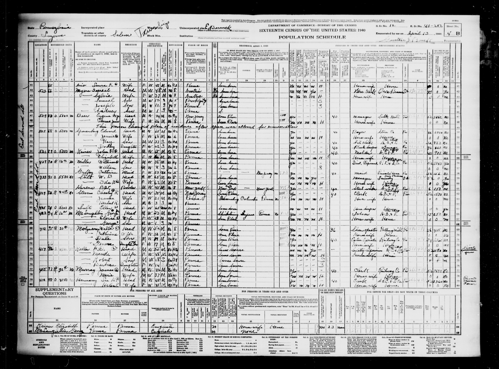

# Houses we can actually see: the Sponenberg branch

**Three family-attributed house photographs and one documented address.** The photographs below are hosted by the [Jowest family archive](https://jowest.net/Genealogy/John/Christian/Sponenberg.htm), which credits relatives for the identifications but gives no photo dates or reuse license. Click a picture to read its original caption. They are displayed from that archive, not copied into this repository. A modern view shows a place **now**, not necessarily the building a relative knew.

```text
Daniel Sponenberg + Hannah Shellhammer
├─ James C. + Mary Jane Garney       → riverside farm; later Front/Ida house
├─ Legrant + Mary Alice Fortner       → possible farm, exact place unresolved
└─ John Leonard + Emma Hartman
   ├─ Emma → 211 W. Front St. in 1901
   └─ Edward J. + Jennie Mensinger → 505 E. Second St. by 1927–50
```

The [1915 Edward biography](../sources/records/edward-sponenberg-biography-1915-187.jpg) calls James, Legrant and John Leonard children of Daniel and Hannah and Edward a son of John. [Hannah's family Bible](../sources/records/hannah-sponenberg-family-bible-births.jpg) independently lists those sons. Thus **James and Legrant were Edward's uncles**; their photographed houses must not be captioned as Edward's.

## James C. and Mary Jane Garney Sponenberg: riverside farmhouse

<a href="https://jowest.net/Genealogy/John/Christian/JamesCSponenbergFarmhouse.htm"></a>

The archive quotes descendant **John H. Harter III**, who places the house at the end of **South Warren Street below Susquehanna Avenue**, with railroad tracks and the river behind it. He describes later additions and an icehouse mentioned in family/local accounts. This is a **family identification of a surviving building**, not a deed or a dated picture of James and Mary living there. James and Mary appear as a couple in the [1915 family biography](../sources/records/edward-sponenberg-biography-1915-187.jpg). [Full archive caption and photograph](https://jowest.net/Genealogy/John/Christian/JamesCSponenbergFarmhouse.htm).

## James C.'s later house: West Front and Ida

<a href="https://jowest.net/Genealogy/John/Christian/JamesCSponenbergHouse.htm"></a>

Harter identifies this as the house **at West Front and Ida Streets** mentioned in James's [1907 will as presented by the family archive](https://jowest.net/Genealogy/John/Christian/JamesSponenbergWill1.htm). He says it was probably built for James's retirement from farming around 1900. His story that Ida Street was named for James's daughter is **family recollection**, not yet checked against a street ordinance. Photo date and any remodeling are unknown. [Full archive caption and photograph](https://jowest.net/Genealogy/John/Christian/JamesCSponenbergHouse.htm).

## Legrant Sponenburg: an attributed farmhouse

<a href="https://jowest.net/Genealogy/John/Christian/LegrantSponenbergFarm.htm"></a>

A cousin supplied this picture as the **possible** home of Legrant and Mary Alice Fortner Sponenburg. The archive itself says the house might be in **Briar Creek, Columbia County, or Nescopeck, Luzerne County**; it does not know which. Legrant was Edward's uncle and is the [family-attributed cavalry portrait](../sources/family/legrant-sponenberg-mounted-portrait-attributed.jpg) subject. **No precise map pin is justified yet.** [Full archive caption and photograph](https://jowest.net/Genealogy/John/Christian/LegrantSponenbergFarm.htm).

## Emma Hartman Sponenberg: a mapped West Front address

<a href="../sources/records/sanborn-berwick-west-front-1896-plate4.jpg"></a>

The [1901 Berwick directory, p. 169](../sources/records/sponenberg-berwick-directory-1901-p169.jpg) lists **Emma, widow of John**, at **211 W. Front Street**. Five years earlier, the [1896 Sanborn map, plate 4](https://www.loc.gov/resource/g3824bm.g3824bm_g075271896/?sp=4) labels **211** on the west side of Front Street, south of Mulberry, as a **two-story dwelling** (`2 D`). This is a rare view of the *building footprint and block* near Emma's recorded residence. The map predates the directory: it does **not** name an occupant, establish ownership, or prove the identical building stood there in 1901. On the [1907 Sanborn plate 10](https://www.loc.gov/resource/g3824bm.g3824bm_g075271907/?sp=10), the number **211** is no longer labeled in that sequence; address continuity needs a directory or deed. Both Sanborn maps: Library of Congress Geography and Map Division, public domain.

Edward is listed separately as a **Berwick Store Company clerk living on W. Front**, without a number. The directory does not say he lived with Emma at 211.

## Edward J. and Jennie Mensinger Sponenberg: the address trail

| Date | What names their home | What it establishes |
| --- | --- | --- |
| **1901** | [Berwick directory, p. 169](../sources/records/sponenberg-berwick-directory-1901-p169.jpg) | Edward's home was on **West Front Street**; no house number. This was before the later building claim. |
| **1907** | [1915 biography, p. 807](../sources/records/edward-sponenberg-biography-1915-187.jpg) | The writer says Edward built a Berwick house in 1907, **without an address or picture**. |
| **1910** | [Original Salem Township census, sheet 4A, lines 40–43](../sources/records/edward-jennie-sponenberg-census-1910.jpg) | Edward, Jennie, Ray and Elsie lived in Salem Township. Edward was a retail grocery salesman and the household **owned a mortgaged home**. The street field is blank; **308/309 are enumeration dwelling/family numbers**, not an address. |
| **1927 and 1932** | [City-directory entries for Edward J. and Jennie E.](https://www.myheritage.com/research/record-10705-2100012/edward-j-sponenberg-in-us-city-directories) | Both list **505 E. Second Street**, Edward a clerk, and `h` for home. These are a later address, not proof of the 1907 build date for that building. |
| **1935 and 1940** | [Saved original 1940 census, Salem Township, ED 40-252, sheet 4B, lines 50–53](../sources/records/edward-jennie-sponenberg-census-1940.jpg) · [NARA image](https://catalog.archives.gov/medialz/census-1940/T627/PA/m-t0627-03560/m-t0627-03560-00233.jpg) | Edward, Jennie, son Ray and daughter Dorothy are on the **same original page** at **505 E. Second**. Edward reported the **same house in 1935**. |
| **1950** | [1950 census, Edward and Jennie](https://www.myheritage.com/research/record-11006-175275386/edward-j-sponenberg-in-1950-united-states-federal-census) | The index again gives **505 E. Second Street**. |
| **Modern view** | [505 E. Second Street property page with a Google street-view image](https://www.zillow.com/homedetails/505-E-2nd-St-Berwick-PA-18603/299280889_zpid/) | A way to **look at the address today**. The image is externally hosted; its capture date, the property's original construction year and the survival of Edward's 1907 building are not established. |

Edward and Jennie's documented address sits in **East Berwick/Salem Township, Luzerne County** in the census, though a Berwick mailing address is used today. A closer reading of the [1919 Sanborn plate 19](https://www.loc.gov/resource/g3824bm.g3824bm_g075271919/?sp=19) corrects our earlier county-boundary interpretation: the printed Columbia/Luzerne line runs diagonally across the **upper left of the plate and off its western edge above East Second Street**. The mapped **505 E. Second**, just east of Spruce Street, is on the **Luzerne side**, consistent with the 1940 census header. The map labels a **two-story dwelling (`2 D`) at 505**; it names no owner or resident. This is a strong address-to-map match, **not proof Edward built that exact structure in 1907 or that it survives today**. Their 1901 West Front residence, the claimed 1907 construction and the 1927–50 East Second address still need a deed or earlier directory to connect them.

<a href="../sources/records/sanborn-east-berwick-1919-plate19.jpg"></a>

The crop shows **505 on East Second**; use the [complete saved plate](../sources/records/sanborn-east-berwick-1919-plate19.jpg) to see the diagonal county line. Sanborn Map Company, October 1919; [Library of Congress source](https://www.loc.gov/resource/g3824bm.g3824bm_g075271919/?sp=19), public domain. It is a map of a house, not a photograph of Edward or proof of title. The [August 1907 Berwick atlas, plate 15](https://www.loc.gov/resource/g3824bm.g3824bm_g075271907/?sp=15), stops its mapped East Second block around number **500**, before this 505 site; it cannot establish when the 1919 dwelling was built.

<a href="../sources/records/edward-jennie-sponenberg-census-1940.jpg"></a>

The [cross-family house atlas](family-home-photo-atlas.md) places this address alongside Kramer, Cordaro, Miller, Blevins, Smith and Weatherford homes and links to modern photo views.

**Next check:** Find the original 1907–20 deed/building assessment and a pre-1927 directory for 505 E. Second; compare the mapped structure or parcel with Edward's name. Seek a dated exterior photo or family album image of Edward and Jennie's house. For James C.'s two buildings, compare the [1907 will images](https://jowest.net/Genealogy/John/Christian/JamesSponenbergWill1.htm) with a deed and an old street plan. Ask the photo contributors for dates and reuse permission before preserving their full-resolution images in the repo.

[Sponenberg family story](../branches/sponenberg-deep-dive.md) · [Picture guide](../media/README.md) · [Source notes](../research/sources.md)
