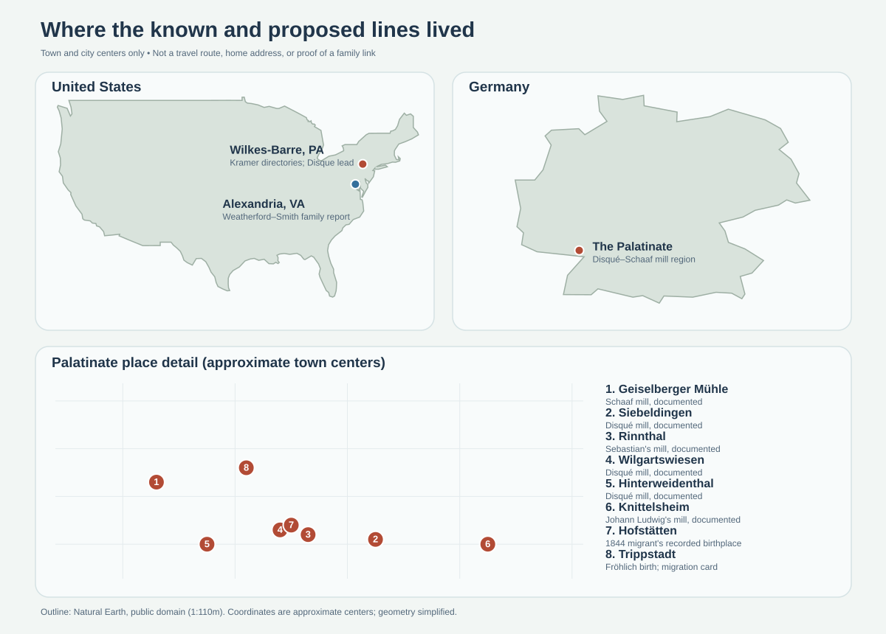

# The families in their times

The map shows **places**, not a proven route for every person. The table pairs a family record with events close to its time and place. A regional pressure is a possible explanation to investigate, **not a recorded personal motive**.

| When and where | Family evidence | What was happening nearby | What it can tell us |
| --- | --- | --- | --- |
| **1684–1839, Palatinate** | A [miller-family history](https://www.eberhard-ref.net/pf%C3%A4lzisches-m%C3%BChlenlexikon/pf%C3%A4lzische-m%C3%BCllerfamilien/litera-d/) quotes Johann Bernhard Disqué's 1684 offer to rebuild a derelict mill; later Disqué and Schaaf relatives operated leased water mills. | Millers negotiated water dues, rent, and rights with local authorities. The family history describes working mills and asset transfers among sons and brothers. | The 1684 agreement explains **how this mill was restarted**; it does not say why the family first came to the Palatinate. The specialist calls them Huguenots, but their French departure, route, and reason have not been traced in original records. |
| **1864, Palatinate → Le Havre → New York** | The [Institute for Palatinate History card](https://migration.pfalzgeschichte.de/person/98001) says widowed **Magdalena Fröhlich Disque** emigrated with four named children; [Margaretha's card](https://migration.pfalzgeschichte.de/person/98304) names the ports. The chart's **Magdalena Disque Kramer** is absent from the card's child list. | A [regional historical exhibition](https://www.auswanderung-rlp.de/ziele-der-auswanderung/auswanderung-nach-nordamerika/ausstellung-zur-auswanderung-2010.html) identifies **1864–1873** as a Palatinate migration peak. It describes population growth, farmland divided among heirs, crowded trades, and earlier crop and price crises. Their arrival also fell during the [U.S. Civil War](https://www.archives.gov/exhibits/american_originals/civilwar.html) (1861–1865). | These pressures make economic migration **plausible**, but no family letter, departure petition, or passenger-list original here states the Disques' motive. The Civil War is arrival context, not evidence that they joined it or traveled because of it. |
| **1870s–1950, Wilkes-Barre** | [Directories](https://pagenweb.org/~luzerne/towns/donnacd.htm) describe Matthew/Matthias as a mason, laborer, then ropemaker; the [1940 census](https://catalog.archives.gov/medialz/census-1940/T627/PA/m-t0627-03563/m-t0627-03563-00103.jpg) calls **Ferdinand (c. 1882)** a wire-rope foreman, and the [1950 census](https://1950census.archives.gov/iiif/2/1950census%2F43290879-Pennsylvania%2F43290879-Pennsylvania-135713%2F43290879-Pennsylvania-135713-0005.jpg/full/full/0/default.jpg) gives **Ferdinand Louis (1913)** machine work at a wire-rope works. | [Anthracite mining centered partly in Luzerne County](https://www.pa.gov/agencies/dep/programs-and-services/mining/bureau-of-mining-programs/pa-mining-history); a [1940 federal contract list](https://www.govinfo.gov/content/pkg/GOVPUB-PR32_400-2251cc160e2b3a8d44f2685bb4796b99/pdf/GOVPUB-PR32_400-2251cc160e2b3a8d44f2685bb4796b99.pdf) names **American Chain & Cable** in Wilkes-Barre as a cable supplier. | Local industry helps explain the *availability* of rope work. No record yet names a Kramer employer, proves a mining job, or ties the family to that government contract. |
| **1920s–1970s, Danville → northern Virginia** | [Garnett Sr.'s obituary](https://www.washingtonpost.com/archive/local/2007/07/03/obituaries/43ba782a-181c-4c59-a78e-7d361d86bf4a/) places his birth in Danville, WWII Navy service in the Pacific, and later bus work in Alexandria. | [Danville's preservation plan](https://www.danvilleva.gov/DocumentCenter/View/31105/Danville-Preservation-Plan) describes its tobacco and textile economy. [Fairfax County's history](https://www.fairfaxcounty.gov/planning-development/sites/planning-development/files/assets/documents/historic/history275.pdf) records sharp postwar population growth alongside the expanding Washington region. | The settings show two different local economies across his lifetime. **His move date and reason are unknown**; neither source establishes that he worked in Danville's mills or moved for a particular job. |
| **1972 onward, Wilkes-Barre** | Younger Kramer generations lived or had family roots in the area; specific exposure to the flood has not been recorded. | [Wilkes University's before-and-after tour](https://www.wilkes.edu/academics/library/agnes-flood-walking-tour/main-street.aspx) shows damage to Main Street from the 1972 Agnes flood and later rebuilding. | A consequential hometown event to ask relatives about, not evidence that a particular Kramer home or business flooded. |
| **1973, Alexandria region** | The obituary says Garnett drove for **AB&W** for 25 years, then **Metro** for 16. | [WMATA's own chronology](https://www.wmata.com/about/history/upload/history.pdf) dates its purchase of AB&W to **4 February 1973**, when Metrobus was formed. | This event connects directly to a documented family career. It helps explain the change of employer name, though personnel records would be needed for Garnett's exact transfer date and routes. |

## The migration questions

**Why did the Disques leave?** The 1864 institutional index provides a departure lead and the Palatinate history supplies credible regional pressures. The decisive missing pieces are the **original passenger list**, a local emigration petition or property sale, and letters or church records that might identify a personal reason. The index's named children do **not** yet connect the chart's Magdalena to this party.

**Why did the Kramers leave Germany?** We cannot yet establish that **Bernhard or Matthew Kramer** emigrated from Germany at all. The chart gives no birthplace for Matthew, and the paternal Kramer link to Bernhard is unproved. The documented German mill and 1864 migration leads belong to the **Disqué side**. Find Bernhard and Matthew in a birthplace-bearing census, marriage, naturalization, death, or church record before giving the Kramer surname a migration story.
