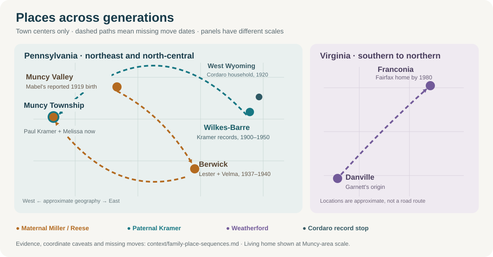

# How the family places connect across generations

*Map of **places named in records or family accounts**, with town-center positions rather than house pins. Dashed connectors show a **generational sequence with an undated move**, not a documented road, journey, or shared household. Each panel has its own scale. Sources and limits are below.*

## The Muncy return

[Paulene Miller Beach's *Life Journey*](https://bhaven.org/paulene/life-journey) says her mother **Mabel/Pearl Reese Wilson** was born **31 January 1919 in “Muncy Vally, Lycoming County”** and raised by her father's aunt and uncle after her mother's reported influenza death. The [state birth index](../sources/records/mabel-reese-pa-birth-index-1919.png) lists a **Mabel Reese** born that day in **Lycoming County**, strongly supporting the date and county. It gives no town; the full certificate and a Reese-to-Wilson record are needed for the rest. The [state death index](../sources/records/meda-reese-pa-death-index-1919.png) lists Meda Reese's death on **12 February**, but no cause or parentage.

The place wording needs care: [Sullivan County lists Muncy Valley in Shrewsbury Township](https://www.sullivancountypa.gov/municipalities/shrewsbury-township), while the [U.S. Census address geocoder](https://geocoding.geo.census.gov/geocoder/geographies/onelineaddress?address=181%20Quaker%20Church%20Road%2C%20Muncy%2C%20PA&benchmark=Public_AR_Current&vintage=Current_Current&format=json) places Justin's parents' reported current address in **Muncy Township, Lycoming County**. The Muncy mailing name does not put their house in [Muncy Borough](https://muncyboro.org/). The 1919 index supports **Lycoming County** while Paulene's “Muncy Valley” town name points to today's **Sullivan County** locality. She may have used “Muncy Valley” broadly or misremembered the civil location. The birth certificate should decide the **1919 town or township**. These are **nearby but distinct places**; the map deliberately marks both areas.

| When | People and place | Evidence and limit |
| --- | --- | --- |
| **1919** | Mabel Reese indexed as born in **Lycoming County**; **Muncy Valley** locality reported | [Original state birth index](../sources/records/mabel-reese-pa-birth-index-1919.png) confirms a matching name, date and county; [Paulene's memoir](https://bhaven.org/paulene/life-journey) supplies the town and later Wilson placement. Today's Muncy Valley is in Sullivan County. The full certificate, birth mother and placement still need proof. |
| **1937–1940** | Mabel, using **Velma P. Wilson**, and **Lester E. Miller** of **Berwick** | Their [1937 Maryland marriage index](https://www.myheritage.com/research/record-20828-1259334/lester-e-miller-and-velma-p-wilson-in-maryland-marriages) says both lived in Berwick; the [1940 census index](https://www.myheritage.com/research/record-10053-108307645/marqueen-miller-in-1940-united-states-federal-census) puts them with Marqueen and Amos/Mary Miller there. The marriage record establishes *Wilson*, but does not itself establish *Reese* as her birth name. |
| **Now, family-supplied** | **Melissa Miller Kramer** and her husband **Paul Kramer** live in the **Muncy postal area**, near Williamsport | Justin reports their home as **181 Quaker Church Road, Muncy, PA**; the Census geocoder places that address in **Muncy Township, Lycoming County**. Residence is family-supplied; geocoding does not prove occupancy or move date. The map marks the **township area**, not their home. [Family-supplied, 26 September 2026] |

That makes a memorable **regional return across generations**: Mabel's reported Muncy Valley start → the recorded Berwick household → Melissa and Paul Kramer's present Muncy-area home. It does **not** mean the family returned to the same town or property, and no motive or date for the later move is known. The family chain here is **Mabel/Pearl → son Paul Miller → daughter Melissa Miller Kramer**; Melissa's husband is **Paul Kramer**, a different Paul. [Family relationship guide](../branches/maternal-kramer-side.md).

## Other lines on the map

| Line | Place sequence | What remains open |
| --- | --- | --- |
| **Kramer/Bosch, paternal** | [1900](https://www.myheritage.com/research/record-10131-47210375/ferdinand-kramer-in-1900-united-states-federal-census?s=OYYV7ARRCL4FQTYCDTGIPASUAVZSK7I) and [1950](https://1950census.archives.gov/iiif/2/1950census%2F43290879-Pennsylvania%2F43290879-Pennsylvania-135713%2F43290879-Pennsylvania-135713-0005.jpg/full/full/0/default.jpg) records place earlier generations in **Wilkes-Barre**; Justin says his father **Paul Kramer** now lives in the Muncy area with Melissa. | Paul's personal move date and intermediate homes are unknown. The line on the map connects **generations and places**, not a verified trip from Wilkes-Barre. |
| **Cordaro/Caucci, paternal** | A [1920 census](https://www.familysearch.org/ark:/61903/1:1:M611-V9M?lang=en) places Italy-born Antonio/Pietra and Pennsylvania-born Joseph in **West Wyoming**; [1938](../sources/records/cordaro-caucci-marriage-1938.jpg) and [1962](../branches/cordaro-passport-lead.md) marriage records continue this northeast Pennsylvania branch. | Their exact ocean crossings and the passport holder's relationship to this line remain unproved. [Sicily map](../maps/cordaro-sutera-places.svg). |
| **Weatherford, Ashley's paternal line** | [Garnett's obituary](https://www.washingtonpost.com/archive/local/2007/07/03/obituaries/43ba782a-181c-4c59-a78e-7d361d86bf4a/) places his childhood origin in the **Danville, Virginia** area and later work around Alexandria; a [1954 Fairfax marriage index](https://www.fairfaxcounty.gov/circuit/sites/circuit/files/assets/documents/pdf/hrc/marriage-book-index-1853-1957-brides.pdf) and [1980 Fairfax deed history](../branches/weatherford.md#garnett-and-florence) anchor the northern Virginia chapter. | The exact move date, stops and reason are unknown. “Alexandria” on family mail did not make the later **Franconia, Fairfax County** home part of Alexandria city. |

**Next map improvement:** attach dated deeds, directories, school records, or census addresses to the gaps, then draw person-level moves. The wider [regional family map](../maps/ancestral-places.svg) locates the German, Italian, Pennsylvania and Virginia settings; the [interactive timeline](../explore/timeline.html) lets readers open dated events and evidence.
