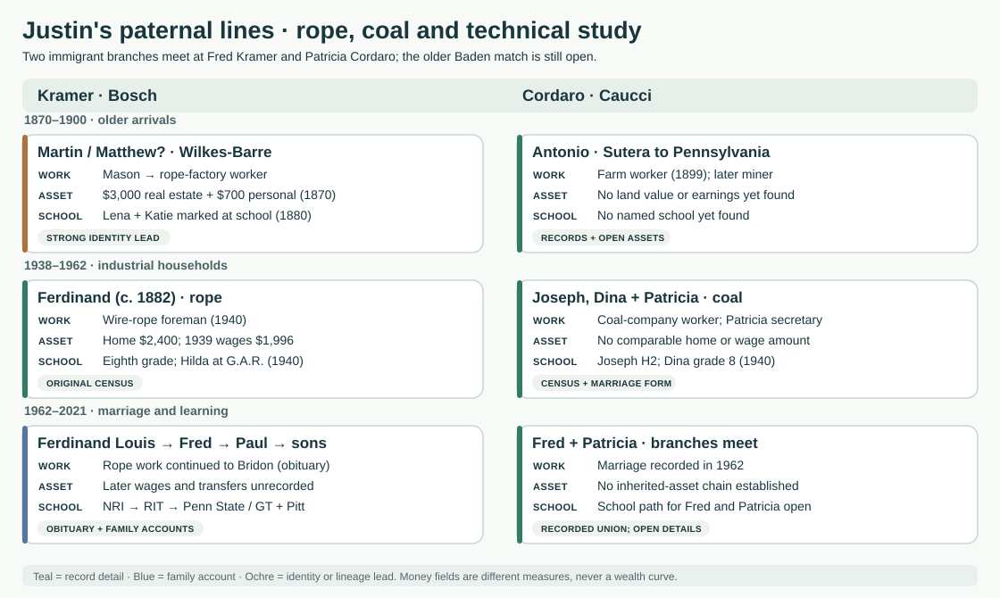
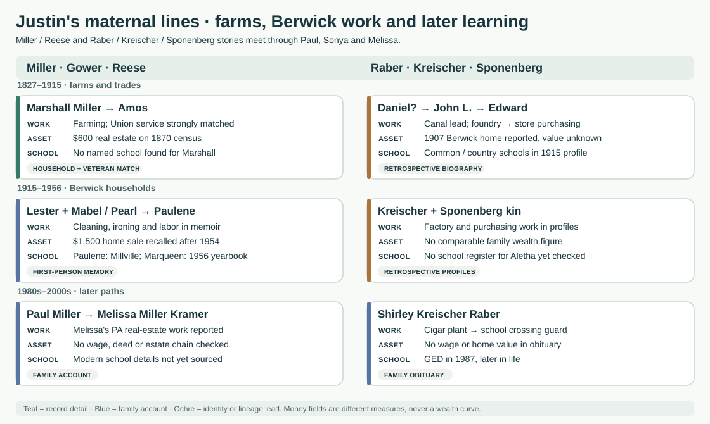
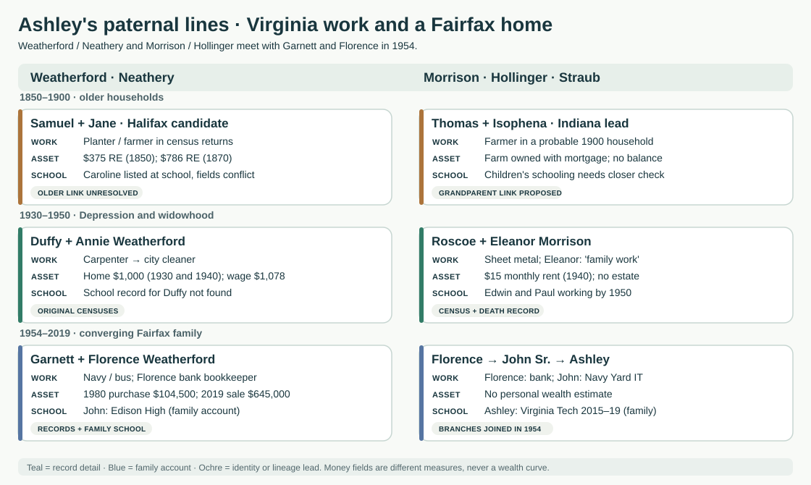
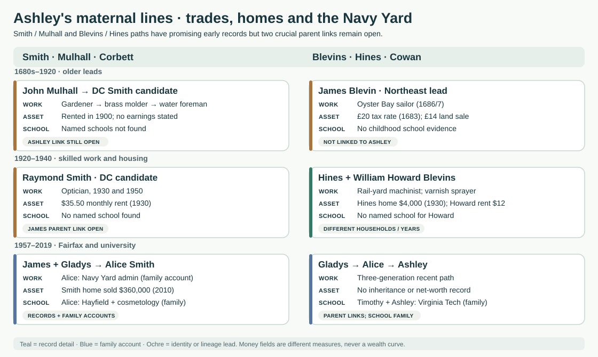
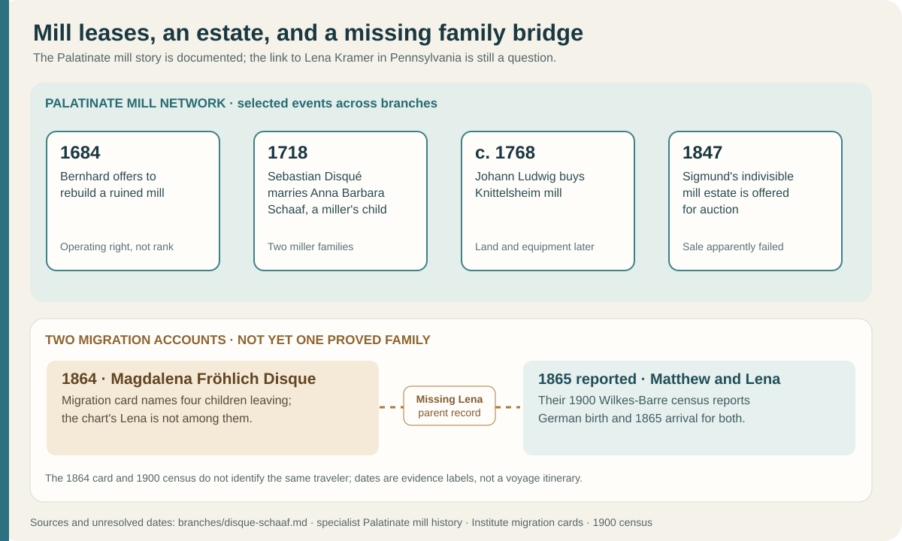
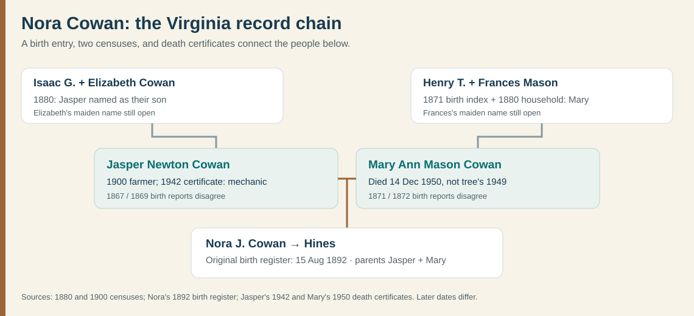
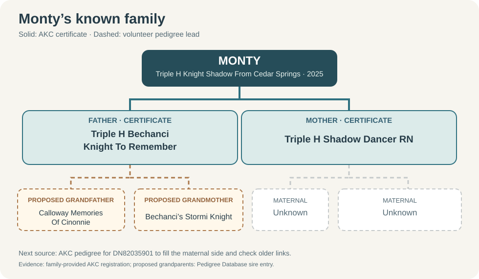

# Family stories at a glance

Start with the four rows, then choose a family arm. Each panel puts **work, education, and a dated money or property clue when one survives beside the people**. The money entries are different kinds of record—census valuations, rents, wages, sale prices and a recollection—so the panels show *when evidence exists*, **not** a family wealth curve. A missing amount means no figure found, not that a household owned nothing. [Full family trees](full-family-trees.md) · [all ten line timelines](../explore/line-timelines.html) · [source-by-source asset ledger](../research/assets-by-generation.md).

| Open a paired view | Short story to notice |
| --- | --- |
| [Justin's paternal lines](#justins-paternal-lines) | Wilkes-Barre rope work and Sicilian farm work meet in a later marriage; radio lessons precede three generations of technical degrees. |
| [Justin's maternal lines](#justins-maternal-lines) | Farms, canal and factory jobs sit beside Paulene's unusually personal account of a Berwick household. |
| [Ashley's paternal lines](#ashleys-paternal-lines) | Depression-era jobs, a widowed household, Navy service, transit and banking all feed into the Fairfax family. |
| [Ashley's maternal lines](#ashleys-maternal-lines) | A Northeast sailor is an unjoined lead; later rail, optical and furniture work leads to the Smith–Blevins home. |

**Color key:** teal marks a recorded detail, blue a family report, ochre a proposed identity or lineage. A card may contain several evidence types; its colored edge follows the **weakest relationship or major claim**. Read the short source note below each panel before joining two cards into a pedigree. For the full sibling groups and parent links, use the [four long trees](full-family-trees.md).

## Justin's paternal lines

- **Rope plus radio.** A [1940 census page](../sources/records/ferdinand-kramer-household-census-1940.jpg) puts **Ferdinand (c. 1882)** in wire-rope foreman work, with a **$2,400 home estimate**, **$1,996 prior-year wages**, and eighth grade completed. Son Emil's signed [draft card](../sources/records/emil-carl-kramer-draft-registration-1940.jpg) names the rope company. The next Ferdinand—**Ferdinand Louis (1913)**—was remembered for [National Radio Institute study](../sources/records/ferdinand-louis-kramer-obituary-1976.jpg). Justin reports Paul, Alex and Justin's later [RIT, Penn State, Georgia Tech and Pitt paths](education-across-generations.md#from-radio-study-to-engineering-and-computing). The shared technical interest is striking; no record proves one person's schooling caused another's choice.
- **A different crossing.** [Sutera marriage papers](../sources/records/cordaro-magro-banns-1899.jpg) call Antonio Cordaro a farm worker; his [1927 naturalization petition](../sources/records/antonio-cordaro-petition-1927.jpg) calls him a Pennsylvania miner. Joseph's [1940 census](../sources/records/joseph-dina-cordaro-census-1940.jpg) reports two high-school years for him and grade eight for Dina. The photographed [Italian passport](../sources/family/italian-passport-details.jpg) is evocative, but its holder has **not** been linked to Antonio. A local 1905 landslide is [context for departures](../branches/cordaro-passport-lead.md#what-changed-around-their-sicilian-home), not a documented Cordaro motive.

The older **Martin/Matthew** identity and the further-back **Unadingen Matthäus → Pennsylvania Matthew** step are different questions. The 1870 $3,000 real-estate and $700 personal-estate entries belong to **Martin Cramer**; connecting him to the 1900 Matthew is strong but not final. [Record comparison](../branches/kramer-martin-migration.md) · [older German candidate](../branches/kramer-baden-candidate.md) · [Cordaro generations](../branches/cordaro-passport-lead.md).

## Justin's maternal lines

- **A household remembered from inside.** Original [1919 birth](../sources/records/mabel-reese-pa-birth-index-1919.png) and [death](../sources/records/meda-reese-pa-death-index-1919.png) index pages put Mabel Reese's birth and Meda Reese's death twelve days apart. Her daughter [Paulene's memoir](https://bhaven.org/paulene/life-journey) recalls later cleaning and ironing, music at home, a Millville school year, and a **$1,500 house sale after Mary died in 1954**. The sale and who received its proceeds need a deed and estate; the memoir supplies the family's memory, not a verified inheritance account. [Berwick chronology](../branches/miller-berwick-timeline.md).
- **Work and learning at different ages.** A [1915 biography page](../sources/records/edward-sponenberg-biography-1915-187.jpg) says Edward Sponenberg moved from rolling-mill work to Berwick Store Company purchasing and built a home in 1907. It describes older kin's common or country schooling, but is retrospective. Another [1915 biography and sibling diagram](../maps/kreischer-fairchild-siblings.svg) shows William Sr. moving from railroad work to the car works, and places Ruth beside William Henry, the likely father of Shirley. Ruth's later **Fairchild** name has a strong [Berwick burial-list match](https://peoplelegacy.com/ruth_e_kreischer_fairchild-482j331); the spouse's name and direct link through William Jr. still need records. Shirley Kreischer Raber's [obituary](../branches/raber-kreisher-fairchild.md) remembers cigar-plant and crossing-guard work and a **GED in 1987**. These descriptions show choices and jobs; none gives a salary or house equity. [Sponenberg deep dive](../branches/sponenberg-deep-dive.md).

The [1870 census](../sources/records/marshall-elizabeth-miller-census-1870.jpg) reports **$600 real estate** for Marshall Miller; a separate [1890 veteran schedule](../context/civil-war-family-lines.md) strongly matches him to Union service. The possible 1827 Daniel Sponenberg canal contractor has **not** been uniquely tied to the later Berwick grandfather. Keep the two early men and their financial clues in their own evidence lanes. [Maternal family tree](full-family-trees.md#justins-maternal-branches).

## Ashley's paternal lines

- **Two homes, two kinds of record.** Duffy Weatherford's original [1930](../sources/records/duffy-annie-weatherford-census-1930.jpg) and [1940](../sources/records/duffy-annie-weatherford-census-1940.jpg) censuses each estimate an owned home at **$1,000**. His work changes from carpenter to city cleaner, with **$1,078 wages in 1939**. The repeated estimate cannot prove the same parcel or unchanged buying power. Roscoe Morrison's [1940 household](../sources/records/morrison-household-census-1940.jpg) instead reports **$15 monthly rent** and sheet-metal work; after his [1947 death](../sources/records/roscoe-gordon-morrison-death-1947.jpg), Eleanor's [1950 census](../sources/records/morrison-household-census-1950.jpg) places her with seven children and records two sons working. These different households cannot be ranked by one housing figure.
- **Navy, bus and bank.** [Garnett's Navy discharge card](../branches/weatherford.md) documents service; his obituary remembers Pacific duty and a long bus career. Florence's [1954 marriage return](../sources/records/garnett-florence-marriage-1954.jpg) calls her a bank bookkeeper. Justin says son John attended Edison High and later worked on IT equipment at Washington Navy Yard. The [1980 purchase and 2019 sale](../branches/weatherford-smith.md#the-two-earlier-homes) are **nominal prices for one house**, not profit, equity or inheritance. [Family work scenes](lives-across-generations.md).

The older **Samuel/Jane Weatherford** and **Thomas/Isophena Morrison** households are **candidates** with unresolved descendant links. Their 1850/1870 real-estate amounts and 1900 mortgaged-farm entry show what those records say about those particular households; they do not extend Ashley's verified wealth line. [Weatherford evidence](../branches/weatherford-early-virginia.md) · [Morrison evidence](../branches/morrison-hollinger.md).

## Ashley's maternal lines

- **Skilled work, different living costs.** The candidate DC Smith household follows John Mulhall from gardening and brass molding to water-department work; Raymond Smith is an [optician](../sources/records/smith-dc-household-census-1930.jpg) paying **$35.50 monthly rent in 1930**. The link from Raymond's son James to Ashley's grandfather James Allen needs a parent-naming record. On the Blevins side, [William Howard's 1940 household](../sources/records/blevins-household-census-1940.jpg) gives **$1,000 wages in 1939** for furniture varnish work and **$12 rent** at census time. The amounts differ in year and city and say nothing complete about either family's wealth. [Assets ledger](../research/assets-by-generation.md).
- **A real object, an open family bridge.** A [1916 printing of an Oyster Bay deed](../sources/records/james-blevin-oyster-bay-deed-1687-p437.jpg) calls James Blevin a sailor and shows wife An's mark. A later Westerly James/Ann could be the same couple, and a member tree proposes another James's move south. The original Westerly deeds and Ashley's intervening parent links remain unverified; the sailor cannot yet be put in her direct pedigree. [Evidence diagram and question list](../branches/blevins-rhode-island-lead.md).

The later line is clearer: William Howard → Gladys → Alice. Justin says **Alice studied at Hayfield, tried cosmetology, and worked in administration at Washington Navy Yard**; Ashley and uncle Timothy attended **Virginia Tech** in different decades. Those school and work details are family accounts alongside the [1986 marriage return](../branches/weatherford-smith.md). The Smith [2010 house sale](../branches/weatherford-smith.md#the-two-earlier-homes) documents a property transaction, not what each heir received. [Education source tiers](education-across-generations.md) · [full maternal tree](full-family-trees.md#ashleys-maternal-branches).

## Where to go next

### Other paths worth opening

| Visual | One reason to open it |
| --- | --- |
|  | **Disqué / Schaaf:** leased and owned mills appear in the [asset ledger](../research/assets-by-generation.md), but the 1864 migrant family has not been joined to Lena Kramer. [Short line story](../branches/disque-schaaf.md). |
|  | **Cowan / Mason:** an 1892 birth entry and later households build Nora Hines's older side; comparable property, wage and school records remain to find. [Source notes](../branches/cowan-mason.md). |
|  | **Monty:** his AKC certificate anchors two parents and a distinct pet-family timeline; older paternal names are still leads. [His story](../branches/monty.md). |

Use the [interactive timeline](../explore/timeline.html) to filter moments by branch, the [asset ledger](../research/assets-by-generation.md) for exact source fields and open transfer questions, and the [education guide](education-across-generations.md) to distinguish a named school from a census grade or family account. [Faces and artifacts](faces-and-places.md) shows what survives as a photo or document; its captions distinguish relatives from period settings.
