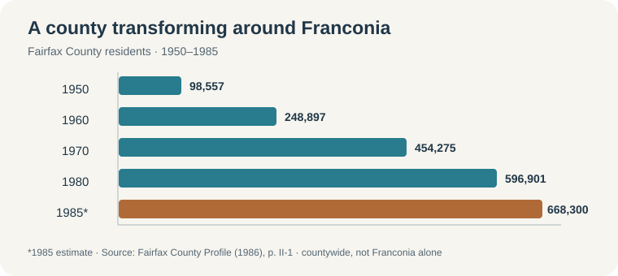

# Growing up around Franconia, about 1960–1985

**Place matters:** John and Alice Weatherford's family homes had **Alexandria mailing addresses**, but the known Miller Drive and later Colette Drive parcels are in **Franconia, Fairfax County**. This account describes the surrounding Fairfax area during their likely childhood and youth; their school years and personal experiences still need dates or first-person detail. [Place and school evidence](places-and-schools.md) · [Family neighborhood map](../maps/colette-neighborhood.svg).

*Countywide population, not a count for the Miller Drive block. 1950–80 are census figures; 1985 is a county estimate. [Fairfax County's 1986 profile, p. II-1](https://www.fairfaxcounty.gov/demographics/sites/demographics/files/assets/fairfaxcountyprofiles/profile_1986.pdf#page=29).*

## What the place felt like

Franconia changed quickly from farm country to a car-oriented suburb. A [local history of Hayfield](https://www.franconiahistory.com/historic-sites/hayfield-secondary-school) recalls a working farm beside the new secondary school's football field in **1969**. **Hayfield Secondary** opened that year; unfinished construction put some of its first students on an afternoon shift at **Edison**. The family says **Alice attended Hayfield** and **John attended Edison**, but we cannot place either in that 1969 shift. [Hayfield Elementary's official history](https://hayfieldes.fcps.edu/about/history) shows the pace of change: enrollment was **760 by November 1970** in a building designed for **600**, with temporary classrooms added. There is no claim either parent attended that elementary school.

The [Springfield Mall opened in 1973](https://www.fairfaxcounty.gov/boardofsupervisors/sites/boardofsupervisors/files/Assets/meeting%20materials/board/2006/june26-board-summary.pdf#page=39) as a major retail and social center for the growing area. The county's [1986 plan](https://www.fairfaxcounty.gov/planning-development/sites/planning-development/files/assets/documents/comprehensiveplan/planhistoric/1986/area%204.pdf#page=85) described congestion and unsafe conditions on major **roads** in a Franconia planning sector. That finding concerns traffic, not neighborhood crime.

In **June 1972**, Agnes also disrupted ordinary life across northern Virginia: [Fairfax Water](https://www.fairfaxwater.org/news/50th-anniversary-hurricane-agnes) says flood damage stopped service to more than **500,000** people in Alexandria, Fairfax and Prince William. Limited Fairfax service returned within **35 hours**, with full area service in eight days. Nearby jurisdictions experienced flooding too, but no record yet places a Weatherford or Smith home in floodwater or confirms that household's water-service experience. [Compare the family's three Agnes settings](agnes-1972.md).

## Racing, break-ins, robberies and fights

- **Drag racing: documented nearby.** In **November 1979**, police broke up recurring Friday-night illegal racing at **Fullerton Industrial Park in Springfield** and arrested 13 young men. Franconia police units participated. This backs up the family's memory of a local racing scene, though it does not locate a race on Miller or Colette Drive or involve a family member. [Contemporary report](https://www.washingtonpost.com/archive/local/1979/11/18/a-jump-on-dragsters/0343da14-ade3-491c-afc9-af454c2e9c62/).
- **Break-ins: documented countywide.** Fairfax police reported **613 burglaries in August 1980**, nearly five in six at homes, many in daylight. This is countywide evidence of a real burglary problem; the [contemporary report](https://www.washingtonpost.com/archive/local/1980/09/24/burglaries-up-sharply-in-the-washington-area/d3bc30b5-6184-45bb-b463-b9d07f792156/) does not measure risk on their block.
- **Robbery: a nearby example.** In **August 1980**, a gunman robbed a restaurant in **Springfield Plaza** and locked employees in a freezer. It illustrates what made regional news, not a pattern established for the family neighborhood. [Contemporary report](https://www.washingtonpost.com/archive/local/1980/08/12/robber-leaves-victims-in-freezer/a3b058d9-cf55-437e-a1d8-8fc680a7115d/).
- **Fights and feeling unsafe:** These remain **John and Alice's reported memories**. School incident logs, their own accounts with dates and places, or neighborhood crime data would be needed to say where fights occurred or whether their immediate streets were unusually dangerous.

**Why it may have felt that way:** Fairfax County grew from **248,897 residents in 1960** to **596,901 in 1980**. New subdivisions, crowded schools, highways, shopping centers and industrial roads changed daily life. The documented races fit the car-centered setting; countywide burglaries and the nearby robbery give a factual basis for some fear. This is a **contextual explanation**, not proof that growth caused any particular fight, crime or family experience. The known **6312 Miller Drive house was built in 1980**, so it should not be described as John's early-childhood home; the [1986 marriage return](https://www.familysearch.org/ark:/61903/1:1:QK9V-J612?lang=en) places him there just before marriage.
