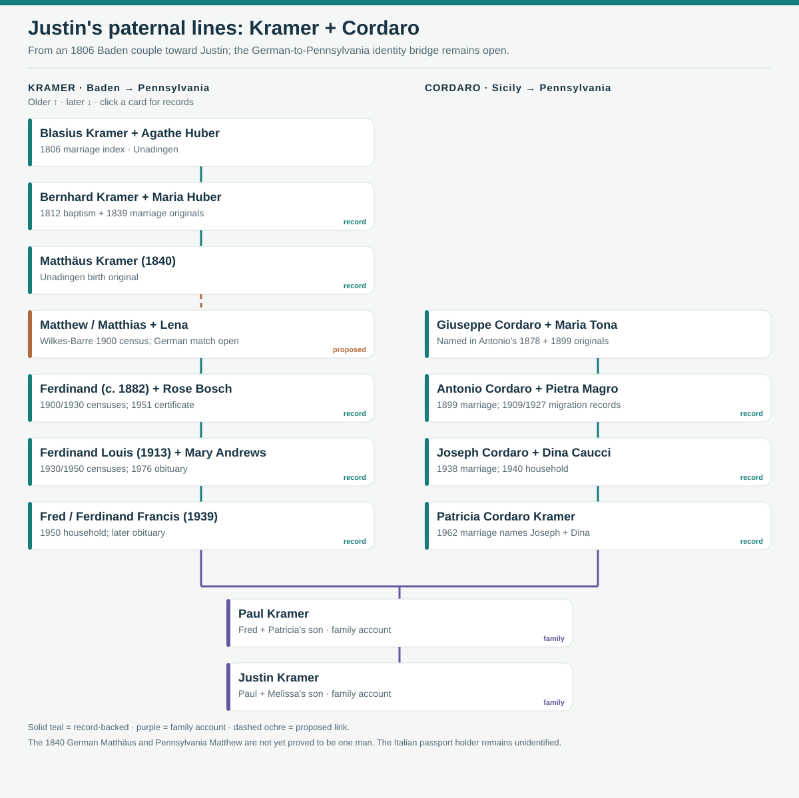
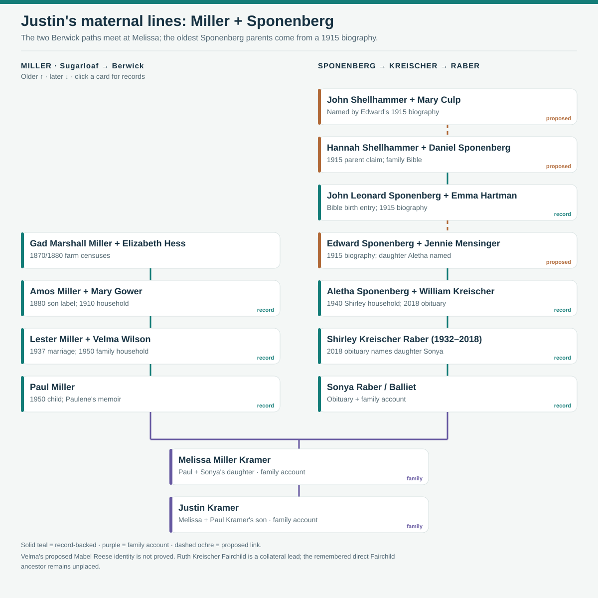
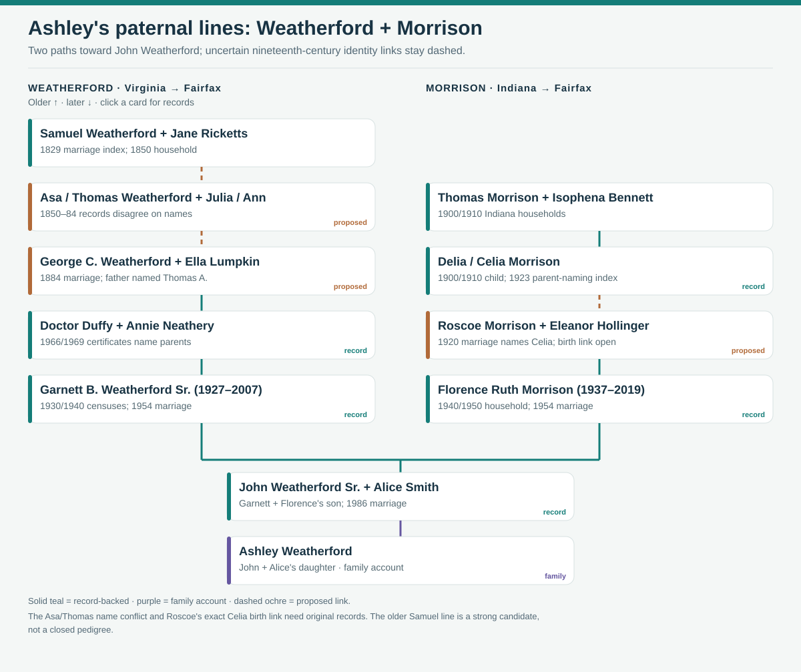
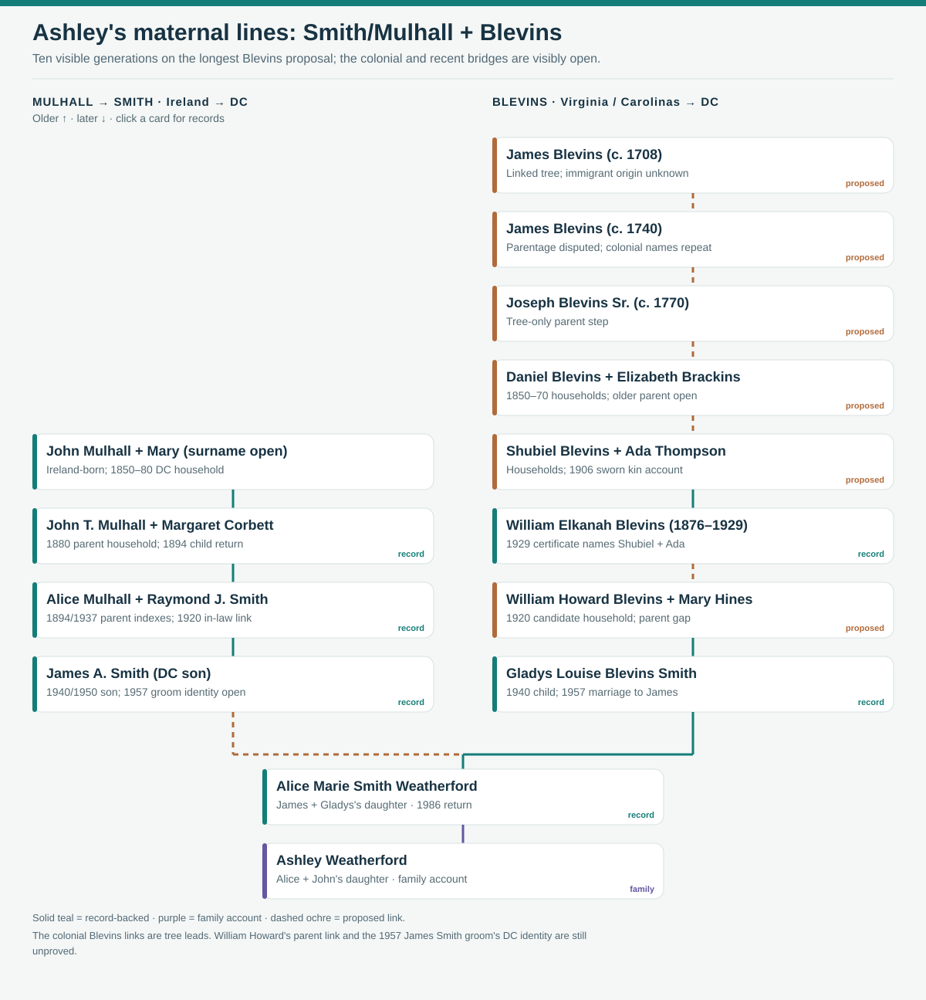

# Full family trees

These four long views follow **one ancestral path in each column** to show how far the current research can go. Click a person card to open that branch's source notes. The diagrams are not claims that every sibling or spouse's ancestry has been found.

**Read the links first:** solid teal means a relationship supported by a record; purple marks Justin or Ashley's family account; dashed ochre means a proposed identity or parent link that still needs a decisive record. An old person appearing in a tree does **not** mean every link down to Justin or Ashley is established.

## Justin's paternal branches

The [Kramer records](../branches/kramer.md) trace Matthew and Lena to the Pennsylvania Ferdinands, Fred and Paul; the [Unadingen original](../branches/kramer-unadingen-household.md) independently traces Blasius to Bernhard to Matthäus. The dashed **Matthäus → Matthew** link needs a parent or birthplace record for the Pennsylvania man. [Original Sicilian birth and marriage acts, migration documents and Pennsylvania applications](../branches/cordaro-passport-lead.md) connect Giuseppe/Maria through Antonio/Pietra, Joseph/Dina and Patricia. The photographed Italian passport is not assigned to a holder.

Dina's **separate maternal path** now reaches her Italian-born parents **Joseph Caucci and Anna Belardinelli** through the [1938 original application and focused evidence diagram](../branches/caucci-belardinelli.md). The proposed Winton census children and Anna Caucci burial stay outside the confirmed tree until an original record joins them.

## Justin's maternal branches

The [Raber–Kreischer–Balliet record trail](../branches/raber-kreischer-balliet-record-trail.md) adds a three-lane visual that reaches **Michael and Catherine Balliet's 1870 household**, independently places **elder and younger William Kreischer together in 1930**, and directly names **Sonya as William John Raber's daughter in 1950**. It marks the remaining same-person and parent gaps.

[Original Miller censuses](../branches/miller-gower-reese.md) connect Marshall to Amos; the later household and Paulene's account connect Lester and Paul. On Sonya's side, a [1915 Berwick biography, family Bible, 1940 census and 2018 obituary](../branches/raber-kreisher-fairchild.md) supply the longer path. The oldest Shellhammer link and John Leonard → Edward step rely on the biography's retrospective account. A [separate Kreischer sibling diagram](../maps/kreischer-fairchild-siblings.svg) shows **William Sr.'s four children**, including **Ruth Elizabeth**, whose Fairchild married surname has a strong [Berwick burial-list match](https://peoplelegacy.com/ruth_e_kreischer_fairchild-482j331). The biography's **William Henry born 1909** is a strong match for Shirley's father **William H. Jr.**, but still needs a parent-naming record before that older path joins this full tree. The proposed Reese/Wilson identity and the earlier memory of a Fairchild-born ancestor remain outside the linked tree pending records.

Justin's newly named **William John → William G. Raber** paternal path for Sonya and **Crystal Balliet's eleven-child 1940 household** are shown in a [separate evidence diagram](../maps/raber-balliet-evidence-paths.svg). Justin identifies **Stanley and Crystal as Sonya's Floyd's parents**. The [original census sheet](../sources/records/crystal-balliet-household-census-1940.jpg) confirms Crystal's children, including one-year-old Floyd; the dashed link to Sonya's documented husband **Floyd A.** marks a family-identified connection still awaiting an independent adult-to-child record. A [1937 newspaper-index transcription](https://genealogytrails.com/penn/luzerne/1937_deaths/a_b_c.html) dates Stanley's death to **25 December**, making Floyd a likely **posthumous son** if the family identification and date are correct. [Household analysis](../branches/balliet-raber-candidates.md).

## Ashley's paternal branches

The [Samuel and Jane household and George's 1884 marriage](../branches/weatherford-early-virginia.md) form an older **Weatherford candidate**, but the Asa/Thomas and Ann/Julia name conflict prevents a closed chain. [Duffy's and Annie's original certificates, household censuses and Garnett's 1954 marriage](../branches/weatherford-smith-generations.md) secure the later layers. [Indiana censuses and Roscoe's marriage](../branches/morrison-hollinger.md) suggest Delia/Celia was Roscoe's mother, while his exact birth record is still open.

## Ashley's maternal branches

The [Mulhall originals](../branches/smith-mulhall-corbett.md) identify the Ireland-born John and Mary, their son John T., Alice and Raymond; matching the **DC son James A.** to the **1957 groom James Allen** still needs a parent-naming document. The [Blevins evidence guide](../branches/blevins-deep-lineage.md) distinguishes the documented Shubiel → William Elkanah and William Howard → Gladys links from the open **William Elkanah → William Howard** step. Earlier James and Joseph connections are tree hypotheses, with multiple same-name colonial men to distinguish in the [early Virginia research](../branches/blevins-colonial-james.md).

## Coverage and next records

These views go farther than the small household diagrams while keeping one readable route per column. Separate [sibling diagrams and generation lists](../maps/README.md) carry the collateral relatives; the [interactive timeline](../explore/timeline.html) shows events across all branches. The most valuable missing bridges are Pennsylvania Matthew's parent or German town, James Smith's 1957 parent-naming return, William Howard Blevins's parent record, Roscoe Morrison's birth record, and an original record resolving Asa/Thomas Weatherford. [Research questions](../research/open-questions.md) list the active checks.
