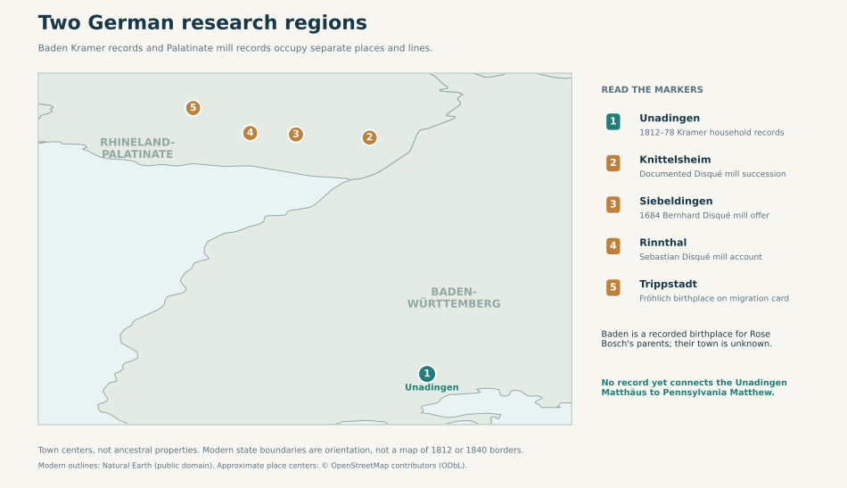
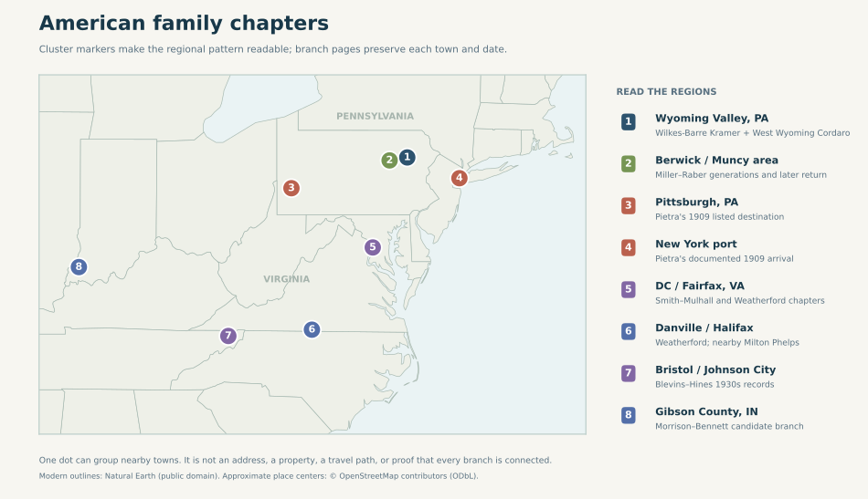

# Family geography atlas

These maps locate **recorded towns, reported regions, and research leads** across the families. Their outlines are modern; their dots are approximate place or regional centers, **never a family home or parcel**. A dot does not establish a relationship between people who lived nearby. [Open the dated timeline](../explore/timeline.html) for the sequence of events.

## Germany: two different research regions

[Full-size map](../maps/germany-family-places.svg) · [PNG preview](../maps/germany-family-places-preview.png)

| Marker | Why it is here | Family-link limit |
| --- | --- | --- |
| **1 · Unadingen** | [Original 1812 birth](../sources/records/bernhard-kramer-baptism-1812.jpg), [1839 marriage](../sources/records/bernhard-kramer-maria-huber-marriage-1839.jpg), [1840 Matthäus birth](../sources/records/unadingen-matthaeus-kramer-register-1840-candidate.jpg), and [1878 church notice](../sources/records/bernhard-kramer-huber-unadingen-memorial-1878.jpg) establish a Kramer household in this Baden village. [Twelve-child diagram](../maps/kramer-unadingen-household.svg). | The Pennsylvania Matthew's parents and town have not been established; [the matching birth month is insufficient](../branches/kramer-baden-candidate.md). |
| **2–4 · Knittelsheim, Siebeldingen, Rinnthal** | A [specialist Palatinate mill history](https://www.eberhard-ref.net/pf%C3%A4lzisches-m%C3%BChlenlexikon/pf%C3%A4lzische-m%C3%BCllerfamilien/litera-d/) describes Disqué leases and people at these places, including the 1684 Siebeldingen mill offer. [Mill and succession notes](../branches/disque-schaaf.md). | The complete chain from those millers to Justin's charted Magdalena Disque remains unproved. The map makes **no Kramer–Disqué geographic or property connection**. |
| **5 · Trippstadt** | A [Palatinate migration card](https://migration.pfalzgeschichte.de/person/98001) gives Magdalena **Fröhlich** a Trippstadt birthplace and reports her 1864 move with four named children. | The card's family must not be silently equated with the chart's different Magdalena Disque or with Matthew Kramer's wife. |

Rose Bosch Kramer's parents reported **Baden** birth in the [1920 Kramer/Bosch census](../branches/other-paternal-lines.md). No record found so far names their town; the map deliberately gives them **no town marker**. The state lines are modern orientation, not Baden's nineteenth-century borders.

## Europe: how specific is each origin?

[Full-size map](../maps/europe-family-places.svg) · [Sicily close-up](../maps/cordaro-sutera-places.svg)

- **Sicily:** [Antonio Cordaro's Milocca records](../branches/cordaro-passport-lead.md) and Pietra Magro's [1909 passenger manifest](../sources/records/pietra-cordaro-calabria-manifest-1909-front.jpg) anchor **Milocca/Sutera** and **Palermo**. The manifest documents her Palermo → New York voyage and Pittsburgh destination; Antonio's earlier itinerary is a later petition report with a conflicting passenger lead. The [Sicily map](../maps/cordaro-sutera-places.svg) separates these places.
- **Ireland:** [John and Mary Mulhall](../sources/records/mulhall-corbett-neighbor-households-census-1880.jpg) and likely Corbett relatives reported Irish birth in Washington records. Their **county, town and crossing date are unknown**. The [link from this DC Smith family to Ashley](../branches/smith-mulhall-corbett.md) remains probable, so Ireland is shaded as a country-level lead rather than pinned to a guessed port.
- **Germany:** The Unadingen, Palatinate and Baden claims have different sources and degrees of certainty, as shown in the map above. None supplies a documented route for Pennsylvania Matthew.

## America: clusters, not invented journeys

[Full-size map](../maps/america-family-places.svg) · [Pennsylvania and Virginia sequence map](../maps/family-place-sequences.svg)

| Region | Record trail or account |
| --- | --- |
| **1 · Wyoming Valley, Pennsylvania** | [1900 Kramer census](../sources/records/kramer-matthew-lena-census-1900.jpg) in **Wilkes-Barre**; [Cordaro 1927 petition](../sources/records/antonio-cordaro-petition-1927.jpg) names children born in **West Wyoming**. Two nearby towns, not one address. |
| **2 · Berwick and Muncy area** | [Miller/Raber generations](../branches/maternal-kramer-side.md) in Berwick; a [1919 Reese index and later Muncy-area family account](family-place-sequences.md) show a regional return with an unresolved **Muncy Valley versus Lycoming County** birthplace conflict. |
| **3–4 · Pittsburgh and New York** | Pietra's [1909 *Calabria* manifest](../sources/records/pietra-cordaro-calabria-manifest-1909-front.jpg) records the arrival port and listed destination. It does not date the later move to West Wyoming. |
| **5 · Washington and Fairfax** | [Mulhall–Smith DC records](../branches/smith-mulhall-corbett.md) and [Weatherford–Smith Fairfax records](../branches/weatherford-smith.md) span different generations. The later Franconia homes were in Fairfax County despite the Alexandria mailing name. |
| **6 · Danville, Halifax and nearby Milton** | [Weatherford Virginia household trail](../branches/weatherford-early-virginia.md) and the separate [Phelps/Neathery Milton lead](../branches/neathery-phelps.md). A grouped marker does not put these people in one town or household. |
| **7 · Bristol / Johnson City** | [Blevins–Hines household records](../branches/smith.md) locate Gladys's parents in this Virginia–Tennessee region in the 1930s. |
| **8 · Gibson County, Indiana** | [Morrison–Bennett records](../branches/morrison-hollinger.md) anchor a probable older branch of Ashley's family; Roscoe's exact parent link is still being tested. |

**Map data:** [Natural Earth outlines](https://www.naturalearthdata.com/about/terms-of-use/) are public domain. [OpenStreetMap](https://www.openstreetmap.org/copyright) town or administrative centers were retrieved with Nominatim and are credited under **ODbL**; [the saved centers and individual OSM object links](../maps/place-centers.json) make the locations auditable. The [generator](../maps/generate_geography_atlas.py) writes editable SVG and PNG previews. No route line here claims a ship's exact course or an ancestor's unrecorded move.

For a closer scale, see [Sutera and Milocca](../maps/cordaro-sutera-places.svg), [Palatinate mills](../maps/ancestral-places.svg), [the maternal Pennsylvania return](../maps/family-place-sequences.svg), [the separate colonial James Blevins sightings](../maps/blevins-early-settlement.svg), and [the Fairfax family neighborhood](../maps/colette-neighborhood.svg). The [map index](../maps/README.md) also links the evidence and lineage diagrams.
