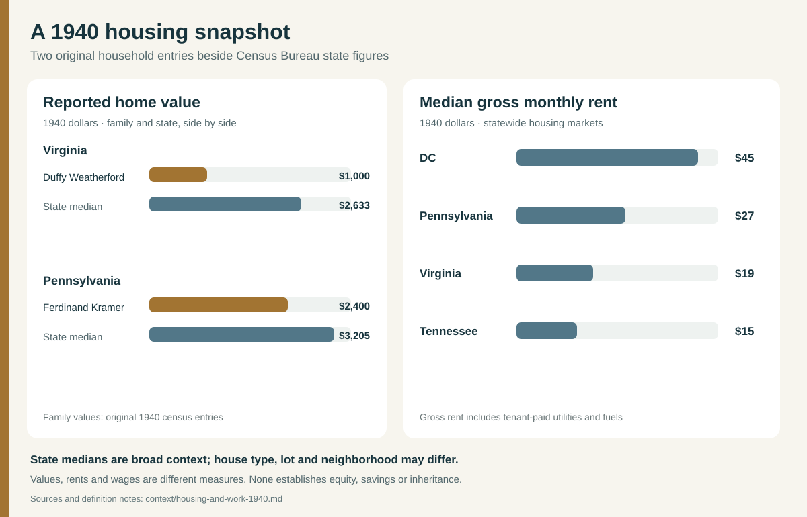

# Housing and work around 1940

The [1940 Census Bureau home-value table](https://www2.census.gov/programs-surveys/decennial/tables/time-series/coh-values/values-unadj.txt) supplies a same-year **statewide** reference for two original family census entries. The [rent table](https://www2.census.gov/programs-surveys/decennial/tables/time-series/coh-grossrents/grossrents-unadj.txt) shows how housing costs differed among regions connected to these branches. Both sets of dollars are **nominal 1940 figures**, not present-day values.

| Household | Its original 1940 record | Same-year area reference | What this says |
| --- | --- | --- | --- |
| **Ferdinand Kramer (c. 1882), Wilkes-Barre, Pennsylvania** | His [saved census sheet](../sources/records/ferdinand-kramer-household-census-1940.jpg), lines **44–46**, reports an **owned home valued at $2,400**, **$1,996** of his 1939 wages as a wire-rope foreman, and **$1,234** in wages for his resident son, strongly identified as Emil. | The Census Bureau reports **$3,205** as Pennsylvania's 1940 median value for specified owner-occupied homes. | The reported home value was below this broad state median. Neither entry tells us mortgage balance, savings, family spending or whether Emil pooled earnings with his father. |
| **Duffy and Annie Weatherford, Pittsylvania County, Virginia** | Their [saved census sheet](../sources/records/duffy-annie-weatherford-census-1940.jpg), lines **31–39**, reports an **owned home valued at $1,000**; Duffy, a city cleaner, reported **$1,078 wages** for 45 weeks in 1939. | Virginia's statewide 1940 median was **$2,633** for the Census Bureau's specified owner-occupied homes. | The household's estimate was below that state median, but a rural Pittsylvania home is not a close price match to every Virginia home. The figure cannot show equity or inherited assets. |
| **Howard and Mary Blevins, Johnson City, Tennessee** | The [original census](../sources/records/blevins-household-census-1940.jpg) reports **$12 monthly rent** and Howard's **$1,000 wages** for 52 weeks in 1939 as a furniture-industry varnish sprayer. | Tennessee's statewide **median gross rent was $15 monthly** in 1940. | Their listed rent and the state median use different definitions: gross rent adds tenant-paid utilities and fuels. The $12 entry therefore cannot be ranked precisely against $15. If $12 persisted for a full year, it would total **14.4%** of Howard's prior-year wages alone. |

In 1940 the Census Bureau's **median gross monthly rent** was **$45 in DC, $27 in Pennsylvania, $19 in Virginia and $15 in Tennessee**. [Gross rent](https://www.census.gov/data/tables/time-series/dec/coh-grossrents.html) includes rent plus estimated tenant-paid utilities and fuels. This gives a sense of the **regional housing market**, not a bill paid by a particular ancestor. Raymond and Alice Smith's DC census gives **$35.50 monthly rent in 1930**; a different decade and rent definition prevent a direct comparison with DC's $45 gross median in 1940. [Their record trail](../branches/smith-dc-candidate.md).

The [1940 census questionnaire](https://www.census.gov/programs-surveys/decennial-census/technical-documentation/questionnaires.1940_Census.html) asked for **1939 money wages or salary** and separately whether a person received at least $50 from other sources. A reported wage is therefore **not household income or net worth**. The Census Bureau's home-value medians refer to a defined set of owner-occupied single-family homes on less than ten acres without a business or medical office. Whether each family home fits that definition is unverified; use the state figures as broad context only. The existing [assets and jobs ledger](../research/assets-by-generation.md) lists the other generations and the records still needed to trace transfers.
