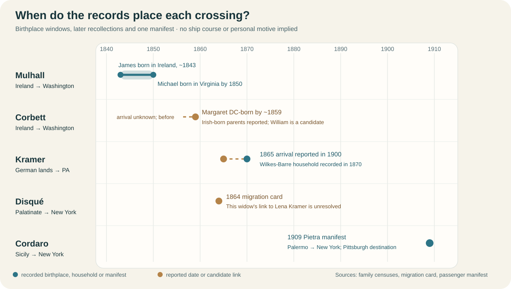

# Immigration stories: what the records let us say

[Explore the Europe map](../maps/europe-family-places.svg) · [U.S. destinations](../maps/america-family-places.svg) · [Sicily detail](../maps/cordaro-sutera-places.svg). The map colors **Ireland as a country**, not a guessed Mulhall or Corbett county. Its **Unadingen dot belongs to a separate Kramer candidate**, not a confirmed birthplace for Pennsylvania Matthew. The lines above represent evidence windows, not ship courses.

| Family | Crossing evidence | What might explain the period | Missing piece |
| --- | --- | --- | --- |
| **John and Mary Mulhall** | Their [1850 Washington census](https://www.familysearch.org/ark:/61903/1:1:MX6M-KYG?lang=en) has Ireland-born son **James, 7**, and Virginia-born infant **Michael**. [1860](https://www.familysearch.org/ark:/61903/1:1:MCV9-27J?lang=en) repeats John, Mary and James; [1870](https://www.familysearch.org/ark:/61903/1:1:MN49-L65?lang=en) and [1880](../sources/records/mulhall-corbett-neighbor-households-census-1880.jpg) repeat the younger Joseph, Eliza and Frank. This strongly suggests a family move **after about 1843 and by about 1850**; the exact date, port and route are unknown. | The interval overlaps Ireland's **Great Hunger**, which began after the 1845 potato blight and drove mass emigration. [NPS history](https://www.nps.gov/articles/000/jfk-and-the-history-of-irish-immigration-in-boston.htm). Nothing in these household records says famine, eviction, work, religion or politics motivated **this** family. | A passenger or naturalization record tying John, Mary and James together, or an Irish parish record that names Mary and a locality. An [attached Wicklow/Ontario tree](../branches/smith-mulhall-corbett.md#tree-collision-to-avoid) appears conflated. The [link from the DC Smith branch to Ashley](../branches/smith-mulhall-corbett.md) remains probable. |
| **Margaret Corbett's parents** | [1900 and 1910 censuses](../branches/smith-mulhall-corbett.md) report both Margaret and her parents' births as **DC and Ireland**, respectively. An Ireland-born **William Corbett** with DC-born Maggie and Annie lived beside the Mulhalls in [1880](../sources/records/mulhall-corbett-neighbor-households-census-1880.jpg); he is a strong candidate for her father, not yet proved. | Margaret's reported DC birth around **1859** implies her parents had reached America by then, if the census reports and candidate identity are right. This also lies near the famine aftermath, with no personal motive recorded. | Margaret's marriage or death record naming parents; a continuous 1860–80 Corbett household. A [1860 Wm and Bridget **Carbet** household](https://www.familysearch.org/ark:/61903/1:1:MCV9-RG9?lang=en) has similarly named daughters but **conflicting ages**, so it is only a lead. |
| **Matthew/Martin Kramer and Lena** | The [1900 original census](../sources/records/kramer-matthew-lena-census-1900.jpg) reports **1865** U.S. arrival for both Germany-born adults. The likely same Martin and Lena appear in [1870 Wilkes-Barre](../sources/records/kramer-martin-lena-census-1870.jpg). The 1865 entry is a recollection, not a ship record. [1870](../sources/records/kramer-martin-lena-census-1870.jpg) gives Martin **Bavaria** and [1880](../sources/records/kramer-martin-lena-census-1880.jpg) gives **Württemberg**; the proposed [Unadingen, Baden Matthäus](../branches/kramer-baden-candidate.md) is not yet identified as him. | A [German Historical Institute overview](https://germanhistorydocs.org/en/from-vormaerz-to-prussian-dominance-1815-1866/introduction) places another major emigration wave from German lands beginning in **1864**. Economic opportunity, land pressure or politics are possible period forces; **none is Matthew's documented motive**. His shift from masonry to rope-factory work occurred **after** arrival. | A naturalization declaration, original marriage, passenger record, or parent-naming death certificate that fixes his German town, route and identity. [Detailed Kramer record trail](../branches/kramer-martin-migration.md). |
| **Magdalena Fröhlich Disqué and four children** | An [Institute for Palatinate History migration card](https://migration.pfalzgeschichte.de/person/98001) places this **distinct widow and her named children** on an **1864** departure; a related [card](https://migration.pfalzgeschichte.de/person/98304) names **Le Havre → New York**. | Her husband's **1853 death** is documented family circumstance, but not a stated reason for leaving eleven years later. [Regional migration history](https://www.auswanderung-rlp.de/ziele-der-auswanderung/ausstellung-zur-auswanderung-2010.html) describes divided farmland and crowded trades in the period. | The original passenger list, departure papers and a bridge to the charted **Magdalena Disque Kramer**; the card's named children do not currently establish that connection. [Separate Disqué analysis](../branches/disque-schaaf.md). |
| **Pietra Magro Cordaro** | Her [1909 *Calabria* manifest](../sources/records/pietra-cordaro-calabria-manifest-1909-front.jpg) records **Palermo → New York**, with **Pittsburgh** as destination. [Sutera/Milocca map](../maps/cordaro-sutera-places.svg). | Sicilian land and work conditions matter to the era; no letter or declaration here states Pietra's personal reason. A listed destination is a concrete family or work lead, not proof of her eventual Pittsburgh residence. | Her own account or a correspondent's record explaining the choice, and a separate verified manifest for Antonio. [Cordaro crossing notes](../branches/cordaro-passport-lead.md). |

**How to read a “why” claim:** A census birthplace or arrival field can date a move approximately. A famine, migration wave or local economy explains the **setting**, not an individual's decision. A letter, departure application, ship record with a named contact, or contemporary family testimony could turn these settings into a personal story. The [period context](family-in-its-times.md) and [research queue](../research/open-questions.md) keep those questions open.
