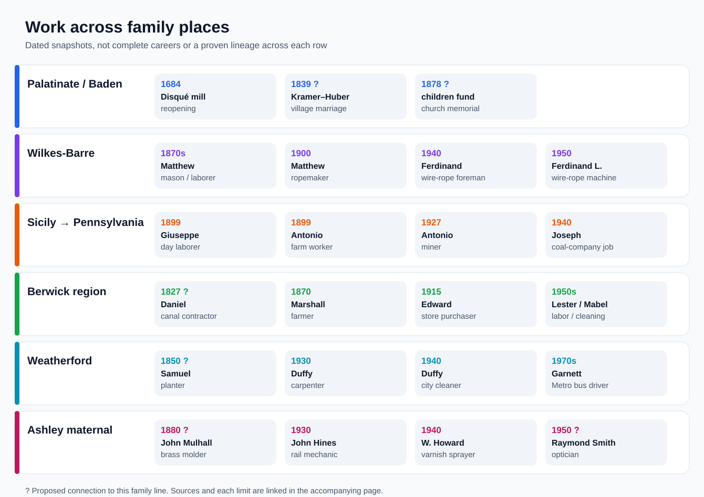

# What daily work and community life look like in the records

These are **short scenes supported by records**, not complete careers or a ranking of families. A job, a single home value, or a town's reputation cannot tell us that someone was famous, poor, popular, or personally involved in a local event. The diagram groups related research branches by region; a row is **not** a proven parent-to-child chain. A question mark marks a proposed identity or line.

The [faces and places gallery](faces-and-places.md) pairs three family-attributed portraits with saved views of several of these settings, each labeled by date and identification strength.

| Family and generation | A glimpse of their world | What we can say about the person |
| --- | --- | --- |
| **Disqué and Schaaf mill households, Palatinate, 1680s–1800s** | Water and milling rights mattered enough for Johann Bernhard Disqué to negotiate the reopening of a derelict mill in **1684**. A [specialist mill history](https://www.eberhard-ref.net/pf%C3%A4lzisches-m%C3%BChlenlexikon/pf%C3%A4lzische-m%C3%BCllerfamilien/litera-d/) follows later relatives through leased mills. | This was a family with documented local trade and repeated mill arrangements, **not** proof of a fortune, fame, or a direct line through every named miller to Lena Disque Kramer. [Lineage limits](../branches/disque-schaaf.md). |
| **Bernhard and Maria/Marie Kramer, Unadingen, 1839–78 — candidate paternal ancestry** | Their [1839 marriage entry](../sources/records/bernhard-kramer-maria-huber-marriage-1839.jpg), [1840 son Matthäus's birth](../sources/records/unadingen-matthaeus-kramer-register-1840-candidate.jpg), and the children's [1878 church memorial](../sources/records/bernhard-kramer-huber-unadingen-memorial-1878.jpg) put family ceremonies across nearly four decades in one Baden village. A Bernhard Kramer was a local wedding witness twice, though his identity is not certain. | We know a **100-mark collective memorial gift**, not their income, rank in the village, or whether the child emigrated to Pennsylvania. [The evidence bridge](../branches/kramer-baden-candidate.md) remains open. |
| **Matthew/Matthias and later Kramers, Wilkes-Barre, 1870s–1950** | Directories call the older man a **mason, laborer, then ropemaker**. The [1940 census](../branches/kramer.md) calls **Ferdinand (c. 1882)** a wire-rope foreman; **Emil's draft card** names American Chain & Cable, and the [1950 sheet](../branches/kramer.md) puts **Ferdinand Louis (1913)** in wire-rope machine work. | Multiple generations appear in related industrial trades. That pattern is distinctive; it does not show a family-owned rope business or uninterrupted work at one company. [Work visual](../maps/kramer-work.svg). |
| **Cordaro and Magro, Sicily to Pennsylvania, 1899–1940** | [1899 banns](../sources/records/cordaro-magro-banns-1899.jpg) call Antonio a farm worker and his father Giuseppe a day laborer. The family's staggered crossing followed a [1905 Sutera landslide and local emigration surge](https://dgagaeta.cultura.gov.it/public/uploads/documents/Saggi/6593ab8704a1d.pdf). [Antonio's 1927 petition](../sources/records/antonio-cordaro-petition-1927.jpg) calls him a miner; Joseph's [1940 card](../sources/records/joseph-anthony-cordaro-draft-card-1940.jpg) names a coal-company employer. | Their recorded work changed from Sicilian agriculture to Pennsylvania coal. The disaster is a close local backdrop, **not** their stated reason for emigrating. Neither occupation proves landlessness or prosperity. [Crossing story](../branches/cordaro-passport-lead.md). |
| **Sponenberg and Miller, Berwick region, 1820s–1950s** | A 1915 [biography](../sources/records/edward-sponenberg-biography-1915-187.jpg) remembers Daniel Sponenberg's canal contracting and says his grandson Edward moved from rolling-mill work to store purchasing. Across the other maternal branch, [Marshall Miller's 1870 census](../sources/records/marshall-elizabeth-miller-census-1870.jpg) calls him a farmer with **$600 real estate**; his [1890 veterans entry](../context/civil-war-family-lines.md) strongly matches a Union soldier. A [1926 Berwick-built railcar survives at Steamtown](https://www.nps.gov/stea/planyourvisit/freight-cars.htm). | This region held both farm and factory work. Edward's buying role is a real community-facing job, but no record says he was famous or knew everyone. The museum car is a **town artifact**, not a family possession. Marshall's figure is one census value, not a fortune. [Maternal branches](../branches/maternal-kramer-side.md). |
| **Lester, Mabel and Shirley, Berwick, mid-1900s** | [Paulene's family memoir](https://bhaven.org/paulene/life-journey) remembers Mabel's cleaning and ironing, Lester's labor jobs, a coal-heated house, and family music. A later [obituary](../branches/raber-kreisher-fairchild.md) says Shirley Kreischer Raber worked at a cigar plant, became a school crossing guard, and earned a GED at about **55**. | These give unusually personal work and learning stories. The memoir is a daughter's memory; the obituary is a family account. Neither yields annual family income or a town-wide reputation. [Berwick timeline](../branches/miller-berwick-timeline.md). |
| **Samuel and Jane Weatherford, Halifax, 1850–80 — earlier-line candidate** | [Original censuses](../branches/weatherford-early-virginia.md) call Samuel a planter, then farmer, with recorded real estate of **$375** in 1850 and **$786** in 1870. Virginia's [county survey](https://www.dhr.virginia.gov/pdf_files/SpecialCollections/HA-064_HalifaxCountySurvey_2008_HSPC_report.pdf#page=47) describes tobacco, corn, wheat, and railroad construction nearby. | Samuel's crop, acreage, and experience of the railroad are unknown. The 1860 estate fields are blank; the two amounts cannot establish a continuous wealth trend or whether he enslaved people. |
| **George, Duffy, Garnett and Florence Weatherford, Virginia, 1884–1970s** | George's [1884 marriage](../branches/weatherford.md) says **farmer**; a strong 1937 match calls him a **night watchman**. Duffy's 1930 and 1940 sheets move from **building carpenter** to **city cleaner**. Garnett's obituary follows his **WWII Navy** service through AB&W bus driving and **Metro** after the [1973 takeover](https://www.wmata.com/about/history/upload/history.pdf); Florence's 1954 marriage form calls her a **bank bookkeeper**. | These are four distinct job stories, not a single decline or rise. Garnett's nickname **“Gee Bee”** appears in his [published notice](../branches/weatherford.md); his exact bus routes and Florence's later bank dates remain unknown. |
| **Hines, Blevins, Mulhall and Smith, 1880–1950 — Ashley's maternal branches** | A [Bristol directory and 1930 census](../branches/smith.md) put John Hines in **railway-shop mechanic** work and Mary in **candy packing**. Gladys's father William Howard sprayed **furniture varnish** in 1940 for **$1,000 prior-year wages**. The **probable** DC Smith branch includes John Mulhall, a **brass molder**, and Raymond Smith, an **optician** in several censuses. | These occupations show skilled trades, factory work, and retail service across several households. The Mulhall-to-Ashley link still needs James's parent-naming marriage record; William Howard's own earlier Blevins parentage remains open. [Smith evidence](../branches/smith.md). |

**A useful comparison:** One relative's [1885 Phelps estate file](../branches/neathery-phelps.md) actually shows a financial turning point: after Robert Phelps's death, Ann reported debts, obtained a widow's allotment, and auctioned interests in land. That is evidence of a particular household's property pressure, **not** proof that later Weatherfords inherited or lost its proceeds. The [assets guide](../research/assets-by-generation.md) keeps each amount and ownership question separate.

**Next records to make the stories more personal:** a trade or tax record for Bernhard in Unadingen; an original 1957 Smith–Blevins marriage return naming James's parents; a deed or probate linking Samuel Weatherford to later Halifax relatives; employment or oral-history material for the Berwick and Wilkes-Barre workers. Those can test specific claims about local standing, wages, and inheritance.
