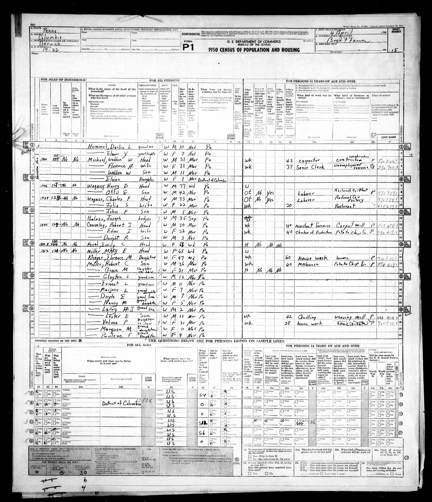
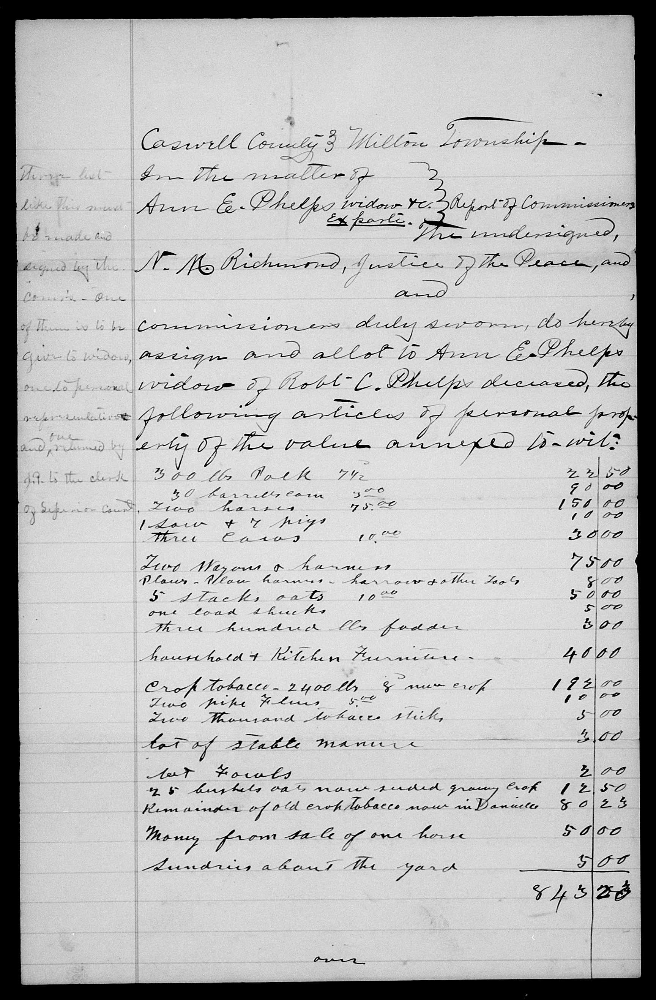

# The people behind the records

Eight short scenes from the family research. Each links to the fuller branch and the evidence behind it. A memory describes what its teller experienced; a biography records its writer's account. Neither lets us measure someone's whole character, income or standing.

## Mabel / Pearl Miller: a home full of sound

**Berwick · family memory.** Paulene remembered a coal-heated childhood home, her mother cleaning and ironing for others, and children listening to radio adventures and playing Monopoly. She described Mabel as kind and helpful. Later, mother and daughters made six trips to Branson, in Paulene's telling. These details give the household warmth as well as hardship; they are a daughter's recollections, posted in 2024, with no measured household income.

[Read Paulene's memoir](https://bhaven.org/paulene/life-journey) · [Follow Mabel's Reese → Wilson → Miller identity trail](../branches/miller-gower-reese.md#what-life-looked-like). The pictured census begins a household continued on the next sheet; it does not record the remembered games or personality.

## Lester Miller: the case marked “Shorty”

**Berwick · family memory and surviving objects.** Grandson Michael Beach remembers Lester playing mandolin and harmonica, Carl Miller on drums and Fred Beach on bass. Carl taught Michael drums. After Lester died, Pearl passed Michael a case of harmonicas, a homemade belt with pockets for them, and handwritten song lists. The nickname on the case makes this a particularly personal trace of a working musician; the band's venues and dates remain unknown.

[See Michael's account and photographed song lists](https://bhaven.org/mm-gang/harmonica-selections) · [Follow the Miller music and travel timeline](../branches/miller-berwick-timeline.md). The photographs remain on the family's source site.

## Edward Sponenberg: from mill floor to store buying

**Berwick · directory and biography.** The 1901 directory calls Edward a clerk at Berwick Store Company. His 1915 biographer describes earlier rolling-mill work, advancement to purchasing agent, and a house built in 1907. The writer also describes Methodist and fraternal memberships and independent political choices. Together they sketch a man working among the town's farmers and industrial residents; the memberships and house-building claim still need their own records, and no salary is known.

[Read the work and house evidence](../branches/sponenberg-deep-dive.md#work-and-a-glimpse-of-daily-life) · [See the recorded address and house views](family-homes.md#edward-j-and-jennie-mensinger-sponenberg-the-address-trail).

## Ferdinand Louis (1913): rope work and radio study

**Wilkes-Barre · census, signed card and obituary.** A radio set appears in his parents' 1930 home when Ferdinand Louis was sixteen. His signed 1940 registration names American Chain & Cable's Hazard Division; his obituary reports over 44 years in the industry and graduation from National Radio Institute. The combination offers a real technical-learning thread, but no record yet explains why he enrolled, what he built or whether radio was part of his paid work.

[Open the school evidence](education-across-generations.md#a-radio-lesson-by-mail) · [Keep the three Ferdinands straight](../maps/kramer-three-ferdinands-1950.svg). His father is **Ferdinand (c. 1882)**; his son is **Fred / Ferdinand Francis (1939)**.

## Antonio and Pietra Cordaro: a move made in stages

**Sicily → Pennsylvania · original records.** Antonio's 1899 marriage papers call him a farm worker; his 1927 petition calls him a miner. Pietra's 1909 passenger record places her and two daughters on their way to join him. The family crossed in stages and built a household across two countries. Sutera's 1905 landslide helps explain the local setting, but neither the manifest nor petition says it caused their departure. The family-held passport's owner remains unidentified.

[Follow the crossing records and translation](../branches/cordaro-passport-lead.md#antonios-crossing-and-citizenship-an-original-record-chain) · [See Sutera and Milocca](../maps/cordaro-sutera-places.svg).

## Garnett and Florence: bus driver and bookkeeper

**Virginia · marriage return and obituary.** Their 1954 marriage return calls Florence a First National Bank bookkeeper. Garnett's newspaper profile follows Navy service in the Pacific with bus driving for AB&W and Metro. These are two careers beside one another, rather than just a couple's dates. The family's later Burke & Herbert bank account needs employment evidence; Garnett's ship, individual wartime experiences and bus routes remain open.

[Read the Weatherford work story](../branches/weatherford.md#garnett-and-florence) · [See the later Miller Drive home trail](family-home-photo-atlas.md). The certificate records a particular moment, not their complete careers.

## Shirley Kreischer Raber: learning later in life

**Berwick · family obituary.** Shirley's 2018 notice remembers cigar-plant work, service as a school crossing guard, and a GED earned in 1987, when she was about 55. It is a compact story of work and education at different ages. The obituary names her parents and daughter Sonya, making it useful for kinship as well as memory. It does not identify her earlier high school or establish how much she earned.

[Read Shirley's family and work](../branches/raber-kreisher-fairchild.md#shirleys-family-and-work) · [Compare the education clues across generations](education-across-generations.md).

## Ann Phelps: a farm inventoried after a death

**Caswell County · original estate papers.** After Robert Phelps died, Ann's 1885 widow's allotment listed horses, cows, wagons, grain, household goods and tobacco valued together at **$843.23**. Later land sales and the 1887 administrator's deficit show property pressure alongside those tangible possessions. The allotment is a specific legal provision for Ann, not the whole estate or a measure of family wealth. The papers do not establish what later Weatherfords inherited.

[Read the inventory, auctions and final account](../branches/neathery-phelps.md#the-phelps-farm-after-roberts-death) · [Compare the different kinds of money evidence](../research/assets-by-generation.md).
