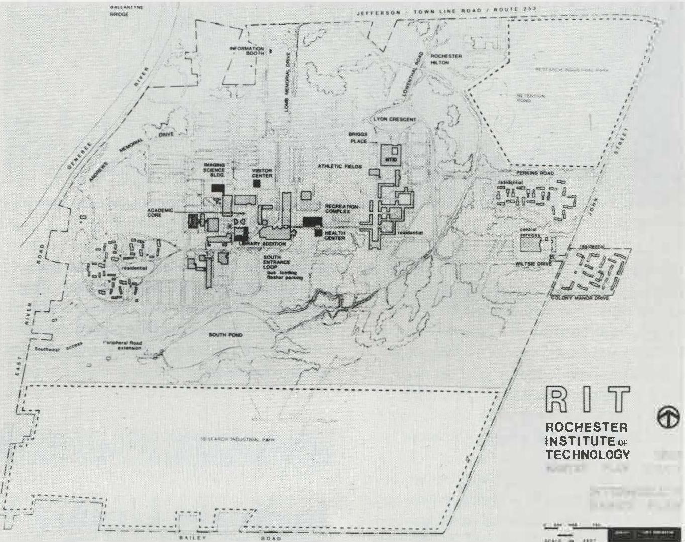
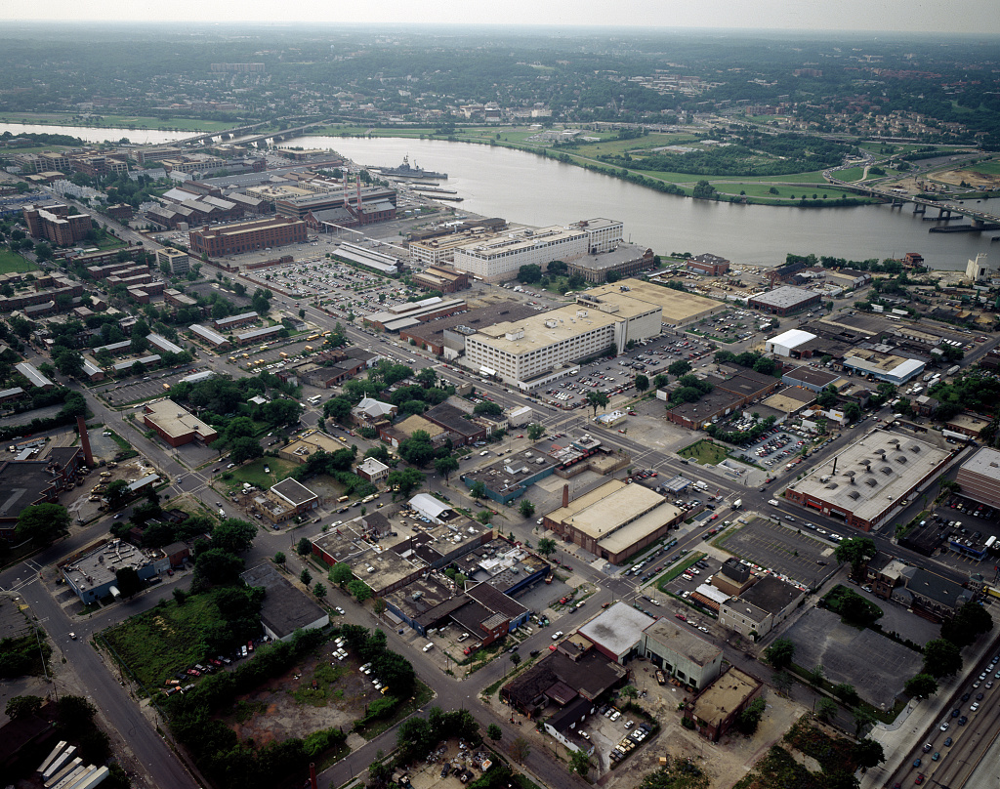
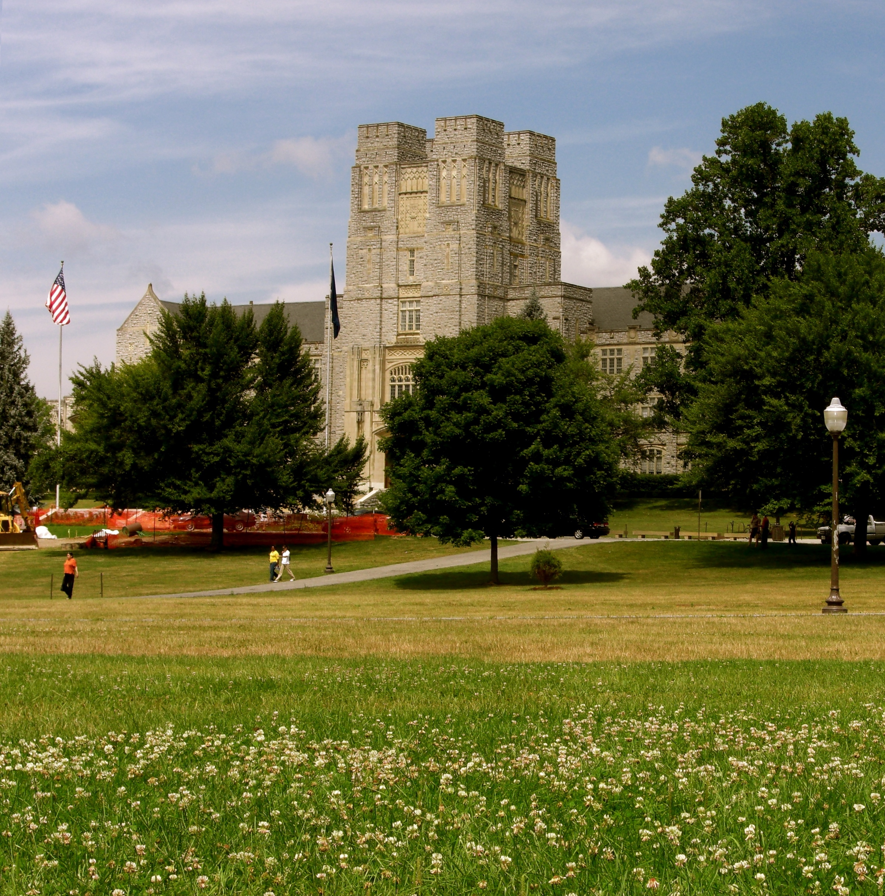

# The recent generations: work, study and a few records

**Read the shapes:** filled markers have a contemporary person-specific source; outlined markers are Justin's family account. The dates on an outlined marker can be approximate. This is a way to follow the people, not a claim that the pictured campus or workplace contains them. [Source notes](../research/sources.md#recent-generation-records-and-images).

## Two households, then another generation

| People | A short scene | What checks it |
| --- | --- | --- |
| **Paul Joseph and Melissa Miller Kramer** | Justin remembers his father serving in the **Army Reserve** and studying electrical engineering at **RIT around 1986**. Melissa worked in **Pennsylvania real estate in the 2000s**. Their later move to the Muncy area gives the family another Lycoming County chapter. | **Family account** for these roles, degree and move; no service, RIT student, Pennsylvania license or marriage record yet tied to this pair. Fred / Ferdinand Francis Kramer's separate Reserve service in his obituary is **not Paul's service record**. [Family account](../research/sources.md) · [Muncy place sequence](family-place-sequences.md). |
| **John Gordon and Alice Marie Smith Weatherford** | Their [12 April 1986 Fairfax marriage return](https://www.familysearch.org/ark:/61903/3:1:3Q9M-C9TY-595M-1?view=index&personArk=%2Fark%3A%2F61903%2F1%3A1%3AQK9V-J612&action=view&cc=2370234&lang=en) joins two neighboring Miller Drive homes and names **both sets of parents**. Justin says they then spent **25+ years at the Washington Navy Yard**: Alice in administration, John with IT equipment. He recalls **Edison High** for John and **Hayfield High** for Alice. | **Original marriage record** for the wedding, addresses, parents and grade 12 completed; **family account** for named schools, job duties and tenure. No personnel file or school page yet. [Generations](../branches/weatherford-smith-generations.md) · [school trail](education-across-generations.md). |
| **Alex and Justin Kramer** | Justin says Alex completed **Penn State electrical engineering** and later a **Georgia Tech master's**. Justin's own **Pitt** path is now visible in public records: a 2020 university article quotes him as **Computer Science Club vice president of operations**, and the [2021 commencement program, printed p. 81 / PDF p. 88](https://web.archive.org/web/20250208181123/https://www.commencement.pitt.edu/sites/default/files/pitt-commencement-2021_fullprogram_accessible.pdf#page=88) lists **Justin Kramer** for the **M.S. in computer science**, noting a **Pitt B.S. in 2020**. | **Family account** for Alex's programs and dates; **university article and contemporary program** for Justin. A commencement program lists degree candidates, so Justin's statement that he completed both degrees remains the completion evidence. [2020 Pitt story](https://www.pittwire.pitt.edu/pittwire/features-articles/computer-science-club-bridges-gaps-between-students-industry). |
| **Ashley Marie Weatherford** | Justin places Ashley at **Virginia Tech, 2015–19**, continuing a school connection he remembers for her uncle **Timothy A. Smith** decades earlier. Her branch brings the Smith–Blevins and Weatherford–Morrison histories into this generation. | **Family account** for attendance and dates. A Virginia Tech student or graduation record securely tied to *this* Ashley has not been found. Several unrelated Ashley Weatherfords appear in searches; none is attached here. [Education guide](education-across-generations.md) · [family paths](../FAMILY-TREE.md). |

### An authored record from Justin's college years

Justin is named with **Hanzhong Zheng and Shi-Kuo Chang** on a [2020 paper about modularity in microservices](https://ksiresearch.org/jvlc/journal/JVLC2020N2/paper008.pdf) and a [2021 paper comparing microservice design patterns using queueing networks](https://ksiresearch.org/seke/seke21paper/paper180.pdf). The first paper lists the authors in Pitt's computer science department; the [Pitt faculty publication list](https://people.cs.pitt.edu/~chang/papers.html) independently catalogs the second. These are a concrete trace of **work Justin did**, beside the family account of later degrees. They do not establish a later employer or career path.

## See the settings, with their limits

| Image | Why it belongs here |
| --- | --- |
|  | **RIT in July 1986.** An actual campus plan from [RIT *News & Events*](https://commons.wikimedia.org/wiki/File:Campus_plan,_RIT_NandE_Vol17Num19_1986_Jul17_Complete.jpg), close to Paul's **family-reported** study period. It does not identify his course, building or presence. |
|  | **Washington Navy Yard, c. 1980–2006.** [Library of Congress place view](https://www.loc.gov/item/2011634490/) of John and Alice's **family-reported** workplace. Neither person is identified in the photograph. |
|  | **Virginia Tech, 2007.** [EpicV27's licensed view](https://commons.wikimedia.org/wiki/File:Burruss_Hall_Virginia_Tech.jpg) shows the Blacksburg campus before Ashley's reported 2015–19 years. It does not place her or Timothy at this building. |

The [family photograph gallery](faces-and-places.md) has older relatives and saved artifacts. **No authenticated photo of Justin, Ashley, Paul, Melissa, John or Alice is yet in this repo.** A labeled family photo, graduation program, service paper, real-estate card or Navy Yard work item would let this page show the people themselves, with the date and identification recorded alongside each image.
