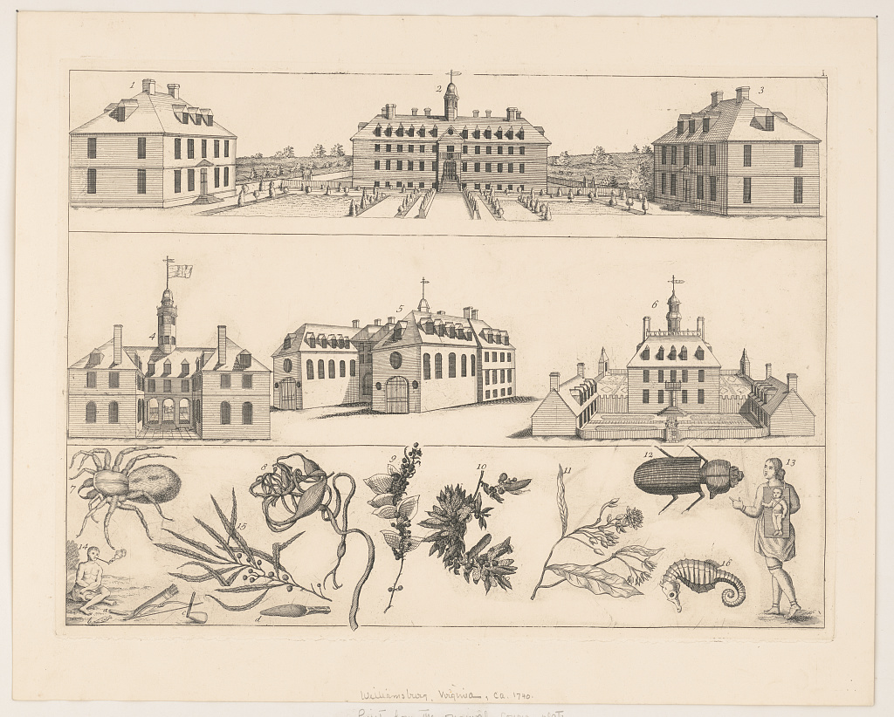
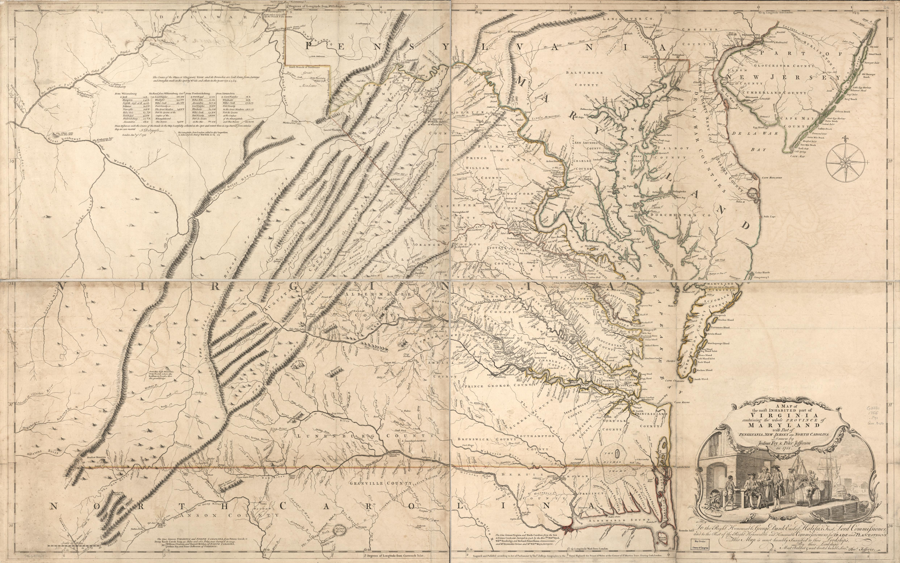
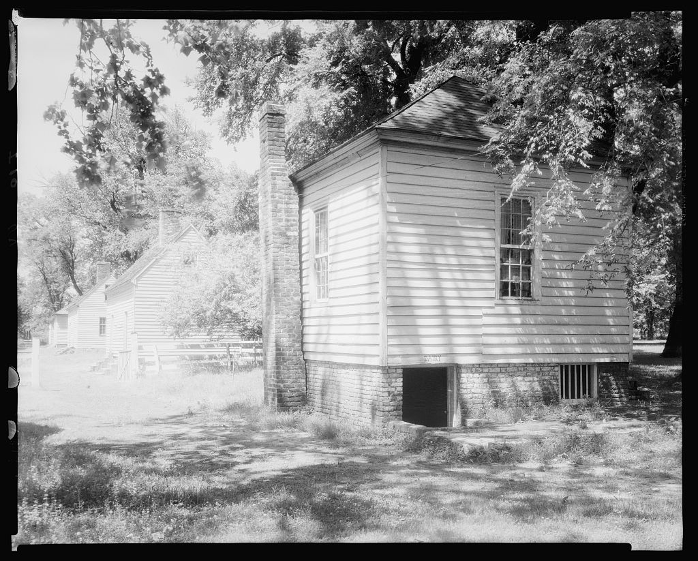
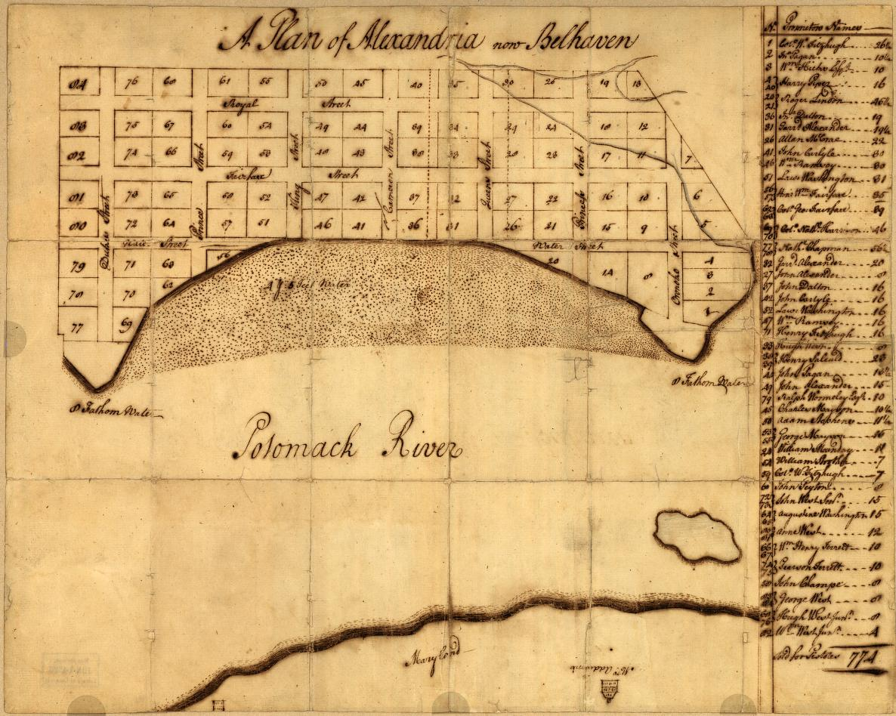

# Virginia in the 1740s: three views, three different places

**How to read these images:** The [1737 Goochland grants and 1743–45 deeds](../branches/blevins-colonial-james.md) document a **James Blevin**, but his place in Ashley's direct line is unproved. Ashley's better-supported Weatherford trail begins with [nineteenth-century Halifax records](../branches/weatherford-early-virginia.md). These images show regional settings and survive from different dates; none depicts a known family home or person.

| Date | Family evidence in its own place | How it relates to Ashley |
| --- | --- | --- |
| **1737–45** | James Blevin held and sold land in **Goochland** and later called himself *of Brunswick*. [Deeds and grants](../branches/blevins-colonial-james.md). | A real person and transaction, but **the descent to Ashley is not proved**. |
| **1850–84** | Samuel and Jane Weatherford's **Halifax** household, then George C. Weatherford's marriage, trace a likely line through Asa/Thomas. [Record trail](../branches/weatherford-early-virginia.md). | **Strong line with a remaining name-identity conflict** in the middle. |
| **1930–86** | Garnett appears with his parents in **Danville**; Alice and John's marriage return places their families in **Fairfax County**. [Generation guide](../branches/weatherford-smith-generations.md). | **Record-backed modern branch**, distinct from the colonial Blevin hypothesis. |

| 1737–45 record area | 1749 town plan | 1755 regional map |
| --- | --- | --- |
| **Goochland:** James's grants and sales concern Little Muddy Creek. In 1745 he called himself *of Brunswick*. The later Smith River hunter may be another James. | **Alexandria:** the new Potomac town's plotted streets and lots predate the modern Fairfax neighborhood by centuries. No identified Weatherford or Smith is tied to this plan. | **Virginia and neighboring colonies:** the Fry–Jefferson map shows rivers, counties, roads, mountains and settlement as its makers understood them a decade after the deeds. It is not a survey of James's tract. |

## What a contemporary Virginia image actually shows

The [Library of Congress etching of Williamsburg](https://www.loc.gov/item/2012649731/) was made **sometime between 1740 and 1770**, according to its catalog, and shows numbered buildings, plants, animals and depictions of Indigenous people. Its artist is not certain; the catalog says it *may* have been by John Bartram. Williamsburg was Virginia's colonial capital, while the James Blevin deeds concern inland **Goochland** and **Brunswick**. The etching gives a period view of the colony's public architecture and one artist's representation; it does **not** show James's tract, home, neighbors, or Ashley's confirmed ancestors. The proposed colonial Blevins link remains unproved.

## A period map of the wider landscape

Joshua Fry and Peter Jefferson's [1755 map at the Library of Congress](https://www.loc.gov/item/74693089/) gives the big picture: the Potomac and tidewater towns lie to the east, while the Piedmont, county boundaries and mountain chains fill the interior. Its 1755 publication makes it **near-contemporary**, not a literal 1740 scene. Cartographic blanks and colonial boundary lines do not mean land was empty or uncontested; Indigenous peoples and enslaved Africans are largely absent from the map's labels. The Goochland deeds provide the person's land transactions, not the precise house site.

**What was changing:** The [National Park Service's Piedmont land history](https://home.nps.gov/articles/000/virginia-agriculture-portici-cultural-landscape-manassas.htm) describes growing European settlement after the 1722 Treaty of Albany and increasing reliance on enslaved labor in colonial Virginia. That is regional context only: James's deeds do not reveal who worked his land, what he grew, or his relationship with Indigenous neighbors.

## One building photographed much later

Frances Benjamin Johnston photographed this **small outbuilding** at [Tuckahoe in Goochland County in April 1936](https://www.loc.gov/item/2017890613/). The Library of Congress catalog calls it a frame building with brick ends and gives an approximate early-eighteenth-century structure date. Tuckahoe was a [wealthy Randolph plantation](https://www.loc.gov/pictures/item/va0490/): it represents one elite site, not an average frontier dwelling, and its history includes enslaved labor. No evidence places James Blevin there or shows that his house looked like it.

## A town that was just being laid out

The [1749 Alexandria/Belhaven plan](https://www.loc.gov/item/98687108/) draws blocks and numbered lots beside the Potomac. It helps explain why the later Alexandria region has a very different story from inland Goochland or Smith River. Ashley's known twentieth-century relatives lived in **Fairfax County near Alexandria**, not on any identified lot on this eighteenth-century plan. For their own school years, see [Franconia growing up](franconia-growing-up.md) and [Fairfax historic aerial photographs](https://www.fairfaxcounty.gov/maps/aerial-photography).

**Next place check:** locate the two Little Muddy Creek patents on a historical plat or survey. Until then, no pin on a modern map should be presented as James's house. The [Blevins evidence page](../branches/blevins-colonial-james.md) separates the Goochland landholder, Smith River hunter and later namesakes.
