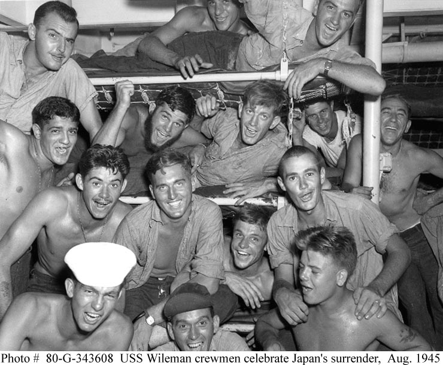
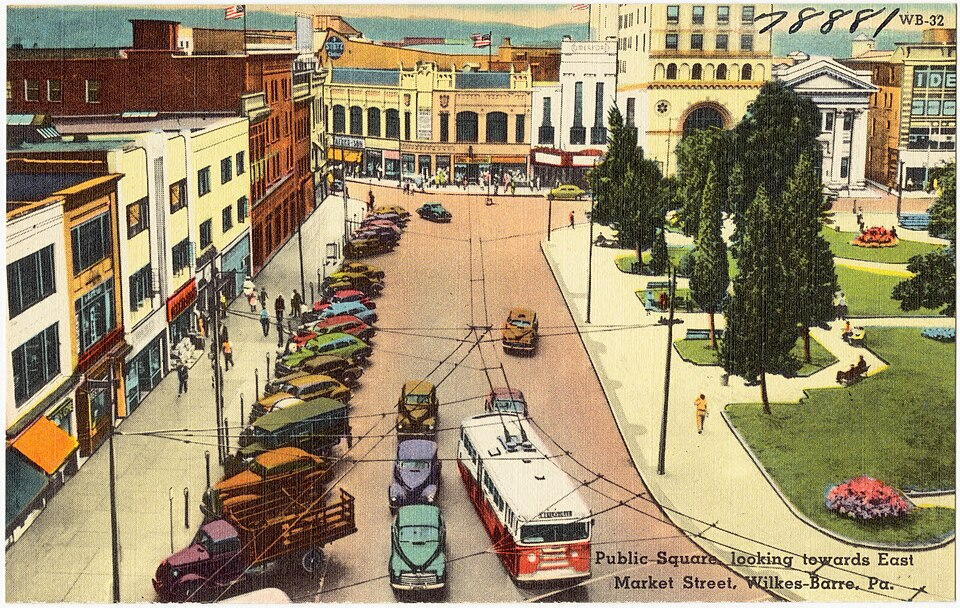
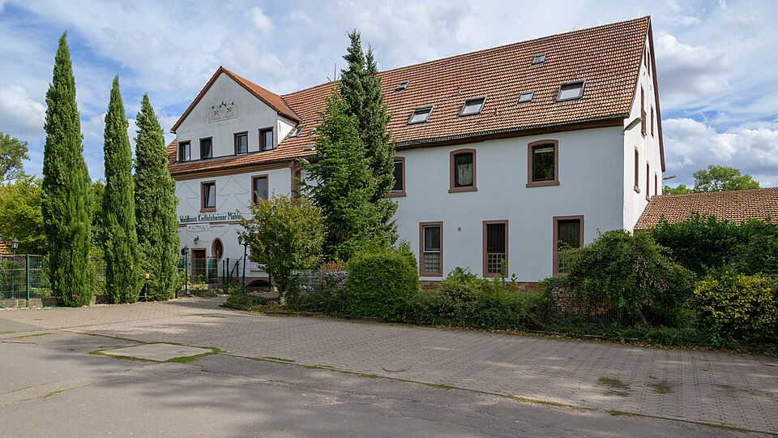
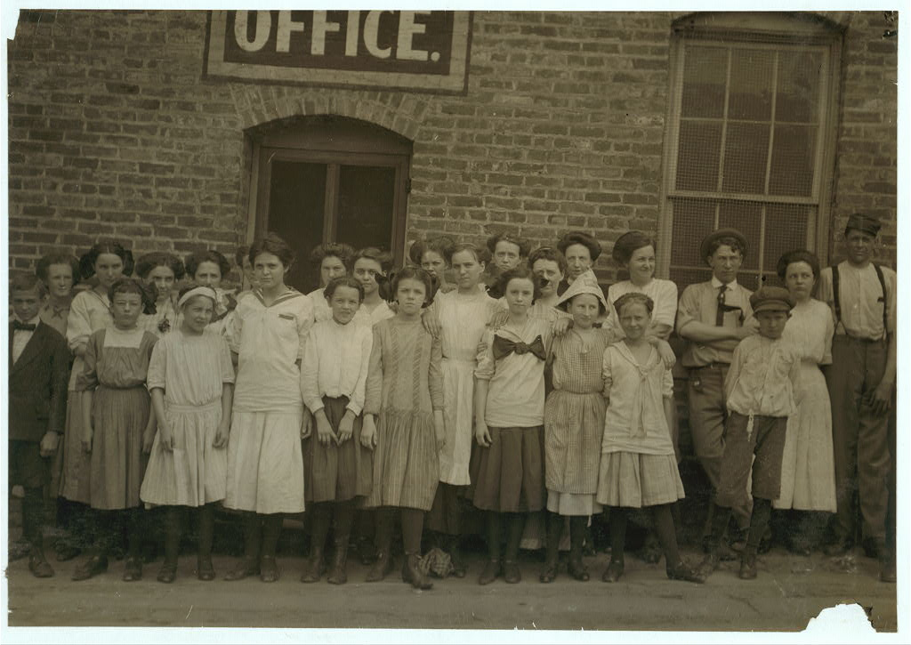
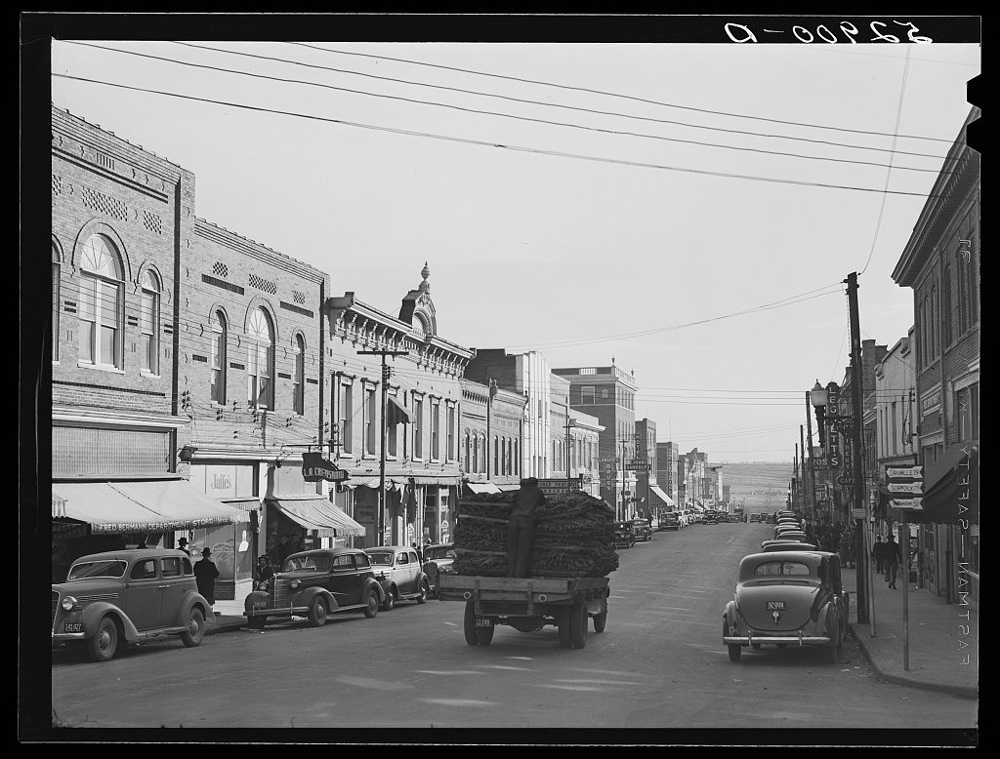
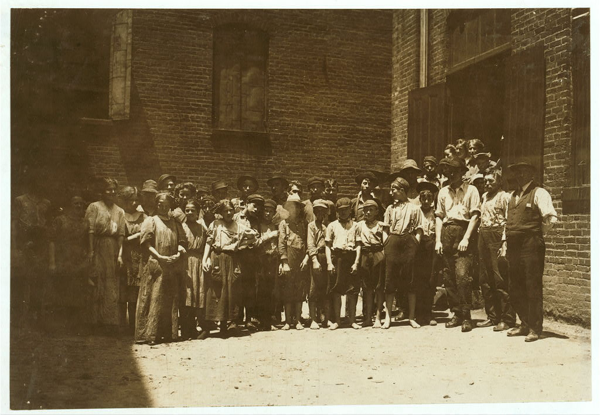
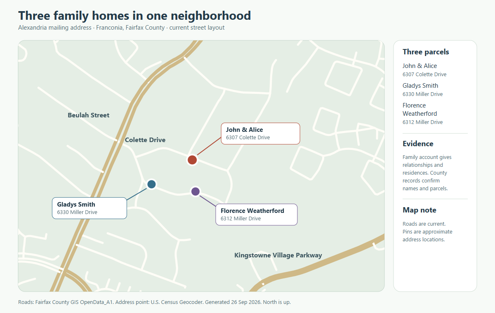
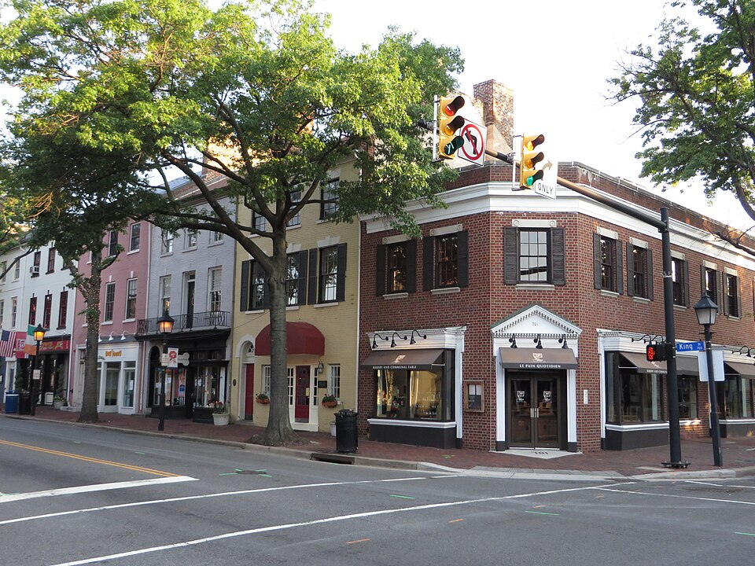

# Picture guide

The place and period illustrations below are **not portraits**, property deeds, or evidence that an ancestor visited the exact camera location. Local copies are included for a durable view; each original and credit is linked.

## Family-supplied originals

- [Cordaro family portrait](../sources/family/cordaro-family-portrait-unidentified.jpg): Justin identifies the group as Cordaros and estimates the 1930s. A visual review leans toward the **1920s**, with a broad **c. 1915–1935** range and low confidence. The six people, place and exact date are unknown. See the [passport and photo note](../branches/cordaro-passport-lead.md) before identifying anyone in the image.
- [Sutera passport page](../sources/family/italian-passport-details.jpg) and [cover](../sources/family/italian-passport-cover.jpg): photographs of a family-held Italian passport with a provisional Cordaro Onofrio reading. Its bearer has not yet been tied by records to a named Kramer grandmother.

## A Navy scene from Garnett Sr.'s era

An [official U.S. Navy photograph, 80-G-343608](https://www.ibiblio.org/hyperwar/OnlineLibrary/photos/images/g340000/g343608c.htm), shows **USS Wileman** crew members hearing of Japan's acceptance of surrender terms around **15 August 1945**, photographed by Naval Air Station Ebeye, Kwajalein. Garnett's [obituary](https://www.washingtonpost.com/archive/local/2007/07/03/obituaries/43ba782a-181c-4c59-a78e-7d361d86bf4a/) establishes only that he served in the **Navy in the Pacific during WWII**. **No one in this picture is identified as Garnett, and there is no evidence he served aboard USS Wileman.** The image illustrates his service era, not his ship or experience. Credit: Department of the Navy / National Archives, 80-G-343608; official U.S. Navy photograph.

### Leads for photographs of relatives

- **Garnett Sr.:** No publicly indexed, identified service portrait turned up in this pass. The [Naval History and Heritage Command photo guide](https://www.history.navy.mil/our-collections/photography.html) says its main collection generally lacks individual enlisted-sailor and boot-camp portraits; it points to the **National Museum of the American Sailor**, Navy cruise books, and National Archives military personnel photographs. His service file or a family discharge paper naming a ship, unit, or training company would make those searches specific.
- **Garnett Jr., possible yearbook lead:** [Hayfield Secondary School's 1972 yearbook, page 258](https://www.e-yearbook.com/yearbooks/Hayfield_Secondary_School_Harvester_Yearbook/1972/Page_258.html) indexes a “Garnett Weatherford.” The name alone does **not** prove it is John's brother; the site also restricts image copying, so no page is reproduced here.
- **Hilda Kramer Wolosz:** Her [obituary](https://www.legacy.com/us/obituaries/citizensvoice/name/hilda-wolosz-obituary?id=7822560) says she graduated **G.A.R. Memorial High School in 1940**. The [1940 Garchive yearbook](https://www.e-yearbook.com/yearbooks/G_A_R_Memorial_High_School_Garchive_Yearbook/1940/Page_5.html) is a place to check for her portrait, but no page or image has yet been confirmed as hers. The yearbook site's reproduction rules apply.

If family albums supply a named original photograph, add its date, photographer or owner when known, and the identifying evidence beside it.

## Wilkes-Barre, Pennsylvania

For **Berwick**, where Paul Miller's family lived, the [Berwick Historical Society's wartime history](https://berwickhistoricalsociety.org/Local%2BHistory-13.htm) includes a photograph of the **American Car & Foundry Stuart tank assembly line**. Its [local history collection](https://berwickhistoricalsociety.org/Local%2BHistory-13.htm) is a place to explore the town shown in Paulene Miller Beach's [memoir](https://bhaven.org/paulene/category/marqueen-kitta). The photo is linked rather than copied because reuse rights are not stated; **no Miller is identified as an ACF worker or as a person in it**. The memoir page's small generic image is not an identified portrait of Paulene or her relatives. A named family album photo, school yearbook or obituary portrait remains the best lead for actual ancestors.

Public Square looking toward East Market Street, circa 1930–1945. [Boston Public Library Tichnor Brothers postcard via Wikimedia Commons](https://commons.wikimedia.org/wiki/File:Public_Square_looking_towards_East_Market_Street,_Wilkes-Barre,_Pa_(78881).jpg); public domain in the United States. It depicts the city around the time of some later Kramer generations, not their house. For flood-era comparison, see [Wilkes University's historic before/after photographs](https://www.wilkes.edu/academics/library/agnes-flood-walking-tour/main-street.aspx).

## Knittelsheim, Palatinate

Former Knittelsheim mill, photographed **2 September 2026** by **Achim Lammerts**. [Original and credit](https://commons.wikimedia.org/wiki/File:2026-09-02_Knittelsheimer_M%C3%BChle_(Z5-10899E)_by_Achim_Lammerts.jpg) · [CC BY-SA 4.0](https://creativecommons.org/licenses/by-sa/4.0/). This is a modern view of a former mill site, **not proof that the pictured structure is unchanged from Johann Ludwig Disqué's time**. The [Palatinate mill history](https://www.eberhard-ref.net/pf%C3%A4lzisches-m%C3%BChlenlexikon/pf%C3%A4lzische-m%C3%BChlen-u-m%C3%BChlorte/kleinottweiler-kusel/) describes the historical operation. The [Geiselberger mill locality](https://www.pfalz.de/de/kulinarik-in-waldfischbach-burgalben) has a modern image of the Schaaf-associated place.

## Danville, Virginia

For the Weatherfords' **earlier Danville chapter**, Lewis Wickes Hine photographed workers at **Danville Knitting Works in June 1911**:

[Library of Congress original and caption](https://www.loc.gov/item/2018676502/) · National Child Labor Committee collection, LC-DIG-nclc-02173. The catalog says **no known restrictions on publication**; this local JPG is the LOC's large service image, unaltered. Hine reported seeing children working there. George Ira Weatherford's **1940 draft card says “Danville Knitting Mills,”** but the works/mills names have not been proved to refer to one company. This is a **1911 place and labor image**, decades before his recorded job; **no pictured person is identified as a relative**. The image belongs with the [family's Danville timeline](../branches/weatherford.md#garnetts-brother-george-a-second-transit-and-military-story).

### Halifax County tobacco town, 1939

[Marion Post Wolcott's November 1939 photograph](https://www.loc.gov/item/2017802158/) shows a tobacco-laden truck on the main street of **South Boston, Halifax County**. Library of Congress FSA/OWI negative **LC-USF34-052900-D**; the catalog lists **no known restrictions on publication**. The JPG is the archive's large service image, unaltered. This is the county where the earlier Samuel–Jane and probable Asa–Julia Weatherford households were recorded **decades earlier**; it is **not their town, property or lifetime**, and no photographed person is identified as family. It shows how tobacco still shaped a nearby market during Garnett Sr.'s youth in the wider Danville region.

### Danville textile workers, 1911

[Lewis Hine's June 1911 photograph](https://www.loc.gov/item/2018674865/) shows workers outside **Riverside Cotton Mills in Danville**. His original caption says the superintendent denied having workers younger than fourteen, while Hine wrote that he saw some. Library of Congress National Child Labor Committee image **LC-DIG-nclc-02166**; the catalog says **no known restrictions on publication**. This 1911 city scene predates the 1930 Weatherford household by nineteen years. **No pictured worker is identified as family, and Duffy's recorded 1930 job was building carpentry, not mill work.** The photograph shows an aspect of the regional labor setting, not the family's school attendance or employment.

## Alexandria region, Virginia

For the eighteenth-century setting, the [Virginia period-view gallery](../context/virginia-colonial-views.md) displays these archive images:

- **1755 Fry–Jefferson map**, [Library of Congress Geography and Map Division](https://www.loc.gov/item/74693089/), downloaded at 25% of the archive scan. The LOC item is free to reuse with no rights advisory. This is a regional map from **after** James Blevin's Goochland deeds, not a family parcel map.
- **1749 plan of Alexandria/Belhaven**, [Library of Congress Geography and Map Division](https://www.loc.gov/item/98687108/), downloaded at 25% of the archive scan. The LOC item is free to reuse with no rights advisory. It shows planned lots in the riverside town, not the family's later Fairfax homes.
- **Tuckahoe small outbuilding**, photographed **April 1936** by **Frances Benjamin Johnston**, Carnegie Survey of the Architecture of the South, [Library of Congress Prints and Photographs Division](https://www.loc.gov/item/2017890613/). LOC states **no known restrictions on publication**. The catalog calls this a small frame outbuilding with brick ends on the Tuckahoe property; its exact survival/alterations since the 1700s are unverified. It is an elite plantation scene, not a Blevin property.
- **Williamsburg etching**, [Library of Congress Prints and Photographs Division](https://www.loc.gov/item/2012649731/), LC-DIG-pga-13707. LOC dates the original **between 1740 and 1770**, attributes it only tentatively to John Bartram, and lists **no known publication restrictions**. The local JPG is the archive's 1024-pixel service image, unaltered. It depicts the colonial capital, not a Goochland or Blevin site.

These archive copies were downloaded without color changes or cropping. Their item pages supply the full-size originals and catalog descriptions.

The [neighborhood map](../maps/colette-neighborhood.svg) shows current Fairfax County roads and approximate markers for the **Colette Drive Weatherford home** and two **Miller Drive grandparents' homes**. It is generated from [Fairfax County GIS roads](https://services1.arcgis.com/ioennV6PpG5Xodq0/arcgis/rest/services/OpenData_A1/FeatureServer/0) and [Census Geocoder](https://geocoding.geo.census.gov/geocoder/) address points. [County historic aerials](https://www.fairfaxcounty.gov/maps/aerial-photography) can illustrate neighborhood change across decades.

700 block of King Street, Old Town Alexandria, photographed **23 June 2014** by **Ken Lund**. [Original and credit](https://commons.wikimedia.org/wiki/File:700_block_King_Street,_Old_Town_Alexandria,_Virginia_(14311112599).jpg) · [CC BY-SA 2.0](https://creativecommons.org/licenses/by-sa/2.0/). This depicts the independent city, **not the family's known Franconia neighborhood**. It remains a wider-region image only. For earlier local views use Fairfax County's [historic aerials](https://www.fairfaxcounty.gov/maps/aerial-photography).

For Garnett Weatherford Sr.'s bus-driving years, the City of Alexandria's [AB&W history shows a company bus in the 1960s](https://media.alexandriava.gov/docs-archives/historic/info/attic/2010/attic20101021bus.pdf). His [obituary](https://www.washingtonpost.com/archive/local/2007/07/03/obituaries/43ba782a-181c-4c59-a78e-7d361d86bf4a/) names AB&W and Metro as employers. The image is illustrative company equipment, not proof that it was his assigned vehicle.

For John and Alice's school-era surroundings, [FCPS's Hayfield Elementary history](https://hayfieldes.fcps.edu/about/history) includes period photographs of the school and 1970s construction. They illustrate how the area grew, but neither parent is identified in the photographs or known to have attended that elementary school. See the [Franconia period account](../context/franconia-growing-up.md).

The three place JPGs are reduced-size versions supplied by Wikimedia Commons. No additional cropping or color changes were made. The Navy JPG is the 740 × 610 online image supplied by the Navy's selected-image archive mirror.
