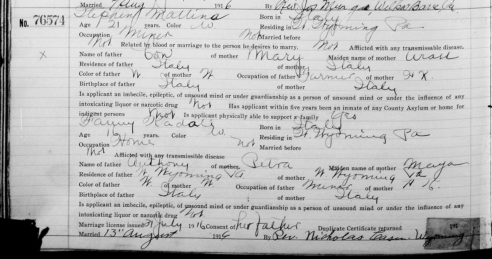
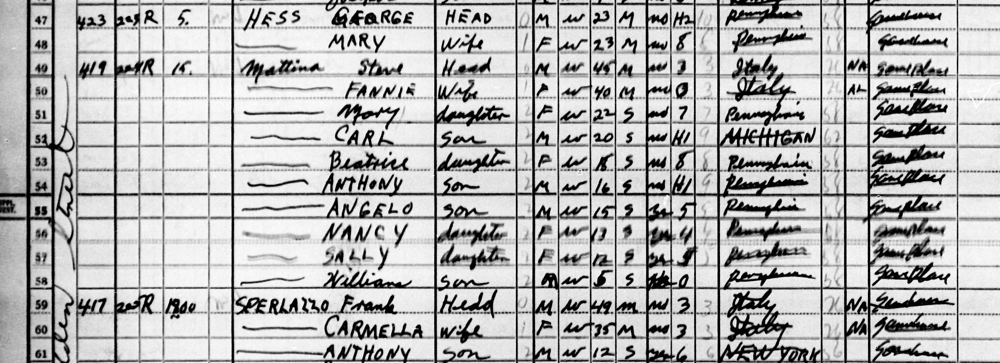
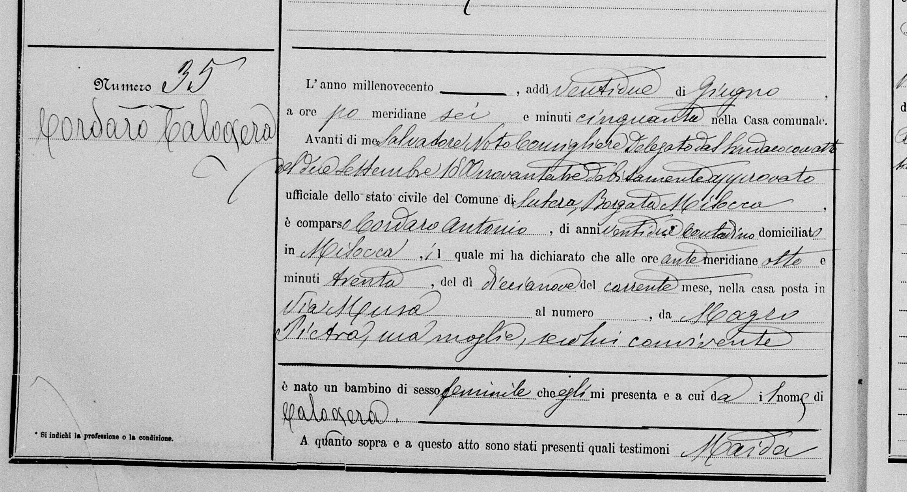
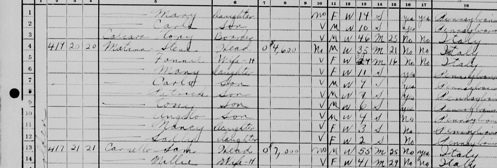
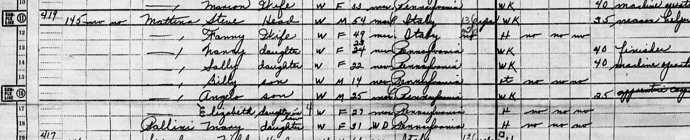
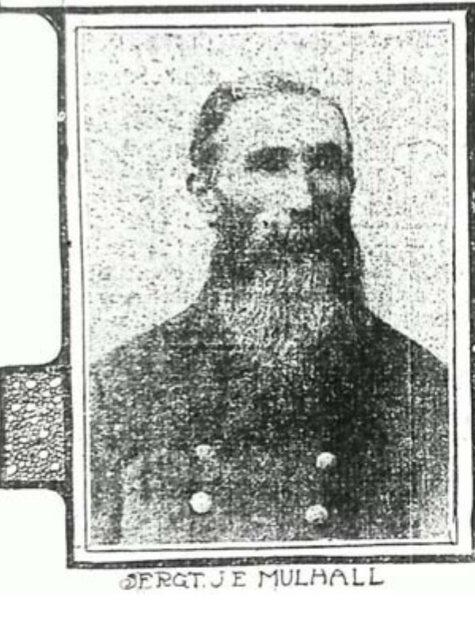
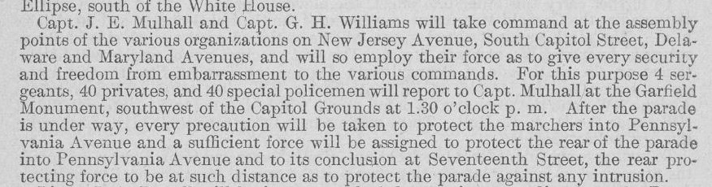

# Picture guide

The place and period illustrations below are **not portraits**, property deeds, or evidence that an ancestor visited the exact camera location. Local copies are included for a durable view; each original and credit is linked.

The [compact faces and places gallery](../context/faces-and-places.md) brings selected images from several branches together with short identification notes.

The [family-homes gallery](../context/family-homes.md) shows three **externally hosted, family-attributed** Sponenberg house photographs. John H. Harter III, Catherine Betty Sponenberg and cousin Susie C. are credited on the original pages; their photo dates and reuse rights are not stated, so the pictures are linked from their source rather than saved here. The gallery also links a modern street view for Edward and Jennie's documented address, without treating the pictured structure as their proven 1907 build.

## A mapped Bosch–Kramer house

- [Ashley Main Street in 1891](ashley-main-street-sanborn-1891.jpg): crop of the [Library of Congress Ashley Sanborn map](https://www.loc.gov/item/sanborn07504_002/), [full plate 3 saved](../sources/records/sanborn-ashley-main-street-1891-plate3.jpg). Emil Bosch's [1890–95 directory entries](https://www.myheritage.com/research/record-10705-189068458/emil-bosch-in-us-city-directories) place a meat market and his home at **52 Main**, but the map's numbering does **not** securely identify his building. This is **street context**, not his proven shop. Sanborn Map Company; Library of Congress Geography and Map Division, public domain.
- [363 Park Avenue in 1910](park-avenue-1910-sanborn-detail.jpg): crop of the [Library of Congress Sanborn map, Wilkes-Barre volume 2, plate 36](https://www.loc.gov/resource/g3824wm.g3824wm_g08049191002/?sp=39), saved [in full](../sources/records/sanborn-wilkes-barre-park-1910-plate36.jpg). The map labels a **separate dwelling at 363** next to Holy Rosary church, and the [1910 Bosch/Kramer census](../sources/records/emil-hilda-bosch-kramer-household-census-1910.jpg) names that address. This is the house's mapped footprint, **not its exterior photograph or deed**.
- [363 Park Avenue in the revision through February 1950](park-avenue-1950-sanborn-detail.jpg): crop of [plate 36 of the later map](https://www.loc.gov/resource/g3824wm.g3824wm_g08049195002/?sp=41), saved [at 45% resolution](../sources/records/sanborn-wilkes-barre-park-1950-plate36.jpg). It still labels a dwelling at 363 and a rear structure. The matching number does not prove an unchanged building or later Bosch/Kramer occupancy. Sanborn Map Company; Library of Congress Geography and Map Division, public domain. [Side-by-side interpretation](../context/family-home-photo-atlas.md#363-park-avenue-a-mapped-house-beside-holy-rosary).

## A Raber family location

- [Wapwallopen powder-works ruins, published spring 1992](wapwallopen-powder-works-ruins-1992-report.png): full page 7 from the [Pennsylvania Geological Survey's *Pennsylvania Geology* report](https://elibrary.dcnr.pa.gov/PDFProvider.ashx?PromptToSave=False&Size=1455572&ViewerMode=2&action=PDFStream&chksum=&docID=1741563&docName=v23n1&nativeExt=pdf&overlay=0&revision=0#page=9). The image shows a surviving sulfur-house wall; its caption also mentions debris likely left by Tropical Storm Agnes in 1972. Photograph credit **Jon D. Inners**; the publication allows reprinting articles with credit. The 1910 census identifies William A. Raber's occupation only as **laborer at a powder works** in Luzerne County, so this image depicts an **unconfirmed possible worksite**, never an identified workplace or ancestor's house.
- [Topton Lutheran Home, Old Main, photographed 8 April 2017](topton-lutheran-home-old-main-2017.jpg): **Smallbones**, [Wikimedia Commons item](https://commons.wikimedia.org/wiki/File:Lutheran_Home_Topton_PA_nrhp.jpg), **CC0 1.0**. It depicts the historic institution building many decades after **Carl, Geraldine and John Raber** were listed there in the [1940 census](../sources/records/raber-children-topton-census-1940.jpg). It does not show the children or prove that every part of the building looked the same in 1940.
- [1940 census detail](raber-children-topton-census-detail.jpg): crop of [National Archives full page](../sources/records/raber-children-topton-census-1940.jpg), lines **76–78**, preserving the three names, ages, earlier Nescopeck residence and **education columns**. All three are marked attending school; highest grades completed are **Carl second, Geraldine first, John second**. The original federal census page is public domain. [What another child remembered about Topton school days](../branches/raber-kreischer-balliet-record-trail.md#193550-three-raber-children-and-the-parent-bridge) comes from a separate memoir, not these children.

## Our parents' and our own era

- [RIT campus plan, 17 July 1986](rit-campus-plan-1986.jpg): unmodified 1,364 × 1,081 JPG from [RIT *News & Events* via Wikimedia Commons](https://commons.wikimedia.org/wiki/File:Campus_plan,_RIT_NandE_Vol17Num19_1986_Jul17_Complete.jpg); Commons marks the U.S. publication public domain for its missing notice/registration. It shows the campus around Paul Kramer's **family-reported** study period, not his enrollment or route through it.
- [Burruss Hall at Virginia Tech, June 2007](virginia-tech-burruss-hall-2007.jpg): unmodified 2,400 × 2,432 photograph by **EpicV27**, [CC BY-SA 4.0](https://creativecommons.org/licenses/by-sa/4.0/), via its [Commons item](https://commons.wikimedia.org/wiki/File:Burruss_Hall_Virginia_Tech.jpg). This is a place view from before Ashley's family-reported attendance, not a photograph of her or a record of her classes.
- [Washington Navy Yard aerial](washington-navy-yard-aerial-1980-2006.jpg): existing [Library of Congress item](https://www.loc.gov/item/2011634490/) for John and Alice Weatherford's **family-reported** workplace. Neither is identified in the image. [Recent-generation reading view](../context/recent-generations.md).

## Census details

- [West Wyoming neighborhood aerial, 26 June 1950](west-wyoming-neighborhood-aerial-1950.jpg): a straight 2,000 × 2,000 pixel detail from a [USDA Farm Service Agency aerial tile](https://www.pasda.psu.edu/pennpilot/era1950/luzerne_1950/luzerne_1950_photos_tif/luzerne_062650_arb_1f_11.tif.zip), via Penn State PennPilot. The [larger complete frame](../sources/records/pennpilot-west-wyoming-aerial-1950.jpg) is a resized local copy of that tile. Its archival footprint intersects today's 438 Holden point, but the detail has no street numbers and does **not** identify a particular family house. The photo is an actual period neighborhood view, not an image of a known Cordaro dwelling.

- [438 Holden, 1920](cordaro-household-1920-detail.jpg): straight crop of the public-domain [1920 West Wyoming census](../sources/records/antonio-pietra-cordaro-household-census-1920.jpg), ED 215, sheet 9A, lines 35–46. Shows the Anthony/Pietra household, reported mortgage-free ownership, and address; consult the full image for occupation columns.
- [438 Holden, 1930](cordaro-household-1930-detail.jpg): straight crop of the public-domain [1930 West Wyoming census](../sources/records/antonio-pietra-cordaro-household-census-1930.jpg), ED 40-220, sheet 1B, lines 73–77. Shows Anthony/Beatrice, Joseph/Carmella/John, and reported $2,000 home value; consult the full image for occupation columns.
- [438/440 Holden census detail](cordaro-holden-1940-census-detail.jpg): straight crop of the public-domain [1940 federal census, ED 40-277, sheet 15A](../sources/records/joseph-dina-cordaro-census-1940.jpg), lines 11–14. It makes the adjacent Cordaro household names, house numbers and housing entries legible; it omits the sheet's street label and the occupation/wage columns. [House story and caveats](../branches/cordaro-passport-lead.md#holden-street-across-three-census-years).

## Family-supplied originals

- [Cordaro family portrait](../sources/family/cordaro-family-portrait-unidentified.jpg): Justin identifies the group as Cordaros and estimates the 1930s. A visual review leans toward the **1920s**, with a broad **c. 1915–1935** range and low confidence. The six people, place and exact date are unknown. See the [passport and photo note](../branches/cordaro-passport-lead.md) before identifying anyone in the image.
- [Sutera passport page](../sources/family/italian-passport-details.jpg) and [cover](../sources/family/italian-passport-cover.jpg): photographs of a family-held Italian passport with a provisional Cordaro Onofrio reading. [Field-by-field English translation](../sources/family/italian-passport-translation.md). Its bearer has not yet been tied by records to a named Kramer grandmother.
- [Mounted soldier portrait attributed to Legrant Sponenberg](../sources/family/legrant-sponenberg-mounted-portrait-attributed.jpg): a Berwick studio portrait [shared by a family contributor](https://jowest.net/Genealogy/John/Christian/LegrantSponenbergCivilWar.htm). The rider is identified by that contributor, not by a visible name on the image. A [family Bible](../sources/records/hannah-sponenberg-family-bible-births.jpg) and [original cavalry roll](../sources/records/legrant-sponenberg-16th-cavalry-register-1862.jpg) separately support Legrant's kinship and service; they do not authenticate the likeness.

## Technical training in Ferdinand Louis's era

The [Wikimedia Commons file page](https://commons.wikimedia.org/wiki/File:Amazing_Stories_v01_n01_front_cover_National_Radio_Institute.jpg) identifies this as the **inside front cover of *Amazing Stories*, April 1926, volume 1, number 1**. Commons contributor **AdamBMorgan** extracted and cropped it from the digitized issue; the advertisement's original creator is unknown. Commons marks the U.S. publication **public domain in the United States**. The local JPG is the Commons 1,200 × 1,650 file, unaltered here. Its coupon offers NRI training **at home**, so the institute's Washington, D.C. address in [Ferdinand Louis Kramer's obituary](../sources/records/ferdinand-louis-kramer-obituary-1976.jpg) does not establish that he attended in person. His course and dates are unknown. Its weekly-pay figures are sales claims, **not his wages**.

## A Navy scene from Garnett Sr.'s era

An [official U.S. Navy photograph, 80-G-343608](https://www.ibiblio.org/hyperwar/OnlineLibrary/photos/images/g340000/g343608c.htm), shows **USS Wileman** crew members hearing of Japan's acceptance of surrender terms around **15 August 1945**, photographed by Naval Air Station Ebeye, Kwajalein. Garnett's [obituary](https://www.washingtonpost.com/archive/local/2007/07/03/obituaries/43ba782a-181c-4c59-a78e-7d361d86bf4a/) establishes only that he served in the **Navy in the Pacific during WWII**. **No one in this picture is identified as Garnett, and there is no evidence he served aboard USS Wileman.** The image illustrates his service era, not his ship or experience. Credit: Department of the Navy / National Archives, 80-G-343608; official U.S. Navy photograph.

### Leads for photographs of relatives

- **Garnett Sr.:** No publicly indexed, identified service portrait turned up in this pass. The [Naval History and Heritage Command photo guide](https://www.history.navy.mil/our-collections/photography.html) says its main collection generally lacks individual enlisted-sailor and boot-camp portraits; it points to the **National Museum of the American Sailor**, Navy cruise books, and National Archives military personnel photographs. His service file or a family discharge paper naming a ship, unit, or training company would make those searches specific.
- **Garnett Jr., possible yearbook lead:** [Hayfield Secondary School's 1972 yearbook, page 258](https://www.e-yearbook.com/yearbooks/Hayfield_Secondary_School_Harvester_Yearbook/1972/Page_258.html) indexes a “Garnett Weatherford.” The name alone does **not** prove it is John's brother; the site also restricts image copying, so no page is reproduced here.
- **Hilda Kramer Wolosz:** Her [obituary](https://www.legacy.com/us/obituaries/citizensvoice/name/hilda-wolosz-obituary?id=7822560) says she graduated **G.A.R. Memorial High School in 1940**. The [1940 Garchive yearbook](https://www.e-yearbook.com/yearbooks/G_A_R_Memorial_High_School_Garchive_Yearbook/1940/Page_5.html) is a place to check for her portrait, but no page or image has yet been confirmed as hers. The yearbook site's reproduction rules apply.

If family albums supply a named original photograph, add its date, photographer or owner when known, and the identifying evidence beside it.

## Wilkes-Barre, Pennsylvania

For **Berwick**, where Paul Miller's family lived, the [Berwick Historical Society's wartime history](https://berwickhistoricalsociety.org/Local%2BHistory-13.htm) includes a photograph of the **American Car & Foundry Stuart tank assembly line**. Its [local history collection](https://berwickhistoricalsociety.org/Local%2BHistory-13.htm) is a place to explore the town shown in Paulene Miller Beach's [memoir](https://bhaven.org/paulene/category/marqueen-kitta). The photo is linked rather than copied because reuse rights are not stated; **no Miller is identified as an ACF worker or as a person in it**. The memoir page's small generic image is not an identified portrait of Paulene or her relatives. A named family album photo, school yearbook or obituary portrait remains the best lead for actual ancestors.

Public Square looking toward East Market Street, circa 1930–1945. [Boston Public Library Tichnor Brothers postcard via Wikimedia Commons](https://commons.wikimedia.org/wiki/File:Public_Square_looking_towards_East_Market_Street,_Wilkes-Barre,_Pa_(78881).jpg); public domain in the United States. It depicts the city around the time of some later Kramer generations, not their house. For flood-era comparison, see [Wilkes University's historic before/after photographs](https://www.wilkes.edu/academics/library/agnes-flood-walking-tour/main-street.aspx).

## Unadingen, Baden

[Rauenstein's original 2020 photograph](https://commons.wikimedia.org/wiki/File:Unadingen,_Kirche_St._Georg.jpg), [CC BY-SA 3.0](https://creativecommons.org/licenses/by-sa/3.0/), unmodified. The [village's church history](https://unadingen.de/kirche/) dates the tower roughly to the sixteenth century and the present nave to the 1930s. It shows a surviving piece of the village environment where the [Bernhard–Maria Huber Kramer household](../branches/kramer-unadingen-household.md) was recorded; it is **not a period portrait, identified family building, or evidence that the Pennsylvania Matthew came from here**. See also the [original 1812 register page](../sources/records/bernhard-kramer-baptism-1812.jpg).

## Knittelsheim, Palatinate

Former Knittelsheim mill, photographed **2 September 2026** by **Achim Lammerts**. [Original and credit](https://commons.wikimedia.org/wiki/File:2026-09-02_Knittelsheimer_M%C3%BChle_(Z5-10899E)_by_Achim_Lammerts.jpg) · [CC BY-SA 4.0](https://creativecommons.org/licenses/by-sa/4.0/). This is a modern view of a former mill site, **not proof that the pictured structure is unchanged from Johann Ludwig Disqué's time**. The [Palatinate mill history](https://www.eberhard-ref.net/pf%C3%A4lzisches-m%C3%BChlenlexikon/pf%C3%A4lzische-m%C3%BChlen-u-m%C3%BChlorte/kleinottweiler-kusel/) describes the historical operation. The [Geiselberger mill locality](https://www.pfalz.de/de/kulinarik-in-waldfischbach-burgalben) has a modern image of the Schaaf-associated place.

## Danville, Virginia

For the Weatherfords' **earlier Danville chapter**, Lewis Wickes Hine photographed workers at **Danville Knitting Works in June 1911**:

[Library of Congress original and caption](https://www.loc.gov/item/2018676502/) · National Child Labor Committee collection, LC-DIG-nclc-02173. The catalog says **no known restrictions on publication**; this local JPG is the LOC's large service image, unaltered. Hine reported seeing children working there. George Ira Weatherford's **1940 draft card says “Danville Knitting Mills,”** but the works/mills names have not been proved to refer to one company. This is a **1911 place and labor image**, decades before his recorded job; **no pictured person is identified as a relative**. The image belongs with the [family's Danville timeline](../branches/weatherford.md#garnetts-brother-george-a-second-transit-and-military-story).

### Halifax County tobacco town, 1939

[Marion Post Wolcott's November 1939 photograph](https://www.loc.gov/item/2017802158/) shows a tobacco-laden truck on the main street of **South Boston, Halifax County**. Library of Congress FSA/OWI negative **LC-USF34-052900-D**; the catalog lists **no known restrictions on publication**. The JPG is the archive's large service image, unaltered. This is the county where the earlier Samuel–Jane and probable Asa–Julia Weatherford households were recorded **decades earlier**; it is **not their town, property or lifetime**, and no photographed person is identified as family. It shows how tobacco still shaped a nearby market during Garnett Sr.'s youth in the wider Danville region.

### Danville textile workers, 1911

[Lewis Hine's June 1911 photograph](https://www.loc.gov/item/2018674865/) shows workers outside **Riverside Cotton Mills in Danville**. His original caption says the superintendent denied having workers younger than fourteen, while Hine wrote that he saw some. Library of Congress National Child Labor Committee image **LC-DIG-nclc-02166**; the catalog says **no known restrictions on publication**. This 1911 city scene predates the 1930 Weatherford household by nineteen years. **No pictured worker is identified as family, and Duffy's recorded 1930 job was building carpentry, not mill work.** The photograph shows an aspect of the regional labor setting, not the family's school attendance or employment.

## Alexandria region, Virginia

[Carol M. Highsmith's aerial photograph](https://www.loc.gov/item/2011634490/) shows the **Washington Navy Yard** sometime **between 1980 and 2006** (Library of Congress, **LC-DIG-highsm-16297**, large JPG). The LOC item reports **no known restrictions on publication**; the saved image is its unaltered large service JPG. Justin says **John Weatherford Sr. and Alice Smith Weatherford** both worked at the Yard for many years, with John handling IT equipment and Alice in administration. Their employment records and exact buildings have not been located, and neither person is identified in this scene. The broad catalog date cannot place the image in a particular year of their employment.

For the eighteenth-century setting, the [Virginia period-view gallery](../context/virginia-colonial-views.md) displays these archive images:

- **1755 Fry–Jefferson map**, [Library of Congress Geography and Map Division](https://www.loc.gov/item/74693089/), downloaded at 25% of the archive scan. The LOC item is free to reuse with no rights advisory. This is a regional map from **after** James Blevin's Goochland deeds, not a family parcel map.
- **1749 plan of Alexandria/Belhaven**, [Library of Congress Geography and Map Division](https://www.loc.gov/item/98687108/), downloaded at 25% of the archive scan. The LOC item is free to reuse with no rights advisory. It shows planned lots in the riverside town, not the family's later Fairfax homes.
- **Tuckahoe small outbuilding**, photographed **April 1936** by **Frances Benjamin Johnston**, Carnegie Survey of the Architecture of the South, [Library of Congress Prints and Photographs Division](https://www.loc.gov/item/2017890613/). LOC states **no known restrictions on publication**. The catalog calls this a small frame outbuilding with brick ends on the Tuckahoe property; its exact survival/alterations since the 1700s are unverified. It is an elite plantation scene, not a Blevin property.
- **Williamsburg etching**, [Library of Congress Prints and Photographs Division](https://www.loc.gov/item/2012649731/), LC-DIG-pga-13707. LOC dates the original **between 1740 and 1770**, attributes it only tentatively to John Bartram, and lists **no known publication restrictions**. The local JPG is the archive's 1024-pixel service image, unaltered. It depicts the colonial capital, not a Goochland or Blevin site.

These archive copies were downloaded without color changes or cropping. Their item pages supply the full-size originals and catalog descriptions.

The [neighborhood map](../maps/colette-neighborhood.svg) shows current Fairfax County roads and approximate markers for the **Colette Drive Weatherford home** and two **Miller Drive grandparents' homes**. It is generated from [Fairfax County GIS roads](https://services1.arcgis.com/ioennV6PpG5Xodq0/arcgis/rest/services/OpenData_A1/FeatureServer/0) and [Census Geocoder](https://geocoding.geo.census.gov/geocoder/) address points. [County historic aerials](https://www.fairfaxcounty.gov/maps/aerial-photography) can illustrate neighborhood change across decades.

700 block of King Street, Old Town Alexandria, photographed **23 June 2014** by **Ken Lund**. [Original and credit](https://commons.wikimedia.org/wiki/File:700_block_King_Street,_Old_Town_Alexandria,_Virginia_(14311112599).jpg) · [CC BY-SA 2.0](https://creativecommons.org/licenses/by-sa/2.0/). This depicts the independent city, **not the family's known Franconia neighborhood**. It remains a wider-region image only. For earlier local views use Fairfax County's [historic aerials](https://www.fairfaxcounty.gov/maps/aerial-photography).

For Garnett Weatherford Sr.'s bus-driving years, the City of Alexandria's [AB&W history shows a company bus in the 1960s](https://media.alexandriava.gov/docs-archives/historic/info/attic/2010/attic20101021bus.pdf). His [obituary](https://www.washingtonpost.com/archive/local/2007/07/03/obituaries/43ba782a-181c-4c59-a78e-7d361d86bf4a/) names AB&W and Metro as employers. The image is illustrative company equipment, not proof that it was his assigned vehicle.

For John and Alice's school-era surroundings, [FCPS's Hayfield Elementary history](https://hayfieldes.fcps.edu/about/history) includes period photographs of the school and 1970s construction. They illustrate how the area grew, but neither parent is identified in the photographs or known to have attended that elementary school. See the [Franconia period account](../context/franconia-growing-up.md).

This is a **crop of an 1896 Berwick map**, not a photograph or proof Emma occupied the building that year. Her [1901 directory entry](../sources/records/sponenberg-berwick-directory-1901-p169.jpg) later gives **211 W. Front**. [Saved full plate](../sources/records/sanborn-berwick-west-front-1896-plate4.jpg) · [Library of Congress original](https://www.loc.gov/resource/g3824bm.g3824bm_g075271896/?sp=4). Sanborn Map Company / Library of Congress Geography and Map Division, public domain. [Address interpretation](../context/family-homes.md#emma-hartman-sponenberg-a-mapped-west-front-address).

The three other place JPGs are reduced-size versions supplied by Wikimedia Commons. No additional cropping or color changes were made. The Navy JPG is the 740 × 610 online image supplied by the Navy's selected-image archive mirror.

The displayed detail is cropped from the [unaltered 1916 Luzerne County marriage docket](../sources/records/stephen-mattina-fanny-cordaro-marriage-1916.jpg), no. 76574, [FamilySearch image](https://www.familysearch.org/ark:/61903/3:1:33SQ-GPT9-9WJK?view=index&personArk=%2Fark%3A%2F61903%2F1%3A1%3AKHF2-FBB&action=view&lang=en). It shows the couple and Fanny's parents; it is a record image, not a portrait.

This is a reading crop of the [unaltered 1940 census page](../sources/records/steve-fannie-mattina-household-census-1940.jpg), ED 40-277, sheet 13B, lines 49–58, [FamilySearch image](https://www.familysearch.org/ark:/61903/3:1:3QS7-L9MT-TPTS?view=index&personArk=%2Fark%3A%2F61903%2F1%3A1%3AKQ7W-KSD&action=view&lang=en). It lists the family and number **419**; the preceding 13A sheet writes Holden Street for the numbered run. Crops do not replace the full original pages.

This crop of the [unaltered Italian act](../sources/records/calogera-cordaro-birth-1900.jpg) shows Antonio Cordaro and Pietra Magro naming daughter Calogera. It says she was born **19 June 1900** and the act was made **22 June**. [FamilySearch original](https://www.familysearch.org/ark:/61903/3:1:3QSQ-G9MX-C4Q8?view=index&personArk=%2Fark%3A%2F61903%2F1%3A1%3AXQ75-4C2V&action=view&lang=en); the crop changes framing only.

This reading crop comes from the [unaltered 1930 census](../sources/records/steve-fannie-mattina-household-census-1930.jpg), ED 40-220, sheet 2A, lines 4–12. It includes **417 Holden**, the owned-home mark and the reported **$4,600** value. [Original viewer](https://www.familysearch.org/ark:/61903/3:1:33SQ-GRZN-QLM?view=index&personArk=%2Fark%3A%2F61903%2F1%3A1%3AXH74-DZC&action=view&lang=en).

This reading crop comes from the [unaltered 1950 census](../sources/records/steve-fannie-mattina-household-census-1950.jpg), ED 40-443, sheet 17, lines 11–18. It includes **419 Holden** and the listed family; the full sheet supplies the occupation columns. [Original viewer](https://www.familysearch.org/ark:/61903/3:1:3QHN-PQHW-FCH3?view=index&personArk=%2Fark%3A%2F61903%2F1%3A1%3A6XBR-KPZN&action=view&lang=en).

## A Washington Mulhall portrait and a Senate order

This is only the **labeled portrait** from the public-domain **12 November 1905 *Evening Star*** police profile, accessed through [Sandra K. Schmidt's 2010 transcription and illustration compilation, PDF p. 42](https://bytesofhistory.com/MPDC/Histories/MPD_History-1905ES.pdf#page=42). The modern compilation itself carries a copyright notice, so its full page and transcription are linked, not reproduced here. The crop retains the original name label and does not identify the 1850 child James on its own. [Evidence and open family link](../branches/smith-mulhall-corbett.md#a-possible-older-brother-in-uniform).

This reading crop comes from [Senate Document No. 1 (1913), p. 5](https://www.govinfo.gov/content/pkg/SERIALSET-06507_00_00-002-0001-0000/pdf/SERIALSET-06507_00_00-002-0001-0000.pdf#page=5); [the full government page](../sources/records/james-e-mulhall-suffrage-police-order-1913.jpg) is saved separately. It identifies an assignment for the suffrage procession, not what Mulhall personally did there. U.S. government publication, public domain.
