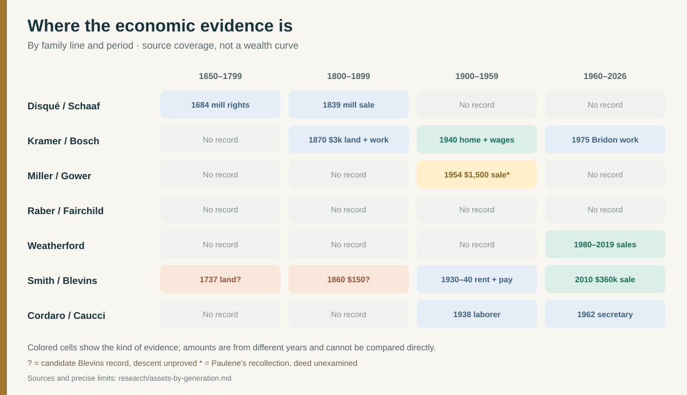

# Assets and work by generation

**Purpose:** track what a source actually records as the generations change. A land area, mill lease, wage, sale price and tax assessment measure different things; they cannot be joined into one family-wealth curve. Blank periods mean **no usable record found**, not poverty. Dollars are nominal amounts from their own years. [Interactive family timeline](../explore/timeline.html) · [Full economic timeline](../timeline.md).

| Line and generation | Dated evidence | What it establishes | Transfer or wealth question |
| --- | --- | --- | --- |
| **Disqué/Schaaf · Bernhard, late 1600s** | A [miller-family history](https://www.eberhard-ref.net/pf%C3%A4lzisches-m%C3%BChlenlexikon/pf%C3%A4lzische-m%C3%BCllerfamilien/litera-d/) quotes Bernhard's **1684** offer to rebuild a ruined mill for temporary relief from water dues. | Access to a mill site and negotiated operating terms. | No capital, income, land title or inheritance amount. |
| **Disqué/Schaaf · Sebastian and later millers, 1700s–1847** | The family history reports **three hereditary mill leases** for Sebastian; [Knittelsheim history](https://www.eberhard-ref.net/pf%C3%A4lzisches-m%C3%BChlenlexikon/pf%C3%A4lzische-m%C3%BChlen-u-m%C3%BChlorte/kleinottweiler-kusel/) quotes a **1768 annual water rent of 14 Malter of grain** and a **1788 inventory** of Johann Ludwig's owned mill, fields and meadows, a **1839 brother-to-brother sale**, and an **1847 estate auction notice** for Sigmund's grain/oil/gypsum mill and hemp machine. | Productive assets and succession across named people. The estate was described as indivisible; the historian says the auction apparently did not complete then. | Sebastian's leases and Johann Ludwig's owned mill are different rights. No sale price, debt balance or connection to Pennsylvania Magdalena has been proved. The 1788 book and 1847 notice need original inspection. |
| **Disqué · widow Magdalena Fröhlich, 1864** | [Palatinate migration card](https://migration.pfalzgeschichte.de/person/98001) says she emigrated with four children after her husband's death. | A household move; **no asset value**. | A local emigration permission or property inventory could reveal what the household held or sold. Her connection to Justin's chart Magdalena is unresolved. |
| **Kramer/Bosch · Martin/Matthew, 1870–1904** | The [1870 original census](../sources/records/kramer-martin-lena-census-1870.jpg) gives Martin Cramer, mason, **$3,000 real estate and $700 personal estate**. The [1880 sheet](../sources/records/kramer-martin-lena-census-1880.jpg) calls him a rope-factory worker; the [1900 sheet](../sources/records/kramer-matthew-lena-census-1900.jpg) marks Matthew and Lena's home **owned free of mortgage**. [Directories](https://pagenweb.org/~luzerne/towns/donnacd.htm) add later rope work and women's jobs. | A dated census valuation, occupations, and a later housing-tenure report. The Martin/Matthew identity match is strong but not final. [Record trail](../branches/kramer-martin-migration.md). | The $3,700 is **reported asset values, not net worth**; debts, later value, deeds, estate, and transfer to Ferdinand are unknown. |
| **Kramer/Bosch · Ferdinand (c. 1882), 1940** | [Original census](https://catalog.archives.gov/medialz/census-1940/T627/PA/m-t0627-03563/m-t0627-03563-00103.jpg): owned home estimated **$2,400**; **$1,996** in 1939 wages as wire-rope foreman. Resident son Emil reported **$1,234** wages. | One unusually concrete home and work snapshot. | Debt, other assets, title transfer and later proceeds unknown. Do not add household wages into net worth. |
| **Kramer/Bosch · Ferdinand Louis (1913) and Emil (1915), 1940–1975** | Emil's [draft card](../sources/records/emil-carl-kramer-draft-registration-1940.jpg) names American Chain & Cable; the [1950 census](https://1950census.archives.gov/iiif/2/1950census%2F43290879-Pennsylvania%2F43290879-Pennsylvania-135713%2F43290879-Pennsylvania-135713-0005.jpg/full/full/0/default.jpg) records Ferdinand Louis as a rope-machine operator. Their [obituary clippings](../sources/records/README.md) report long ACCO careers. | Occupation and employer continuity across brothers, with obituary-reported duration. | No later pay, pension or property values yet. |
| **Miller/Gower/Reese · Amos and Mary, before 1954** | [Paulene's memoir](https://bhaven.org/paulene/life-journey) says Amos built the Berwick homestead and Lester's family cared for Mary there. The [1940 census index](https://www.myheritage.com/research/record-10053-108307645/marqueen-miller-in-1940-united-states-federal-census) independently places Amos, Mary, Lester, Velma and Marqueen in one household. | Three-generation residence is supported; house construction and title remain recollections. | Deed, owner shares and mortgage unknown. The census index says **1912 Fairview Avenue**; Paulene remembered **1908**, so the address needs an original-sheet check. |
| **Miller/Gower/Reese · Lester and Mabel/Pearl, 1940s–1954** | Paulene recalls Mabel's cleaning/ironing pay and Lester's labor jobs; after Mary's death she reports a **$1,500 house sale** and no proceeds for Lester's household. [Memoir](https://bhaven.org/paulene/life-journey). | A strong research lead for work and a possible inheritance break. | Memoir alone cannot establish sale price, ownership, estate division or household wealth. Find the deed and estate. |
| **Raber/Kreisher/Fairchild · Sonya's line** | Justin's [family account](../branches/raber-kreisher-fairchild.md) names Shirley Kreisher Raber and a Fairchild mother. | Names and relationships to investigate. | **No dated asset or pay record** for this line. The Fairchild dairy in Paulene's memoir is not yet shown to belong to this family. |
| **Mulhall/Corbett · possible Smith ancestors, 1880–1920** | An [original 1880 DC census](../sources/records/mulhall-corbett-neighbor-households-census-1880.jpg) gives Ireland-born John Mulhall Sr. as a **gardener**, his DC-born son John T. as a **brass molder**, and nearby Ireland-born William Corbett as a **laborer**; William's daughter Maggie **worked in a store**. The son remained a [brass molder in 1900](../sources/records/mulhall-dc-household-census-1900.jpg) in a rented home and was a [District water-department foreman by 1910](../sources/records/mulhall-dc-household-census-1910.jpg). In [1920](../sources/records/mulhall-smith-household-census-1920-page1.jpg), he and Margaret **rented** with son-in-law Raymond Smith, an **optician**, his wife Alice and daughter Margaret B. | An occupation and co-residence sequence, with **no wage or property dollar amount**. The 1880 John-to-1900 John match is strong; the nearby Maggie-to-Margaret match is probable. The 1920 original directly joins Raymond to Alice's parents. | No earnings, tax assessment, lease, inheritance or proof the occupational change raised purchasing power. Ashley's connection through James Smith remains probable. [Evidence guide](../branches/smith-mulhall-corbett.md). |
| **Smith/Mulhall · Raymond and Alice, 1930–50** | The [1930 DC census](../sources/records/smith-dc-household-census-1930.jpg) reports Raymond as an **optician** and **$35.50 monthly rent**. The [1950 census](../sources/records/smith-dc-household-census-1950.jpg) again describes optician work, now in a retail eyeglass business. | A quoted housing cost and repeated occupation for the same candidate household. | No earnings, ownership of the optical business, or savings record; the 1930 rent is not a measure of wealth. The link between their son James and Ashley's grandfather still needs a parent-naming record. [Record trail](../branches/smith-dc-candidate.md). |
| **Weatherford · likely Asa/Julia household, 1860** | The [original Halifax census](https://www.familysearch.org/ark:/61903/3:1:33SQ-GBS6-94FN?view=index&personArk=%2Fark%3A%2F61903%2F1%3A1%3AM41H-SQF&action=view&cc=1473181&lang=en) calls indexed “Acy T” an **overseer** and lists **$300 personal estate**; real-estate value is blank. | A single occupation and asset-category snapshot for the household likely later indexed Asa/Julia. | Employer, wages, property title and net worth unknown; the identity and name variants need reconciliation. |
| **Weatherford · Duffy and Annie, 1930–40** | [1930](../sources/records/duffy-annie-weatherford-census-1930.jpg) and [1940](../sources/records/duffy-annie-weatherford-census-1940.jpg) original census sheets each report an **owned home valued at $1,000**. Duffy's work is **building carpenter** in 1930 and **city cleaner** in 1940; the latter reports **$1,078 wages in 1939**. | Two nominal home-value reports and two occupation snapshots across the Depression decade. | The same valuation does not prove the same parcel, constant buying power, steady earnings or no financial loss; there are no deeds, mortgages, tax records or continuous wages in this trail. |
| **Morrison · Thomas and Isophena, probable earlier layer, 1900** | The [original Gibson County census](../sources/records/morrison-gibson-census-1900-candidate.jpg) calls Thomas a **farmer** and marks the farm **owned with a mortgage**. | Tenure and work for a household that is **probably**, but not yet proved to be, Roscoe's maternal-grandparent household. | No dollar value, acreage, mortgage balance, later transfer or certified grandparent link. Do not compare this farm directly with Roscoe's 1940 rent as a family loss. |
| **Morrison/Hollinger · Roscoe and Eleanor, 1940–50** | The [1940 Arlington census](../sources/records/morrison-household-census-1940.jpg) lists Roscoe in sheet-metal work and **$15 monthly rent**. After his [1947 death](../sources/records/roscoe-gordon-morrison-death-1947.jpg), the [1950 Fairfax census](../sources/records/morrison-household-census-1950.jpg) lists Eleanor as widowed household head with seven children; her fields read **“washes clothes” / “family work.”** Son Edwin, 18, is a construction carpenter's helper; son Paul, 15, is a grocery clerk. | Rent, widowhood, and jobs of two sons are documented; the records do not measure total assets. | No wage, insurance, estate, debt, inheritance or proof that Eleanor's laundry field meant paid employment. [Family story and dates](../branches/morrison-hollinger.md). |
| **Weatherford/Morrison · Garnett and Florence, 1980–2019** | [Fairfax parcel history](../branches/weatherford-smith.md#the-two-earlier-homes) records a **$104,500 purchase** in 1980 and **$645,000 sale** in 2019; Garnett's [obituary](https://www.washingtonpost.com/archive/local/2007/07/03/obituaries/43ba782a-181c-4c59-a78e-7d361d86bf4a/) reports bus work. | Two nominal transactions for one property and a reported occupation. | No mortgage, maintenance, equity, sale costs or inheritance data; price difference is **not profit**. |
| **Smith/Blevins/Hines · older Virginia leads, 1737–1860** | A James Blevin received [400](https://lva.primo.exlibrisgroup.com/discovery/fulldisplay?docid=alma990007249560205756&context=L&vid=01LVA_INST:01LVA&lang=en) and [295](https://lva.primo.exlibrisgroup.com/discovery/fulldisplay?docid=alma990007249570205756&context=L&vid=01LVA_INST:01LVA&lang=en) acre grants in 1737. An [1860 Daniel Blevins household transcription](https://www.newrivernotes.com/alleghany-county-federal-census-1860/) lists **$150 personal property** and no real-estate value. | Historical land and census amounts for **candidate Blevins people**. | Neither man's descent connection to Ashley is proved; acreage is not a monetary value. Keep these outside her confirmed wealth line. |
| **Hines · Mary's Bristol childhood, 1920–30** | The [1920 Hines household](../sources/records/hines-bristol-census-1920.jpg) rented; its John was a railroad-yard machinist. The [1930 sheet](../sources/records/hines-bristol-census-1930.jpg) records the family at **912 Cumberland** in an **owned home valued at $4,000**. The [1930–31 directory](../sources/records/hines-bristol-directory-1930-31.png) independently places John, wife Nora J., and candy-packer Elizabeth there. | A change in **reported housing tenure** and one census home-value estimate for the household strongly tied to Mary E. Hines. | The 1920 address is not matched to the 1930 one; the record does not give purchase price, mortgage, equity or inherited wealth. The 1930 wife-name conflict remains. |
| **Smith/Blevins/Hines · Gladys's parents, 1940** | [Original Johnson City census](../sources/records/blevins-household-census-1940.jpg), lines 32–38: **W. Howard Blevins**, varnish sprayer in furniture manufacturing, reported **52 weeks worked and $1,000 wages in 1939**. The family rented for **$12 a month** in April 1940. | A documented job, prior-year wage figure and current monthly rent for the household in which young Gladys lived. | No savings, debts, other earnings or later housing value; this is not a wealth estimate or a measured trend. |
| **Smith/Blevins · Gladys and James's Fairfax home, 1960–2010** | [County parcel history](../branches/weatherford-smith.md#the-two-earlier-homes) dates the house to 1960 and records a **$360,000 sale** by named heirs in 2010. | A property sale tied to the Smith address; Alice and Jane used it as a home address. | Purchase cost, mortgage, the puzzling 1990 title entry and heirs' distribution need deeds and probate. |
| **Smith/Weatherford · John and Alice, 1993–2026** | [County record](../branches/weatherford-smith.md#one-property-across-time) gives a **$255,000 purchase** in 1993; [selected assessments](../maps/colette-assessments.svg) reach **$850,640 in 2026**. | Nominal transaction and county estimates for one house. | Assessments are not cash, equity, income or total wealth. |
| **Cordaro/Caucci · Antonio to Patricia, 1900s–1962** | Antonio's [1921 declaration](../sources/records/antonio-cordaro-declaration-1921.jpg) and [1927 petition](../sources/records/antonio-cordaro-petition-1927.jpg) call him a **miner** in West Wyoming; [Joseph's 1938 application](../sources/records/cordaro-caucci-marriage-1938.jpg) calls him a **laborer**; [Patricia's 1962 form](../branches/cordaro-passport-lead.md) calls her a **secretary**. | A direct occupation sequence across three generations. The 1899 banns call Antonio a *contadino* (farm worker) in Sicily. | The mine, employer, wages, property, passport bearer's identity and any asset transfers are not established. These jobs do not establish a wealth trend. |

**What one household budget suggests:** Howard Blevins's $12 monthly rent in April 1940 equals **$144 for twelve months**, or **14.4% of his reported $1,000 wages for 1939**, *if* that rent continued all year. This is a narrow, illustrative housing-cost ratio: the two observations are from different years, and the census does not supply the family's full income, other expenses, debts or savings. The $35.50 DC rent for Raymond Smith in 1930 has no corresponding wage figure, so no comparable burden can be calculated. Different cities and years also make the dollar rents alone a poor measure of relative comfort.

## Turning points to test

| Event | What happened | What might explain it, and the limit |
| --- | --- | --- |
| **Disqué migration, 1864** | The [institute card](https://migration.pfalzgeschichte.de/person/98001) describes widow Magdalena Fröhlich Disque and four children leaving for the United States after Johann Ludwig's death. | The husband died in **1853**, so widowhood is a circumstance, not a proven immediate trigger eleven years later. A [regional historical exhibition](https://www.auswanderung-rlp.de/ziele-der-auswanderung/auswanderung-nach-nordamerika/ausstellung-zur-auswanderung-2010.html) documents an **1864–1873** migration peak amid population growth, subdivided farms, crowded trades and earlier crop/price crises. These are plausible pressures, not this household's stated reason. |
| **Miller homestead, 1954** | Mary died and the home was reportedly sold. | Paulene gives the sale and exclusion account; a deed and estate file can test who owned what and where proceeds went. |
| **Kramer workplace, 1972–1975** | [Bridon bought ACCO rope assets](https://publications.gc.ca/collections/collection_2019/isde-ised/RG54-1-4-eng.pdf); Ferdinand Louis's obituary reports later Bridon work. | The corporate event helps explain his employer-name change, but it is not proof of a wage or asset change. |
| **Weatherford transit work, 1973** | [Metro acquired AB&W](https://www.wmata.com/about/history/upload/history.pdf) as Metrobus formed. | This likely explains the two employer names in Garnett's obituary, pending personnel dates. |

**Best next records:** the Palatinate emigration-permission file and any attached asset statement; **Knittelsheim's 1788 property book** (the mill history also lists Landesarchiv Speyer `F2 260/261/262/265/266` as 1788 tax books; the exact volume containing Johann Ludwig’s entry needs checking), **1839 sale deed** and **1847 estate/auction file**; Amos/Mary Miller estate and 1954 deed; older Ferdinand's probate and 146 Prospect deed; Fairfax parcel deeds and estate records. A [regional history of nineteenth-century emigration procedure](https://www.auswanderung-rlp.de/ziele-der-auswanderung/auswanderung-nach-nordamerika/ausstellung-zur-auswanderung-2010.html) explains why an asset statement may exist in a lawful departure file. Its existence for **this** Disqué household is unverified.
