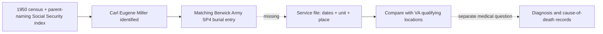

# Carl Miller: what the Agent Orange story can support

**Current finding (27 September 2026): Carl's family identity is established; his individual exposure remains unverified.** A [Social Security application/death index](https://www.familysearch.org/ark:/61903/1:1:6K9G-Y87C?lang=en) names **Carl Eugene Miller**, born **17 February 1948** in Berwick, son of **Lester E. Miller and Velma P. Wilson**, and reports death **12 February 2001**. The [original 1950 Berwick census, sheets 15–16](../sources/records/README.md), places **Carl E., 2**, with Lester, Velma and the siblings named in the family account. These records directly resolve *which Carl* Paulene meant. Her [memoir](https://bhaven.org/paulene/life-journey) says he served in Vietnam, “contracted agent orange,” and died after a heart attack at work. A [veterans' burial index](https://www.interment.net/united-states/pennsylvania/veterans-burials/records.php?page=1482) lists a matching **Carl E. Miller, 1948–2001, U.S. Army SP4, Vietnam**, buried at Roselawn in Berwick. The military entry is now a **very strong match**, but it itself lacks parents, unit, station and deployment dates. No service or medical record checked here establishes his individual exposure or diagnosis.

**Family cross-check, still short of a deployment record:** a [1998 family calendar](https://bhaven.org/uploads/3/4/0/3/34038663/vol4sec1.pdf#page=4) gives Carl's **17 February birthday**, matching the federal record; a [2008 remembrance of Pearl Miller](https://bhaven.org/uploads/3/4/0/3/34038663/vol14sec2.pdf#page=1) explicitly calls Carl **her son** and recalls his playing in the family band with Lester and Fred. Paulene also remembers Carl attending a Vietnam friend's funeral shortly before his own death. That friendship memory is evidence of what relatives remembered, not a deployment itinerary.

**Death-date discrepancy:** the [Social Security Death Index](https://www.familysearch.org/ark:/61903/1:1:J2MT-DJW?lang=en) also says **12 February 2001**; a [Find A Grave derivative index](https://www.familysearch.org/ark:/61903/1:1:QVK4-XMNV?lang=en) says **18 February** and misplaces Berwick's Roselawn Cemetery in Missouri. Prefer the two federal indexes provisionally, but inspect an original death certificate or obituary before treating the exact day as final.

**The location comparison cannot yet be made:** the family account says *Vietnam* and the likely burial match is tagged *Vietnam*, but neither names a province, base, unit, ship or dates in country. The [VA rule](https://www.publichealth.va.gov/exposures/agentorange/locations/vietnam.asp) covers qualifying service anywhere on Vietnam's land or inland waters during **9 January 1962–7 May 1975**, plus the defined offshore zone. Without Carl's assignment and dates, marking a spray location on a map would give false precision. A qualifying service finding would establish a **legal exposure presumption**, not prove that Carl personally handled the chemical or that it caused his death.

**Why a spray map cannot settle this yet:** The [National Archives herbicide file](https://www.archives.gov/research/military/vietnam-war/electronic-data-files) records U.S. spraying missions in **1965–71**. It records missions, **not the names or movements of every soldier**. We have no documented Carl Miller assignment to compare with it. Even if an eventual unit location overlaps a recorded mission, the overlap would need a date and place match and would not measure Carl's individual dose. Conversely, a missing spray mark would not rule out the [VA's broader location-based presumption](https://www.va.gov/disability/eligibility/hazardous-materials-exposure/agent-orange/). The burial listing's “Vietnam” label must first be checked against actual service papers; it may indicate an era of service rather than in-country duty.

**What a real location comparison would use:** NARA also describes a [Southeast Asia Friendly Forces file](https://www.archives.gov/research/military/vietnam-war/electronic-data-files) with U.S. maneuver-battalion locations for **1966–72**, and a **48-battalion tracking study** in III Corps for **1966–69** created in part for an Agent Orange exposure study. Neither is a roster of all personnel. Once Carl's **unit and duty dates** are documented, these datasets may narrow the unit's movements; only then would comparison to spray missions be meaningful. No public source found so far gives his unit, station or dates.

| Checkpoint | What is supported | Missing for the exposure test |
| --- | --- | --- |
| **Family and federal records, 1948–2008** | The 1950 census and parent-naming Social Security index establish **Carl Eugene Miller** as Lester and Velma's son; the family calendar matches his birthday. | An original military identifier and assignment record. |
| **Veteran listing, 2001 death** | A Berwick **Carl E. Miller** with matching years is indexed as an Army **SP4** with a **Vietnam** label: a very strong match to the identified son. | Whether that label means Vietnam-era or in-country service; unit, dates and stations. |
| **Spraying, 1965–71** | NARA preserves mission locations and dates. | Carl's verified movements to compare with them. No personal overlap calculation is possible yet. |
| **Medical question** | Paulene reports a fatal heart attack and attributes it to Agent Orange. | Medical diagnosis, death certificate and any VA decision; geography alone cannot determine his cause of death. |

| Question | What can be said now | What would settle it |
| --- | --- | --- |
| Is the burial-index veteran Paulene's brother? | The parent-naming federal record establishes **Carl Eugene Miller**, and matching name, town and years make the burial listing **very likely** his. The burial index itself gives no family relationship. | Cemetery file or original VA burial record naming full identity; obituary or death certificate can also resolve the death-day conflict. |
| Where did Carl serve? | The index says “Vietnam,” which could be a veteran-era label; it gives **no actual duty station**. No individual location can yet be compared with the NARA spray data. | DD-214, Official Military Personnel File (OMPF), assignment history, unit orders and deployment dates. |
| Was exposure presumed under VA rules? | **Possible if** his documented service meets a [VA qualifying location and date](https://www.publichealth.va.gov/exposures/agentorange/locations/). This is conditional, not a finding about Carl. | Compare his verified duty dates and locations with VA's current list; check any VA decision/claim file. |
| Did Agent Orange cause his reported heart attack? | **Cannot be concluded.** VA recognizes [ischemic heart disease](https://www.publichealth.va.gov/exposures/agentorange/conditions/ischemicheartdisease.asp) as associated with herbicide exposure for benefits, and a heart attack can result from that disease. A family description of a heart attack is neither a diagnosis of ischemic heart disease nor proof of its cause in one person. | Death certificate, contemporaneous medical diagnosis, and any VA claim decision; a clinician's review would be needed for an individual medical conclusion. |

**Where the rule applies:** VA currently presumes exposure for qualifying active service **on Vietnam land or inland waterways, or aboard a vessel within the defined 12-nautical-mile offshore zone, from 9 January 1962 through 7 May 1975**. Its [location guide](https://www.publichealth.va.gov/exposures/agentorange/locations/) also covers specified Korea DMZ units, Thailand bases, C-123 aircraft crews and certain other sites, each with its own criteria. A “Vietnam” line on a burial index alone does not establish that Carl met any one of them. A legal exposure presumption also does not measure an individual's dose or prove a unique medical cause.

**Best next records:** Request Carl Eugene Miller's **DD-214 and [OMPF through the National Archives](https://www.archives.gov/veterans/military-service-records/service-record)** for assignments and dates, and obtain the underlying cemetery/VA burial record to close the military identity match. Because likely discharge was less than 62 years ago, full personnel-file access is generally for the veteran or next of kin, including a child or sibling; a researcher may get only limited public information. An original death certificate would resolve the day and reported cause of death; any VA claim or rating letter would answer a separate benefits question. [NARA's OMPF guide](https://www.archives.gov/personnel-records-center/ompf-background) explains the types of service data a file may hold.
