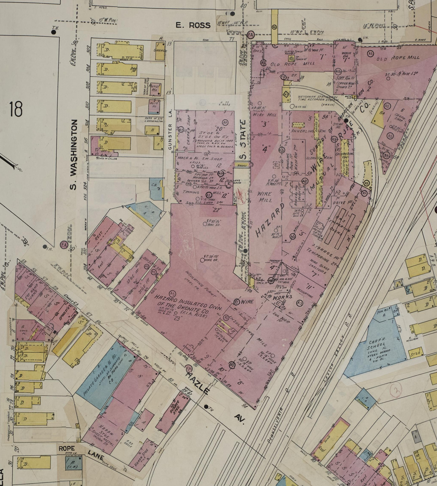
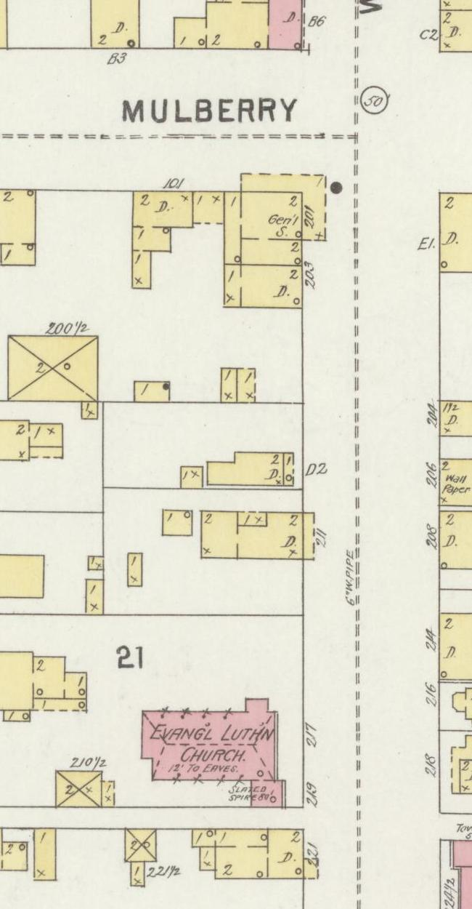
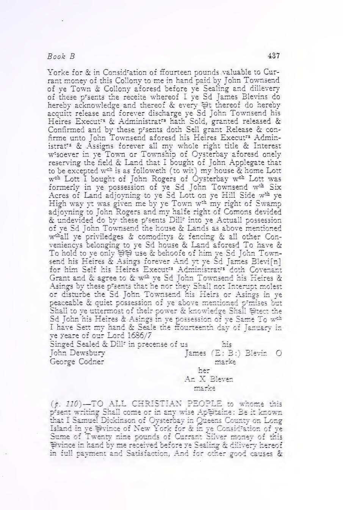
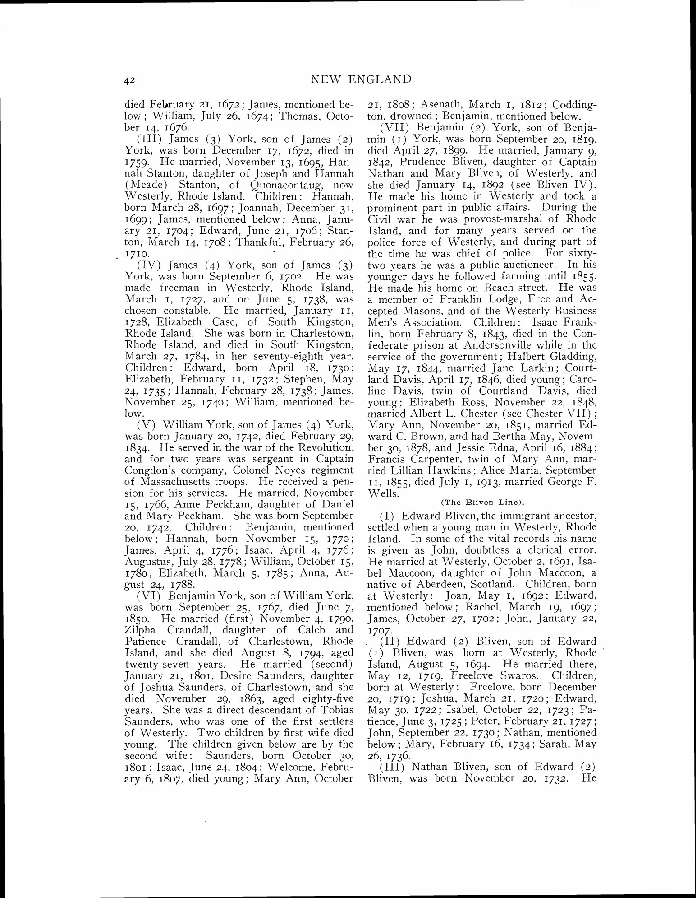
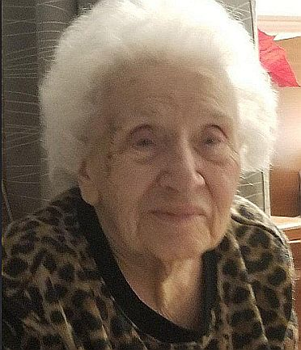

# Original images and identified family portrait

### Andrews, Kennedy, Ferdinand Louis and Mary Kramer, 1900–40

| Original image | Read this first |
| --- | --- |
| [1900 Kennedy census: sheet 22A](edward-mary-kennedy-census-1900-sheet-22a.jpg) · [sheet 22B](edward-mary-kennedy-census-1900-sheet-22b.jpg) · [FamilySearch first](https://www.familysearch.org/ark:/61903/3:1:S3HT-6LKH-Q45?view=index&personArk=%2Fark%3A%2F61903%2F1%3A1%3AM3QQ-MB7&action=view&lang=en) · [continuation](https://www.familysearch.org/ark:/61903/3:1:S3HT-6LKH-HNC?view=index&lang=en&groupId=M9LC-7XR) | **Parsons Borough, ED 101, sheets 22A–B, lines 46–55.** Ireland-born Edward and Mary Kennedy, eight children across the page break, and Edward's coal-mining job. Daughter Mary A. strongly fits later Mary Kennedy Andrews; her [death certificate](https://www.findagrave.com/memorial/126529268/mary-andrews/photo#view-photo=218591682) supplies the mother's **Durkin** surname. |
| [1909 Frank Andrew and Mary Kennedy marriage docket](frank-andrews-mary-kennedy-marriage-docket-1909.jpg) · [FamilySearch image 328](https://www.familysearch.org/ark:/61903/3:1:33S7-9PR3-24Q?view=index&personArk=%2Fark%3A%2F61903%2F1%3A1%3AKHFN-2FN&action=view&lang=en) | **Entry 54285, lower right.** A Parsons marriage, 29 December; Frank a laborer. The entry lacks parents and spells Andrew without final *s*. |
| [1910 Frank and Mary Andrews candidate census](frank-mary-andrews-census-1910-candidate.jpg) · [FamilySearch original](https://www.familysearch.org/ark:/61903/3:1:33SQ-GRKZ-N1V?view=index&personArk=%2Fark%3A%2F61903%2F1%3A1%3AMG4P-N3N&action=view&lang=en) | **ED 85, sheet 23A, lines 42–44.** Possible newlywed family with infant Anna; age/birthplace conflict means the identification remains a candidate. |
| [1920 Andrews census: sheet 3A](frank-andrews-family-census-1920-sheet-3a.jpg) · [sheet 3B](frank-andrews-family-census-1920-sheet-3b.jpg) · [FamilySearch first](https://www.familysearch.org/ark:/61903/3:1:33S7-9RXJ-D3X?view=index&personArk=%2Fark%3A%2F61903%2F1%3A1%3AM61T-QPX&action=view&lang=en) · [continuation](https://www.familysearch.org/ark:/61903/3:1:33SQ-GRXJ-D4L?view=index&personArk=%2Fark%3A%2F61903%2F1%3A1%3AM61T-QPJ&action=view&lang=en) | **Plains Township, ED 148, sheets 3A–3B, lines 50–56.** Frank is alone at the foot of the first page; Mary and five children continue on the next. This is one household, not two isolated records. [Visual](../../maps/andrews-1920-1930-household.svg). |
| [1929 Pennsylvania death-index page](mary-andrews-death-index-1929.png) · [state PDF, p. 33](https://www.phmc.state.pa.us/bah/dam/rg/di/r11_090_DeathIndexes/Death_1929/D-29%20A-B.pdf#page=33) · [certificate photographed on Find a Grave](https://www.findagrave.com/memorial/126529268/mary-andrews/photo#view-photo=218591682) · [original newspaper clipping](https://www.findagrave.com/memorial/126529268/mary-andrews/photo#view-photo=218591721) · [gravestone photo](https://www.findagrave.com/memorial/126529268/mary-andrews/photo#view-photo=97953087) | **Mary Andrews, Wilkes-Barre, 25 May 1929, certificate 58225.** The photographed certificate names **Edward Kennedy and Mary Durkin** as parents and **21 Flick** as home; the clipping repeats 21 and names her six children. The grave marker reads Mary **1887–1929**; the certificate says **1890/age 39** and the 1900 census **July 1886**. Upload rights for the three photos are unestablished; inspect them at the linked memorial. |
| [1930 Frank Andrews and six children census](frank-andrews-children-census-1930.jpg) · [FamilySearch original](https://www.familysearch.org/ark:/61903/3:1:33SQ-GRCJ-42Q?view=index&personArk=%2Fark%3A%2F61903%2F1%3A1%3AXH7Z-F3D&action=view&lang=en) | **ED 40-270, sheet 11A, lines 25–31.** At **71 Flick Street**, Mary and Rita are both Frank's daughters. Frank reported an owned $5,000 house and coal-mine pump-runner work. [Two-household visual](../../maps/andrews-flick-households.svg). |
| [Signed 1936 Luzerne marriage application and return](ferdinand-louis-kramer-mary-andrews-marriage-1936.jpg) · [FamilySearch image 910](https://www.familysearch.org/ark:/61903/3:1:33SQ-GPR7-9Q3P?lang=en) | **Right page, license 1451 C.** Ferdinand calls himself a machinist apprentice; Mary lived at **71 Flick Street**. Their parents are Ferdinand/Rose Bosch Kramer and Frank/Mary Kennedy Andrews. Frank signs consent; the return records **19 September**. The left page belongs to another couple. |
| [1940 census sheet 8B](ferdinand-mary-kramer-census-1940.jpg) · [NARA original](https://nara-1940-census.s3.us-east-2.amazonaws.com/population-schedules/pa/luzerne-county/ed/40-338/m-t0627-03564-00285.jpg) and [sheet 9A](ferdinand-mary-kramer-census-1940-continuation.jpg) · [NARA continuation](https://nara-1940-census.s3.us-east-2.amazonaws.com/population-schedules/pa/luzerne-county/ed/40-338/m-t0627-03564-00286.jpg) | **ED 40-338, lines 79–80 then 1–2.** At **19 Flick Street**, the couple rented for **$5/month**; son Ferdinand is recorded as **nine months**. The next line's “daughter” label for 17-year-old Rita Andrews conflicts with the 1930 record that lists Mary and Rita as Frank's daughters. These are original document images, not family photographs. |

### Prospect Street before the older Ferdinand's listed address

[Full 1910 plate 34](sanborn-wilkes-barre-prospect-1910-plate34.jpg) · [full 1950 revised plate 34](sanborn-wilkes-barre-prospect-1950-plate34.jpg) · [LOC 1910 scan](https://www.loc.gov/resource/g3824wm.g3824wm_g08049191002/?sp=37) · [LOC 1950 revision](https://www.loc.gov/resource/g3824wm.g3824wm_g08049195002/?sp=39) · [house research note](../../context/family-home-photo-atlas.md#a-street-before-the-kramer-house-number-appears). Sanborn Map Company, *Wilkes-Barre*, vol. 2; Library of Congress Geography and Map Division, public domain. The displayed details are cropped from the saved 50%-resolution plates. They show how the block was mapped before and during the [1914–51 Kramer address trail](../../branches/kramer.md), but do not identify a builder or date today's structure.

### The Hazard wire-rope works where Ferdinand Louis was employed

[Full plate 19](sanborn-hazard-wire-rope-1950-plate19.jpg) · [Library of Congress scan](https://www.loc.gov/resource/g3824wm.g3824wm_g08049195002/?sp=24) · [NRI and work evidence](../../context/education-across-generations.md#a-radio-lesson-by-mail). Sanborn Map Company, revised to February **1950**; Library of Congress Geography and Map Division, public domain. The saved scan maps Ferdinand Louis's **employer's works**, corroborated by his signed draft card, but does not place him in one particular building or connect his machine work to radio training. The displayed detail is a crop of the saved 50%-resolution plate.

### Emma Sponenberg's West Front block in 1896

[Full plate 4](sanborn-berwick-west-front-1896-plate4.jpg) · [Library of Congress original](https://www.loc.gov/resource/g3824bm.g3824bm_g075271896/?sp=4) · [1901 directory page naming Emma at 211](sponenberg-berwick-directory-1901-p169.jpg) · [house research note](../../context/family-homes.md#emma-hartman-sponenberg-a-mapped-west-front-address). The September **1896** map predates Emma's directory address; it shows a numbered **two-story dwelling footprint**, but neither resident nor owner. Sanborn Map Company / Library of Congress Geography and Map Division, public domain. The displayed detail is a crop of the saved 50%-resolution plate.

### Edward and Jennie Sponenberg's original census pages (saved 27 September 2026)

| Page | What to inspect |
| --- | --- |
| [1910 Salem Township, ED 115, sheet 4A](edward-jennie-sponenberg-census-1910.jpg) | Lines **40–43**: Edward, Jennie, Ray and Elsie. Edward was a **retail grocery salesman**. The home was **owned with a mortgage**, but no street name/number is written. The **308/309** figures are dwelling/family enumeration numbers. Downloaded original `004973746_01071.jpg`; host item link still needs recovery. |
| [1940 Salem Township/East Berwick, ED 40-252, sheet 4B](edward-jennie-sponenberg-census-1940.jpg) · [NARA original](https://catalog.archives.gov/medialz/census-1940/T627/PA/m-t0627-03560/m-t0627-03560-00233.jpg) | Lines **50–53**: Edward, Jennie, Ray and Dorothy at **505 E. Second Street**, the original page behind a previous census index. Downloaded original `m-t0627-03560-00233.jpg`; NARA image endpoint checked. [House and photo guide](../../context/family-homes.md). |

Both are unaltered federal census-page downloads. A census is strong for the address and the enumerator's recorded answers; it is not a deed or a photograph of the house.

### Raber, Kreischer and Balliet household trail (saved 27 September 2026)

These seven original census images were viewed in Justin's signed-in MyHeritage account and saved as unaltered document pages. The [source log V137–V144](../../research/sources.md) gives page, line, URL and interpretation. They are **not family portraits**.

| Line | Saved census pages | Main clue |
| --- | --- | --- |
| Raber | [William, Shirley and Sonya in 1950](william-shirley-sonya-raber-census-1950.jpg) · [William G. and Alice in 1950](william-alice-raber-census-1950.jpg) | Sonya is explicitly William John's daughter; the older household includes an Alice L. and a Houser brother-in-law. |
| Kreischer | [Elder and younger William in 1930](william-bertha-younger-william-kreischer-census-1930.jpg) · [William and Alethea in 1950](william-aletha-kreischer-census-1950.jpg) | A direct father–son household, then the younger William's matching later home. |
| Balliet | [Michael, Catherine and Nelson in 1870](michael-catherine-nelson-balliet-census-1870.jpg) · [Nelson, Amanda and Stanley in 1910](nelson-amanda-stanley-balliet-census-1910.jpg) · [Stanley and Crystal in 1930](stanley-crystal-balliet-census-1930.jpg) | Carpenter → lumber-woods workers → rented Dorrance household across three generations. |

**New original date check:** [Stanley Balliet's 1937 Pennsylvania death-index page](stanley-balliet-pa-death-index-1937-p144.png) is page **144** of the [State Archives A–B index](https://www.phmc.state.pa.us/bah/dam/rg/di/r11_090_DeathIndexes/Death_1937/D-37%20A-B.pdf#page=144). The line near the bottom reads **Nanticoke, 25 December 1937, certificate 117901**. This public index is an original state finding aid, not the death certificate: it does **not** state his cause of death or identify Floyd's father. [Read the household story](../../branches/balliet-raber-candidates.md#the-balliet-household-in-an-original-census).

**Three Raber children at Topton, 1940:** [Full original census page](raber-children-topton-census-1940.jpg) from the [National Archives image endpoint](https://catalog.archives.gov/medialz/census-1940/T627/PA/m-t0627-03433/m-t0627-03433-00783.jpg), Berks County, Longswamp Township, ED **9-96**, sheet **2B**, lines **76–78**. **Carl, Geraldine and John Raber** appear as guests of the **Lutheran Orphans' Home**, each with **Nescopeck** as 1935 residence. The [readable crop](../../media/raber-children-topton-census-detail.jpg) preserves their rows; the full page preserves the institution heading. The original was downloaded unaltered on **28 September 2026**. The [Topton alumni list](https://www.diakon.org/v3_assets/contentfiles/177/150th-anniversary/A%20Gift%20of%20Love%20-%20low%20res.pdf#page=239) supplies full names; it does not explain their admission. [Visual story](../../branches/raber-kreischer-balliet-record-trail.md#193550-three-raber-children-and-the-parent-bridge).

**Mary Raber, 1936 death-index lead:** [Rendered full index page](mary-raber-pa-death-index-1936-p56.png) from the [Pennsylvania State Archives 1936 R index, PDF p. 56](https://www.phmc.state.pa.us/bah/dam/rg/di/r11_090_DeathIndexes/Death_1936/D-36%20P-R.pdf#page=56). The line gives **Armstrong County, 11 November 1936, certificate 100192**. Geraldine's [1949 NUMIDENT index](https://www.familysearch.org/ark:/61903/1:1:6K9J-YVYX?lang=en) names **Mary Nolf** as her mother, and a member tree assigns the same death date to Mary Grace Nolf Raber. The death-index page itself does not join those identities or explain the children's Topton stay. Saved 28 September 2026 as a full-page rendering of the public archive PDF; [analysis and parent diagram](../../branches/raber-kreischer-balliet-record-trail.md#193550-three-raber-children-and-the-parent-bridge).

**Raber original census pages, 1930 and 1950:** [William G. and Mary R. in Mahoning Township in 1930](william-mary-raber-census-1930.jpg) · [FamilySearch viewer](https://www.familysearch.org/ark:/61903/3:1:33SQ-GRZ6-ZMW?view=index&personArk=%2Fark%3A%2F61903%2F1%3A1%3AXCZH-VWL&action=view&lang=en), ED **3-33**, sheet **16A**, lines **19–20**: a **$9/month rented home** and William's **railroad labor**; identity with the later William G. and Mary Nolf remains a candidate. [Carl and Edna with the Switzers in Shickshinny in 1950](carl-edna-raber-census-1950.jpg) · [FamilySearch viewer](https://www.familysearch.org/ark:/61903/3:1:3QHK-SQHW-FTM1?view=index&personArk=%2Fark%3A%2F61903%2F1%3A1%3A6XBR-XF3B&action=view&lang=en), ED **40-423**, sheet **9**, lines **8–12**: Carl was a coal-company laborer; his sampled line reports **$1,200 wages in 1949**. Both full original pages were downloaded unaltered from signed-in FamilySearch on **28 September 2026**. Neither names a street or house number. [Story and visual](../../branches/raber-kreischer-balliet-record-trail.md#193550-three-raber-children-and-the-parent-bridge).

**Harry S. Raber, 1909 birth index:** [Saved full printed page 2830](harry-raber-birth-index-1909-p2830.png) from the [Pennsylvania State Archives 1909 R birth-index PDF, page 4](https://www.phmc.state.pa.us/bah/dam/rg/di/r11_089_BirthIndexes/Birth_1909/R.PDF#page=4). The entry reads **Raber, Harry S.; Shadel M; Nescopeck Township; 30 June 1909; certificate 83128**. This 28 September 2026 image is an unaltered full-page rendering of the state index PDF (not Harry's birth certificate), which does not print his father's name. [Household and uncertainty](../../branches/raber-shadle-household.md).

**Older William A. and Mary R. Raber, 1930:** [Saved original census sheet 17A](william-mary-shadle-raber-census-1930.jpg) · [FamilySearch viewer](https://www.familysearch.org/ark:/61903/3:1:33S7-9RZ6-C6C?view=index&personArk=%2Fark%3A%2F61903%2F1%3A1%3AXCZH-24Q&action=view&lang=en), Armstrong County ED **3-33**, lines **32–43**. William reported **truck driver at a powder works**, a **$12/month rented home**, and a radio. Ten children were in this home. The image was downloaded unaltered from signed-in FamilySearch on **28 September 2026**. No company, street number, house photo or wage follows from the sheet. [Older household story](../../branches/raber-shadle-household.md).

**William and Mary Raber with eight children, 1920:** [Saved original census sheet 9B](william-mary-raber-household-census-1920.jpg) · [FamilySearch viewer](https://www.familysearch.org/ark:/61903/3:1:33SQ-GRFQ-NRR?view=index&personArk=%2Fark%3A%2F61903%2F1%3A1%3AM6TF-DC9&action=view&lang=en), Armstrong County, Mahoning Township, ED **36**, lines **83–92**. Original handwriting reads **Raber** rather than the sites' indexed **Rober**, names wife Mary and eight children, and records William as **laborer at a powder works**. The nine-year-old son's given name appears approximately **“Glenore”**; the page does not give him a William first name. Downloaded unaltered from signed-in FamilySearch on **28 September 2026**. [Possible lineage and limit](../../branches/raber-shadle-household.md).

**William and Mary Raber with Stirling and Harry, 1910:** [Saved original census sheet 17A](william-mary-raber-household-census-1910.jpg) · [FamilySearch viewer](https://www.familysearch.org/ark:/61903/3:1:33SQ-GRN1-FHR?view=index&personArk=%2Fark%3A%2F61903%2F1%3A1%3AMGD6-1YL&action=view&lang=en), Luzerne County, Nescopeck Township, ED **81**, lines **1–4**. William reported **laborer at a powder works**; the household reported an **owned, mortgage-free farm** with schedule number **9**, without acreage or value. Wife Mary's maternity columns appear to record **three children born, two living**, an unnamed earlier loss to check in vital or church records. Downloaded unaltered from signed-in FamilySearch on **28 September 2026**. [Household analysis](../../branches/raber-shadle-household.md).

[Read the illustrated record trail](../../branches/raber-kreischer-balliet-record-trail.md).

These are saved copies for reading alongside the [interactive timeline](../../explore/timeline.html). The original source link and the limit of each identification stay with the image. A record image depicts a document, **not** the person named in it.

### Northeast Blevin research leads

The [public 1916 Oyster Bay town-record scan](https://archive.org/details/oysterbaytownrec01coxj), vol. 1, supplies five saved **printed-page** images: [1678 land record pp. 114](james-bleving-oyster-bay-land-1678-p114.jpg) and [115](james-bleving-oyster-bay-land-1678-p115.jpg) (PDF 132–33); [1683 country-rate list p. 691](james-bleving-oyster-bay-estate-list-1683-p691.jpg) (PDF 709); [1686/7 sailor deed pp. 436](james-blevin-oyster-bay-deed-1687-p436.jpg) and [437](james-blevin-oyster-bay-deed-1687-p437.jpg) (PDF 454–55). The deed calls James a sailor, names wife An and excepts Applegate land from a £14 sale. These are **published transcriptions, not original manuscript images or portraits**; neither the move to Westerly nor Ashley's descent is proved. [Evidence guide](../../branches/blevins-rhode-island-lead.md).

[LOC public scan, PDF p. 56](https://tile.loc.gov/storage-services/master/gdc/gdcebookspublic/17/00/38/95/17003895/17003895.pdf#page=56) · William R. Cutter, *New England Families* (1915), printed p. 42. The saved full-page scan is a **published retrospective family profile** naming Edward Bliven, Isabel Maccoon and a 1691 Westerly marriage. It is **not** a portrait, marriage original, immigrant manifest, or proved ancestor of Ashley. [Evidence and missing bridges](../../branches/blevins-rhode-island-lead.md).

| Year | Image | What to look for |
| --- | --- | --- |
| **1850–70, Daniel Blevins household** | [1850 Ashe census](daniel-elizabeth-blevins-census-1850.jpg) · [1860 Alleghany p. 85](daniel-elizabeth-blevins-census-1860-page85.jpg) and [continuation p. 86](daniel-elizabeth-blevins-census-1860-page86.jpg) · [1870 Alleghany census](daniel-elizabeth-blevins-census-1870.jpg) · [FamilySearch 1850 viewer](https://www.familysearch.org/ark:/61903/3:1:S3HY-6QB3-SBM?view=index&personArk=%2Fark%3A%2F61903%2F1%3A1%3AM4BQ-XPM&action=view&lang=en) | Shubel is **6 in 1850** and **12 on the 1860 continuation** of Daniel and Elizabeth's household; the ages conflict. Daniel is listed as a farmer, with **$600 real estate** in 1850, **$150 personal estate** and a blank real-estate cell in 1860, then **$200 real estate** in a matching 1870 household. These are different nominal census fields, not a wealth trajectory. [Analysis](../../branches/blevins-deep-lineage.md#daniels-farm-household-and-adas-kin). |
| **1880, Shubal and Ada Blevins** | [Original Piney Creek census](shubal-ada-blevins-census-1880.jpg) · [FamilySearch viewer](https://www.familysearch.org/ark:/61903/3:1:33SQ-GYBJ-9V8H?view=index&personArk=%2Fark%3A%2F61903%2F1%3A1%3AMC6H-RQK&action=view&cc=1417683&lang=en) | Five named children, including **William J.**, plus Shubal's labeled **mother-in-law Mary Thompson** and **brother-in-law Wiley Thompson**. The initial conflicts with the later William Elkanah record; Roby's reported age predates the couple's marriage. [Analysis](../../branches/blevins-deep-lineage.md#daniels-farm-household-and-adas-kin). |
| **1906, Ada Blevins application 4129** | [Number card](ada-blevins-application-4129-index.jpg) · [cover](ada-blevins-application-4129-cover.jpg) · [pages 1](ada-blevins-application-4129-page1.jpg), [2](ada-blevins-application-4129-page2.jpg), [3](ada-blevins-application-4129-page3.jpg) · [court note](ada-blevins-application-4129-court-note.jpg) · [Internet Archive reel 43](https://archive.org/details/easterncherokeea043unit/page/n685/mode/1up) | NARA M1104, original handwritten application; saved JPEGs extracted from the public PDF scan. Ada names her parents and six siblings and makes an older ancestry claim. **The claim is not proof of Indigenous ancestry or enrollment.** No clear final decision was read. [Analysis](../../branches/blevins-deep-lineage.md#ada-names-her-family-in-1906). |
| **1954, Elizabeth Blevins Hodge** | [Original North Carolina death certificate](elizabeth-blevins-hodge-death-1954.jpg) · [FamilySearch viewer](https://www.familysearch.org/ark:/61903/3:1:3Q9M-C95R-DHNJ-4?view=index&personArk=%2Fark%3A%2F61903%2F1%3A1%3AFPZS-FPV&action=view&lang=en) | Names parents **Daniel Blevins and Elizabeth Brackins**. Her reported 1853 birth fits the younger Elizabeth in Daniel's 1860 household, but this is a later informant report. [Analysis](../../branches/blevins-deep-lineage.md#daniels-farm-household-and-adas-kin). |
| **1812, Bernhard's parents** | [Original Unadingen birth-register spread](bernhard-kramer-baptism-1812.jpg) · [Staatsarchiv Freiburg image 7](https://www.landesarchiv-bw.de/plink/?f=5-477660-7) | Upper right, **15 August**: Bernardus/Bernhard Kramer, parents **Blasius Kramer and Agathe Huber**. The [FamilySearch index](https://www.familysearch.org/ark:/61903/1:1:QBGX-G5PZ?lang=en) misreads *Kramer* as *Garner*. This proves the German parent pair, **not** the still-open Pennsylvania identity. [Household](../../branches/kramer-unadingen-household.md). |
| **1839, Unadingen marriage** | [Bernhard Kramer and Marie Huber register spread](bernhard-kramer-maria-huber-marriage-1839.jpg) · [Staatsarchiv Freiburg image 19](https://www.landesarchiv-bw.de/plink/?f=5-477661-19) | Entry 6 near the lower right directly pairs them; the page closes **8 August 1839**. These are the parents of the candidate Matthäus born in 1840, **not yet proved** parents of the Pennsylvania Matthew. [Comparison](../../branches/kramer-baden-candidate.md). |
| **1827, canal contractor lead** | [Pennsylvania Canal Commissioners' original printed table, p. 98](daniel-sponenberg-canal-report-1827-113.jpg) · [full report, PDF p. 113](https://upload.wikimedia.org/wikipedia/commons/f/f4/Report_of_the_Canal_Commissioners%2C_of_the_Commonwealth_of_Pennsylvania%2C_accompanied_with_documents_-_USACE-p16021coll5-37611.pdf#page=113) | The line marked successor to Andrew B. Mitchell names **Daniel Sponenberg** on the Susquehanna Division. This is a contemporary contractor sighting; identity with Shirley Raber's proposed ancestor and personal earnings remain unproved. [Analysis](../../branches/raber-kreisher-fairchild.md). |
| **1915, Sponenberg family biography** | [Printed page 807](edward-sponenberg-biography-1915-187.jpg) · [full county volume, PDF p. 187](https://jetty.klnpa.org/_flysystem/fedora/2023-11/historicalbiogra02chic.pdf#page=187) | Names **Edward J. Sponenberg**, wife Jennie Edora Mensinger, daughter **Aletha Fae**, father John L., and grandfather Daniel; reports foundry, purchasing and canal work and a 1907 Berwick home. This is a family/regional biography, retrospective for older generations. The 2018 obituary provides the later Aletha-to-Shirley bridge. [Analysis](../../branches/raber-kreisher-fairchild.md). |
| **1915, Philip Sponenberg family biography** | [Printed page 646](philip-sponenberg-biography-1915-p646.jpg) · [Wikisource scan page 766](https://en.wikisource.org/wiki/Page:Historical_and_Biographical_Annals_of_Columbia_and_Montour_Counties_(1915),_vol._1.djvu/766) | Names **George → Philip → Harry** on the possible neighborhood branch, and says Philip's unnamed grandfather migrated from Germany to Dauphin County. It **does not link George to Daniel**. Public-domain 1915 volume, digitized by Internet Archive and surfaced via Wikisource. [Analysis](../../branches/sponenberg-deep-dive.md). |
| **1915, James E. Sponenberg biography** | [Printed page 987](james-e-sponenberg-biography-1915-409.jpg) · [continuation page 988](james-e-sponenberg-biography-1915-410.jpg) · [full county PDF pp. 409–10](https://jetty.klnpa.org/_flysystem/fedora/2023-11/historicalbiogra02chic.pdf#page=409) | Philip's son describes a Briarcreek farming household and gives the family's occupations and church. The unnamed German great-grandfather is a **same-book retrospective claim** for the separate George–Philip branch, not Justin's confirmed immigrant. Public-domain 1915 volume, digitized by Internet Archive. [Analysis](../../branches/sponenberg-deep-dive.md). |
| **1915, William H. Kreischer biography** | [Printed page 1204](william-h-kreischer-biography-1915-656.jpg) · [continuation page 1205](william-h-kreischer-biography-1915-657.jpg) · [full county PDF pp. 656–57](https://jetty.klnpa.org/_flysystem/fedora/2023-11/historicalbiogra02chic.pdf#page=656) | The Berwick worker's profile names **John → Henry → William H. → infant William Henry**, and narrates farm/quarry, timber, railroad and car-works jobs. Identity of the 1909 child with Shirley's father **William H. Jr.** is strong but still needs a parent-naming original. Public-domain 1915 volume, digitized by Internet Archive. [Analysis](../../branches/raber-kreisher-fairchild.md#the-other-side-of-shirleys-grandparents-a-1915-kreischer-profile). |
| **1950, John and Ruth Fairchild** | [Original Berwick census](john-ruth-fairchild-household-census-1950.jpg) · [FamilySearch image](https://www.familysearch.org/ark:/61903/3:1:3QHJ-5QHW-X9V1-7?view=index&personArk=%2Fark%3A%2F61903%2F1%3A1%3A6XB5-JW4P&action=view&cc=4464515&lang=en) | ED **19-21**, sheet **71**, lines **27–29**: **John A.**, **Ruth** and daughter **Elizabeth** in Berwick. John's handwritten work entry reads approximately **“secretary / fieldman”** for **“Pa. Holstein Assn.”**; the image does not establish ownership of a dairy. FamilySearch viewer JPG downloaded **27 September 2026**; [Elizabeth's indexed Social Security record](https://www.familysearch.org/ark:/61903/1:1:6K9T-47TG?lang=en) gives Ruth's **Kreischer** surname. [Analysis](../../branches/raber-kreisher-fairchild.md#where-does-fairchild-belong). |
| **1901, Sponenbergs in Berwick and Briarcreek** | [Berwick page 169](sponenberg-berwick-directory-1901-p169.jpg) · [Briarcreek page 186](sponenberg-briarcreek-directory-1901-p186.jpg) · [directory key page 17](columbia-montour-directory-1901-key-p17.jpg) · [full public-domain directory](https://www.pagenealogy.net/e-texts/pdf/Columbia%20-%20Montour%20Counties%20Dir%20-%201901.pdf) | Edward is a **B S Co clerk**; Emma is **John's widow**; Philip farms **50 acres**, with son James E. **farming on shares**. The key says acreage can be owned or leased, so it does not prove Philip owned the land or its value. [Analysis](../../branches/sponenberg-deep-dive.md). |
| **1879 family Bible, older entries retrospective** | [Births](hannah-sponenberg-family-bible-births.jpg) · [marriage](hannah-sponenberg-family-bible-marriages.jpg) · [deaths](hannah-sponenberg-family-bible-deaths.jpg) · [private-holder provenance](https://jowest.net/Genealogy/John/Christian/HannahSponenbergBibleBirths.htm) | Lists Daniel and Hannah Shellhammer Sponenberg and sons **Legrand** and **John Leonard**. The 1879 book records events back to 1829 and later death entries through 1889; handwriting and provenance need care. [Analysis](../../branches/raber-kreisher-fairchild.md#hannahs-bible-and-a-union-cavalry-brother). |
| **1862, Pennsylvania cavalry roll** | [Company E register](legrant-sponenberg-16th-cavalry-register-1862.jpg) · [facing remarks](legrant-sponenberg-16th-cavalry-register-remarks.jpg) · [state original PDF](https://www.phmc.state.pa.us/bah/dam/rg/di/r19-65registerpavolunteers/r19-65Regt161/r19-65Regt161%20pg%2095.pdf) | A 23-year-old **Legrant Sponeberg** is recorded as a private in the **16th Pennsylvania Cavalry** and mustered 2 October 1862. Original roll does not name parents or individual battles. [Analysis](../../branches/raber-kreisher-fairchild.md#hannahs-bible-and-a-union-cavalry-brother). |
| **1863–65, possible Kramer namesake** | [97th Pennsylvania Company G roll, p. 427](mathias-kramer-97th-pa-register-63-1863.jpg) · [facing remarks, p. 428](mathias-kramer-97th-pa-register-64-1863.jpg) · [Pennsylvania State Archives originals](https://www.phmc.state.pa.us/bah/dam/rg/di/r19-65RegisterPaVolunteers/r19-65Regt097/r19-65Regt097%20pg%2063.pdf) ([remarks](https://www.phmc.state.pa.us/bah/dam/rg/di/r19-65RegisterPaVolunteers/r19-65Regt097/r19-65Regt097%20pg%2064.pdf)) | **Sixth corporal** on p. 427: **Mathias Kramer**, 28, drafted in 1863; promotion and muster-out noted opposite. Scans saved from the state archive 27 September 2026. **No link is established** to Wilkes-Barre Matthew Kramer; his reported 1865 arrival conflicts. [Comparison](../../context/civil-war-family-lines.md#a-tempting-kramer-namesake). |
| **1957, Smith–Blevins license notice** | [Original *Evening Star* page C-9](james-smith-gladys-blevins-marriage-license-notice-1957.jpg) · [Library of Congress page 77](https://www.loc.gov/resource/sn83045462/1957-11-06/ed-1/?sp=77) | **Top left, marriage licenses, third narrow column:** **James Allen Smith, 24**, and **Gladys Louise Blevins, 19**, with separate DC residences. This is a **license announcement**, not proof of the wedding date or James's parents. It supplies the spouse/age bridge missing from the earlier DC candidate. [Evidence reading](../../branches/smith-dc-candidate.md). |
| **1985, Carolyn Smith marriage** | [Original Fairfax return](carolyn-smith-james-treme-marriage-1985.jpg) · [FamilySearch viewer](https://www.familysearch.org/ark:/61903/3:1:3Q9M-C9TY-JFGX?view=index&personArk=%2Fark%3A%2F61903%2F1%3A1%3AQV1S-GYT6&action=view&cc=2370234&lang=en) | Names **Carolyn Louise Smith**, Washington, DC-born, and parents **James Allen Smith** and **Gladys Louise Smith**; records **16 November 1985** marriage to James Treme in Alexandria. The site's attached public-tree person **1904–1969** is inconsistent with the bride's father and must not be imported. |
| **1865, Morrison–Bennett marriage** | [Original Gibson County register](thomas-morrison-isaphinia-bennett-marriage-1865.jpg) · [FamilySearch viewer](https://www.familysearch.org/ark:/61903/3:1:939N-T1SQ-4Y?view=index&personArk=%2Fark%3A%2F61903%2F1%3AVH4K-8G5&action=view&lang=en) | **Left page, fourth couple, entry 1258:** Thomas Morrison and **Isaphinia Bennett**. License and marriage are both dated **31 August 1865**. A later daughter-naming index supports a match to the 1900–10 household; Roscoe's exact link remains unproved. [Explanation](../../branches/morrison-hollinger.md#eleanors-earlier-household-a-strong-still-testable-bridge). |
| **1886, probable Celia birth** | [FamilySearch birth index](https://www.familysearch.org/ark:/61903/1:1:4KTP-Q2T2?lang=en) (original image unavailable) | An **unnamed girl Morrison** was recorded **21 February 1886** in Washington Township, Gibson County, to **“Thos. Morrison”** and a mother surnamed **Bennett**. That exact day and parent pair match Celia's [1977 certificate](celia-melissa-morrison-capehart-death-1977.jpg). The baby is unnamed in this index; Roscoe is not mentioned. [Identity diagram](../../maps/celia-morrison-identity-1886-1977.svg). |
| **1900, probable Morrison grandparents** | [Original Gibson County census](morrison-gibson-census-1900-candidate.jpg) · [FamilySearch viewer](https://www.familysearch.org/ark:/61903/3:1:S3HT-DZDC-6X?view=index&personArk=%2Fark%3A%2F61903%2F1%3A1%3AMM17-8CX&action=view&cc=1325221&lang=en) | Washington Township, sheet 7A, lines 21–25: **Thomas, Isophena, William, Delia and Florence Morrison**. Thomas farmed an owned, mortgaged property; the three children were marked at school seven months. In the [1910 sheet](roscoe-morrison-candidate-census-1910.jpg), Tom and Isophenia have two daughters of matching ages and **Roscoe, seven, called grandson**. The Delia/Celia match has stronger support from the [1886 index](https://www.familysearch.org/ark:/61903/1:1:4KTP-Q2T2?lang=en) and later records; Roscoe's exact maternal link still lacks a birth or mother-and-son record. [Explanation](../../branches/morrison-hollinger.md#eleanors-earlier-household-a-strong-still-testable-bridge). |
| **1914, Celia–Denbo marriage** | [Original Gibson County register](celia-morrison-william-denbo-marriage-1914.jpg) · [FamilySearch viewer](https://www.familysearch.org/ark:/61903/3:1:939N-T1K3-V?view=index&personArk=%2Fark%3A%2F61903%2F1%3A1%3AVH42-2Z4&action=view&cc=1410397&lang=en) | **Right page 155, lower entry:** William Denbo and Celia Morrison received a license and were married **25 August 1914**. This page supplies no ages, parents, prior marriages or children; it does not settle Roscoe's parentage. |
| **1950, Celia in Fairfax** | [Original Capehart–Denbo census sheet](capehart-denbo-household-census-1950.jpg) · [FamilySearch viewer](https://www.familysearch.org/ark:/61903/3:1:3QHK-9QHW-7LFG?view=index&personArk=%2Fark%3A%2F61903%2F1%3A6XL5-C949&action=view&cc=4464515&lang=en) | Mount Vernon district, sheet 47, lines 11–15: **Celia M. Capehart**, husband George and George's stepson **William C. Denbo** with wife and child. George and William were sheet-metal workers. The sheet does not name Roscoe or prove an occupational connection to him. [Identity diagram](../../maps/celia-morrison-identity-1886-1977.svg). |
| **1977, Celia's parents** | [Original amended death certificate](celia-melissa-morrison-capehart-death-1977.jpg) · [FamilySearch viewer](https://www.familysearch.org/ark:/61903/3:1:3Q9M-C9PY-1SMW-4?view=index&personArk=%2Fark%3A%2F61903%2F1%3AQVRH-PVH6&action=view&cc=2377565&lang=en) | Names **William Thomas Morrison and Isophena Bennett** as Celia's parents, agreeing with her [1923 marriage index](https://www.familysearch.org/ark:/61903/1:1:4YZ7-3HW2?lang=en) and strongly linking her to the Gibson County daughter called Delia/Celia. It does **not** name Roscoe as her son. |
| **1930, candidate W. Howard Blevins** | [Original Bristol census](william-howard-blevins-candidate-census-1930.jpg) · [FamilySearch viewer](https://www.familysearch.org/ark:/61903/3:1:33SQ-GR8N-9SZ8?view=index&personArk=%2Fark%3A%2F61903%2F1%3ACV9G-ZZM&action=view&cc=1810731&lang=en) | Washington County/Bristol, sheet 9B, line 82: W. Howard, **21**, **boarder** in Robert L. Earnest's household, **laborer in a furniture plant**. Furniture work also appears for Gladys's confirmed father in 1940, strengthening an identity match. This page does **not** name his parents; its Virginia birthplace conflicts with 1940's West Virginia. [Evidence ladder](../../branches/blevins-deep-lineage.md). |
| **1870, Shubal and Adia Blevins** | [Original Ashe County census](shubal-adia-blevins-census-1870.jpg) · [FamilySearch viewer](https://www.familysearch.org/ark:/61903/3:1:S3HY-6S2Q-754?view=index&personArk=%2Fark%3A%2F61903%2F1%3A1%3AMW87-NM5&action=view&cc=1438024&lang=en) | Piney Creek Township, p. 20, household 136: Shubal, **22, farm work**, followed by Adia, **30, keeping house**, in John Thompson's household. The 1870 schedule gives no relationship labels; John's property values are not Shubal's. [Blevins timeline](../../branches/blevins-deep-lineage.md#two-household-snapshots). |
| **1900, Shubiel, Ada and son James** | [Original Smyth County census](james-shubiel-ada-blevins-census-1900.jpg) · [FamilySearch viewer](https://www.familysearch.org/ark:/61903/3:1:S3HT-6737-4SW?view=index&personArk=%2Fark%3A%2F61903%2F1%3A1%3AMMJ4-3PY&action=view&lang=en) | Marion District, sheet 43A/2, lines 10–16: James M. heads the home and calls Shubiel **father**, Ada **mother**. Ada reports **10 births, 6 living**. The sheet gives Shubiel an **April 1846** birth, conflicting with the cemetery transcription's April 1844. |
| **1941, Shubiel's veteran stone** | [Original federal headstone application](shubiel-blevins-headstone-application-1941.jpg) · [FamilySearch viewer](https://www.familysearch.org/ark:/61903/3:1:3QS7-89WL-SXZ2?view=index&personArk=%2Fark%3A%2F61903%2F1%3A1%3AQVS1-14G7&action=view&cc=1916249&lang=en) | Names **Shubiel Blevins, private, Company I, 61st North Carolina**, death **November 1913**, burial at **Laurel Springs Cemetery, Marion, Virginia**. FamilySearch's index misreads the burial state as **Texas**. This records service, not any particular battle. |
| **1870, Marshall and Elizabeth Miller** | [Original Sugarloaf census](marshall-elizabeth-miller-census-1870.jpg) · [FamilySearch viewer](https://www.familysearch.org/ark:/61903/3:1:S3HY-DT6Q-V18?view=index&personArk=%2Fark%3A%2F61903%2F1%3AMZG8-B6P&action=view&lang=en) | Columbia County, p. 5, lines 16–21: Marshall, **farmer**, $600 real estate, Elizabeth, Clarissa, Sarah, two-year-old **Amos**, and infant Nancy. **Coles Creek** post office strengthens the later veteran identity comparison. |
| **1880, Marshall and Elizabeth Miller** | [Original Sugarloaf census](marshall-elizabeth-miller-census-1880.jpg) · [FamilySearch viewer](https://www.familysearch.org/ark:/61903/3:1:33SQ-GYBJ-9P7P?view=index&personArk=%2Fark%3A%2F61903%2F1%3AMWXT-FBL&action=view&cc=1417683&lang=en) | ED 187, p. 11/353C, lines 8–16: the parents and seven labeled children, including **Amos, 12, son**, and younger Miles, Jesse, Minnie and Murray. No property value or school name is recorded. |
| **1844, Jackson and Harriet candidate** | [Original Parke County marriage-register spread](jackson-harriet-weatherford-marriage-1844-indiana.jpg) · [FamilySearch viewer](https://www.familysearch.org/ark:/61903/3:1:33S7-9TM2-1WG?view=index&personArk=%2Fark%3A%2F61903%2F1%3A1%3AKZC6-1WZ&action=view&cc=1410397&lang=en) | Right page, p. 75: **Jackson Weatherford and Harriet McCampbell**; license **9 October 1844**, ceremony **10 October**, recorded **12 October**. No ages, parents or earlier marriages given. This is a **candidate identity comparison**, not a proven ancestor of Ashley. [Explanation](../../branches/weatherford-jackson-candidate.md). |
| **1850, Jackson and Harriet candidate** | [Original Indiana census](jackson-harriet-wetherford-census-1850-indiana.jpg) · [FamilySearch viewer](https://www.familysearch.org/ark:/61903/3:1:S3HY-69YS-C2F?view=index&personArk=%2Fark%3A%2F61903%2F1%3A1%3AMHV9-79T&action=view&cc=1401638&lang=en) | Washington Township, Parke County, lines 39–41: Jackson Wetherford **36, Kentucky-born**, farmer, **$1,000 real estate**; Hariett **27, Kentucky-born**; Eliza **1, Indiana-born**. The marriage/census pair is a strong identity match but not a Virginia parent link. |
| **1850, Samuel and Jane Wetherford** | [Original Halifax census](samuel-jane-weatherford-census-1850.jpg) · [FamilySearch viewer](https://www.familysearch.org/ark:/61903/3:1:S3HT-DZ4Q-TDZ?view=index&personArk=%2Fark%3A%2F61903%2F1%3A1%3AM8D3-227&action=view&cc=1401638&lang=en) | Banister district, p. 112, lines 17–24: Samuel, **planter**, **$375 real estate**, with Jane and six younger household members. The children's school-attendance cells are blank, which does not establish lifetime schooling or literacy. [Household guide](../../branches/weatherford-early-virginia.md#what-the-household-sheets-reveal). |
| **1860, Samuel and Jane Weatherford** | [Original Halifax census](samuel-jane-weatherford-census-1860.jpg) · [FamilySearch viewer](https://www.familysearch.org/ark:/61903/3:1:33S7-9BS6-9H3M?view=index&personArk=%2Fark%3A%2F61903%2F1%3A1%3AM41H-9W2&action=view&cc=1473181&lang=en) | Southern District, p. 115, beginning line 36: Samuel's occupation, real-estate and personal-estate fields are **blank**. The sheet does not report zero. Several household names are initials or difficult handwriting; do not infer relationships from this schedule alone. |
| **1870, Samuel and Jane Weatherford** | [Original Halifax census](samuel-jane-weatherford-census-1870.jpg) · [FamilySearch viewer](https://www.familysearch.org/ark:/61903/3:1:S3HT-69G3-M3V?view=index&personArk=%2Fark%3A%2F61903%2F1%3A1%3AMFGS-6BJ&action=view&lang=en) | Mount Carmel Township, p. 67, lines 21–26: Samuel, **farmer**, **$786 real estate** and **$300 personal estate**, with Jane, Mary, Frances, Sarah and Caroline. Values are census entries, not net worth or a parcel deed. |
| **1880, Samuel and Jane Wetherford** | [Original Halifax census](samuel-jane-weatherford-census-1880.jpg) · [FamilySearch viewer](https://www.familysearch.org/ark:/61903/3:1:33SQ-GYBJ-9CZ4?view=index&personArk=%2Fark%3A%2F61903%2F1%3A1%3AMC54-8NM&action=view&cc=1417683&lang=en) | Black Walnut district, p. 21/229A, lines 22–24, 10 June: Samuel **70, farmer**, Jane **60, keeping house**, Caroline R. **22, “at school.”** All three are listed Virginia-born with Virginia-born parents. The enumerator marked cannot-read and cannot-write columns for all three; no school is named. |
| **1840, German candidate** | [Unadingen birth-register page, entry 29](unadingen-matthaeus-kramer-register-1840-candidate.jpg) · [Staatsarchiv Freiburg original](https://www.landesarchiv-bw.de/plink/?f=5-477660-85) | Left-page top entry: **Matthäus Kramer**, parents **Bernhard Kramer and Maria Huber**. The inherited chart instead says mother **Mary Horner**; the child's identity with the Pennsylvania Matthew/Matthias is **unproved**. [Evidence comparison](../../branches/kramer-baden-candidate.md). |
| **1878, Bernhard Kramer and Maria Huber** | [Saved Freiburg archdiocesan notice, printed p. 24, item 113](bernhard-kramer-huber-unadingen-memorial-1878.jpg) · [German transcription and English translation](bernhard-kramer-huber-unadingen-memorial-1878.md) · [official issue, PDF p. 6](https://www.kirchenrecht-ebfr.de/kabl/7963.pdf#page=6) | Their unnamed children gave **100 marks to the Unadingen church fund** to support an annual memorial Mass. A cross marks Bernhard as deceased; Maria's status is not explicit. This independently supports the pair in the 1840 Baden entry, but identifies no emigrant and provides no estate or wealth figure. |
| **1870, Martin and Lena Cramer** | [Original Wilkes-Barre census](kramer-martin-lena-census-1870.jpg) · [FamilySearch viewer](https://www.familysearch.org/ark:/61903/3:1:S3HT-67BQ-LDC?view=index&personArk=%2Fark%3A%2F61903%2F1%3A1%3AMZP1-LLD&action=view&lang=en) | Ward 3, p. 44, lines 26–29: Martin is a stone mason with **$3,000 real estate and $700 personal estate** reported. His birthplace reads Bavaria. [Three-record trail](../../branches/kramer-martin-migration.md). |
| **1880, Martin and Lena Cramer** | [Original Wilkes-Barre census](kramer-martin-lena-census-1880.jpg) · [FamilySearch viewer](https://www.familysearch.org/ark:/61903/3:1:33SQ-GYBF-55F?view=index&personArk=%2Fark%3A%2F61903%2F1%3A1%3AMWNC-M98&action=view&lang=en) | Ward 12, p. 33A, lines 28–34: Martin works in a **rope factory**; birthplace now reads Württemberg. The Martin/Matthew identity remains a strong match to test. |
| **1900, Matthew and Lena Kramer** | [Original Wilkes-Barre census](kramer-matthew-lena-census-1900.jpg) · [FamilySearch viewer](https://www.familysearch.org/ark:/61903/3:1:S3HY-6XY9-68G?view=index&personArk=%2Fark%3A%2F61903%2F1%3A1%3AM3Q4-XSR&action=view&lang=en) | ED 173, sheet 5A, lines 34–41: both parents say Germany-born and **1865 arrival**; son **Ferdinand** is present. Owned home is marked free of mortgage, no value. |
| **1940, Ferdinand Kramer (c. 1882)** | [Saved Wilkes-Barre census](ferdinand-kramer-household-census-1940.jpg) · [NARA image](https://catalog.archives.gov/medialz/census-1940/T627/PA/m-t0627-03563/m-t0627-03563-00103.jpg) | ED 40-311, sheet 11B, lines 44–46: Ferdinand, a wire-rope foreman, reported an owned home **$2,400**, **$1,996 wages in 1939**, and 52 weeks worked. A resident son, strongly identified as **Emil** from his draft card at the same address, reported **$1,234** wages; his handwritten census name is unclear. [1940 housing comparison](../../context/housing-and-work-1940.md). |
| **1855** | [Halifax Weatherford–Oakes marriage-register spread](halifax-weatherford-oakes-marriage-register-1855.jpg) · [FamilySearch original](https://www.familysearch.org/ark:/61903/3:1:3QS7-L9XF-29M3-F?view=index&personArk=%2Fark%3A%2F61903%2F1%3A1%3A68TT-61CV&action=view&lang=en&groupId=M98Y-PF6) | The indexed Thos E Weatherford / Julia Oakes entry sits among many couples. The handwriting and Thos E / later Asa T identity still need comparison. Full spread retained so the columns remain interpretable. |
| **1884, George and Ella** | [Original Pittsylvania marriage-register spread](george-ella-weatherford-marriage-register-1884.jpg) · [FamilySearch viewer](https://www.familysearch.org/ark:/61903/3:1:3QS7-99LX-MC9V?view=index&personArk=%2Fark%3A%2F61903%2F1%3A1%3A6NJ1-VGMH&action=view&lang=en) | Entry 31 records **2 July**, George, 23, **farmer**, and Ella, 16; the right page names both parent pairs. The wide image is retained to keep columns aligned. |
| **1930, Duffy and Annie** | [Original Pittsylvania census sheet](duffy-annie-weatherford-census-1930.jpg) · [FamilySearch viewer](https://www.familysearch.org/ark:/61903/3:1:33S7-9RZF-DP2?view=index&personArk=%2Fark%3A%2F61903%2F1%3A1%3ACFG1-7N2&action=view&lang=en) | **Dan River District, sheet 14B, lines 51–62:** the parents with ten children including three-year-old Garnett; Duffy reports building carpentry and an owned home valued at **$1,000**. One son's handwritten name is uncertain. See the [child-by-child reading](../../branches/weatherford-smith-generations.md#the-household-when-garnett-was-three). |
| **1940, Duffy and Annie** | [Original Pittsylvania census sheet](duffy-annie-weatherford-census-1940.jpg) · [FamilySearch viewer](https://www.familysearch.org/ark:/61903/3:1:3QS7-89MR-3S4F?view=index&personArk=%2Fark%3A%2F61903%2F1%3A1%3AVRBR-3FX&action=view&cc=2000219&lang=en) | **Dan River District, sheet 8A, lines 31–39:** parents plus James, Junior/Junius, Garnett, William, Helen, Lindsay and Betty. Duffy reports **city cleaner**, **45 weeks** and **$1,078 wages for 1939**; the owned home is again reported at **$1,000**, without proving it was the same property as in 1930. |
| **1937, G. W. Weatherford** | [Original Danville death certificate](g-w-weatherford-death-certificate-1937.jpg) · [FamilySearch viewer](https://www.familysearch.org/ark:/61903/3:1:3QSQ-G9GG-3S1W?view=index&personArk=%2Fark%3A%2F61903%2F1%3A1%3AQVR4-L8KK&action=view&lang=en) | **26 October** death; age 76, wife Ella, father Tom, **night watchman**, 824 Noble Street. The initials differ from George C., but Novella's 1951 record strongly bridges them. |
| **1951, Novella Weatherford Cash** | [Original Danville death certificate](novella-weatherford-cash-death-certificate-1951.jpg) · [FamilySearch viewer](https://www.familysearch.org/ark:/61903/3:1:3Q9M-C95D-WS9R-Q?view=index&personArk=%2Fark%3A%2F61903%2F1%3A1%3AQVYL-DZ4S&action=view&lang=en) | Names **George C. Weatherford and Ella Lumpkin** as her parents, **Carrington E. Cash** as husband and **824 Noble Avenue** as home. This ties together the marriage, 1937 death and daughter. |
| **1899–1941, Hollinger trail** | [Linaus Hollinger–Louisa Straub marriage docket](hollinger-straub-candidate-marriage-1899.jpg) · [1900](hollinger-household-census-1900.jpg), [1910](hollinger-candidate-census-1910.jpg), [1920](hollinger-candidate-census-1920.jpg), [1930](hollinger-candidate-census-1930.jpg) census sheets · [Louisa's memorial with a transcription of her 1941 notice](https://www.findagrave.com/memorial/139916983/louisa_e-hollinger) | The **1900 Pittsburgh sheet** records Linaus, German-born Louisa and baby Theodore; Linaus worked at an iron mill. The later sheets follow daughter Eleanor. The 1941 notice names daughter **Eleanor Morrison** and sons **Theodore** and **Paul**, making the proposed link to Florence's mother strong. The original notice is still to be inspected, and Louisa's birthplace and arrival year conflict across sources. See [the evidence note](../../branches/morrison-hollinger.md#eleanors-earlier-household-a-strong-still-testable-bridge). |
| **1941, Louisa Hollinger** | [Full death certificate](louisa-straub-hollinger-death-certificate-1941.jpg) · [FamilySearch memory](https://www.familysearch.org/memories/memory/175026156) · [Pennsylvania index page](louisa-hollinger-pa-death-index-1941.png) | Certificate **54334** records **20 June** death in **Verona**, birthplace **France**, and father **Nicholas Straub**, also France-born. Mother is unknown on the form. Its “50 years in U.S.” is an estimate, not a passenger record. |
| **1900** | [Ada A. Corderman in the John and Sarah Wilson household](ada-corderman-wilson-household-1900.jpg) · [MyHeritage digitized census](https://www.myheritage.com/research/record-10131-49221936/ada-a-corderman-in-1900-united-states-federal-census) | **Davidson Township, Sullivan County, Pennsylvania; ED 64, sheet 2A, lines 25–31.** Widowed **Rosa E. Corderman** is listed as the Wilsons' daughter; **Ada A., Ella M. and Emery W.** are grandchildren. Ada's **October 1890** birth entry conflicts with the family memoir's **1888**. The image does not identify her as Mabel Reese/Wilson's mother; that link remains a hypothesis. |
| **1910, candidate** | [Roscoe Morrison in Tom Morrison's Indiana household](roscoe-morrison-candidate-census-1910.jpg) · [FamilySearch original](https://www.familysearch.org/ark:/61903/3:1:33S7-9RKM-B6M?view=index&personArk=%2Fark%3A%2F61903%2F1%3A1%3AMKGG-92F&action=view&lang=en) | Gibson County sheet 5B includes seven-year-old **Roscoe**, called a grandson, and **Celia Morrison**. Likely relevant to Florence's father, but the sheet does not identify his parents. |
| **1910** | [William, Elmeda and Ruth Reese household](elmeda-william-reese-household-1910.jpg) · [FamilySearch original](https://www.familysearch.org/ark:/61903/3:1:33S7-9RKZ-V7Z?view=index&personArk=%2Fark%3A%2F61903%2F1%3A1%3AMG7J-QL3&action=view&cc=1727033&lang=en) | **Davidson Township, ED 131, sheet 18A, lines 12–14.** Wife **Elmeda**, 20, fits the age, area and name of the 1900 Ada A. Corderman, but this page does not supply her maiden name. Ruth is listed as their daughter. |
| **1918** | [William Harrison Reese's signed draft registration](william-harrison-reese-draft-card-1918.jpg) · [FamilySearch original](https://www.familysearch.org/ark:/61903/3:1:33S7-81JL-GBT?view=index&personArk=%2Fark%3A%2F61903%2F1%3A1%3A4D7K-942M&action=view&cc=1968530&lang=en) | **12 September** registration: birth **12 March 1884**, Muncy Valley residence, **Meda Reese** as nearest relative, labor in the woods for Joseph Nolan near Eagles Mere, reported blindness in the right eye. FamilySearch's index misdates registration as 12 March. This is a registration, not a service record. |
| **1919** | [Meda Reese in the Pennsylvania death index](meda-reese-pa-death-index-1919.png) · [Pennsylvania State Archives PDF, p. 147](https://www.phmc.state.pa.us/bah/dam/rg/di/r11_090_DeathIndexes/Death_1919/D-19%20P-Q-R.pdf#page=147) | Near the **upper third of the full page**: “Reese, Meda; 21836; Lyco. Co; Feb. 12.” This establishes an indexed **12 February 1919** death in **Lycoming County** and gives certificate **21836**. It does not name parents, spouse or cause. [MyHeritage's index transcription](https://www.myheritage.com/research/record-10724-2257595/meda-reese-in-pennsylvania-death-index) agrees. |
| **1919** | [Mabel Reese in the Pennsylvania birth index](mabel-reese-pa-birth-index-1919.png) · [Pennsylvania State Archives PDF, p. 88](https://www.pa.gov/content/dam/copapwp-pagov/en/phmc/documents/archives/research-online/documents/1919-R.pdf#page=88) | In the **lower half**, between Lucille and Mabel V., the line gives **Mabel Reese; Lycoming County; 31 January; certificate 53653**. It closely matches Pearl's later reported birth date. The mother's surname is difficult to read; [MyHeritage transcribes “M. Catteman”](https://www.myheritage.com/research/record-21058-3011731/mabel-reese-in-pennsylvania-birth-index), which conflicts with **Corderman**. The full certificate is needed to establish parents and investigate the later Wilson name. |
| **1920** | [Roscoe Gordon Morrison–Helen Margaret Hanyon marriage return](roscoe-helen-marriage-1920.jpg) · [FamilySearch original](https://www.familysearch.org/ark:/61903/3:1:S3HT-6Q13-GV7?view=index&personArk=%2Fark%3A%2F61903%2F1%3A1%3AN313-C6T&action=view&lang=en) | Detroit entry 194593 names **Porter J. and Celia Morrison** as his parents, matching his 1947 Virginia death certificate. Groom's reported age 19 conflicts with the later 1903 birth year. Helen's surname needs a second reading. |
| **1930, likely Roscoe** | [Jefferson Township census sheet](roscoe-morrison-candidate-census-1930.jpg) · [FamilySearch original](https://www.familysearch.org/ark:/61903/3:1:33SQ-GRCS-D9T?view=index&personArk=%2Fark%3A%2F61903%2F1%3A1%3AXCHK-HHN&action=view&cc=1810731&lang=en) | **12 April, Allegheny County, ED 2-642, sheet 6B, line 75:** Roscoe Morrison, 27, Indiana-born, listed single and as Withe Briscoe's cousin; **steel-mill laborer**. Name, age, birthplace and county fit Florence's father, but the sheet has no middle name or parents. The reported kinship needs its own proof. Eleanor was still in her mother's Verona household in a separate 1930 census. |
| **1946, Briscoe lead** | [Safety-device patent drawing](withe-briscoe-patent-drawing-1946.png) · [complete U.S. patent 2,401,046](withe-briscoe-patent-1946.pdf) · [patent listing](https://patents.google.com/patent/US2401046A/en) | Inventor **Withe Briscoe of Elizabeth, Pennsylvania** appears to match the rare name of Roscoe's 1930 household head. The drawing is a **patent figure**, not a person or specific mill. The census calls Roscoe a cousin, but their genealogical tie and any benefit to Roscoe from the patent are unproved. |
| **1931** | [William H. Blevins–Mary E. Hines marriage license](william-howard-blevins-mary-hines-marriage-license-1931.jpg) · [FamilySearch original](https://www.familysearch.org/ark:/61903/3:1:3QS7-893N-913X?view=index&personArk=%2Fark%3A%2F61903%2F1%3A1%3AQKH7-PC1M&action=view&lang=en) | Sullivan County issued it **27 August 1931**. It names the couple, but does **not** name their parents or prove a particular child Howard in 1910. |
| **1920–30, Bristol Hines household** | [1920 original census](hines-bristol-census-1920.jpg) · [FamilySearch viewer](https://www.familysearch.org/ark:/61903/3:1:33SQ-GRFH-3J6?view=index&personArk=%2Fark%3A%2F61903%2F1%3A1%3AMJNV-9RM&action=view&lang=en) · [1930 original census](hines-bristol-census-1930.jpg) · [FamilySearch viewer](https://www.familysearch.org/ark:/61903/3:1:33S7-9R8N-9Q3F?view=index&personArk=%2Fark%3A%2F61903%2F1%3A1%3ACV3W-5PZ&action=view&lang=en) | **1920 sheet 9A, lines 37–43; 1930 sheet 18B, lines 93–100.** John and children Howard, Elizabeth/Mary E., Willard, John Jr. and Cecil repeat across the decade; Rex appears by 1930. The wife is written **Nora** in 1920, **Maud** in 1930. John is in railroad mechanical work in both. The 1930 home is recorded as owned, **$4,000** estimated value. |
| **1929–31, Bristol directories** | [1929 page](hines-bristol-directory-1929.png) · [Bristol Public Library PDF, printed p. 209](https://bristol-library.org/wp-content/uploads/2020/02/1929-City-Directory_Part1.pdf#page=210) · [1930–31 page](hines-bristol-directory-1930-31.png) · [library PDF, printed p. 258](https://bristol-library.org/wp-content/uploads/2020/02/1930-1931-City-Directory_Part1.pdf#page=191) | **John J. and Nora J.** live at **912 Cumberland**; Howard is listed there in 1929 and **Elizabeth, candy packer** in 1930–31. The 1930 census gives the same address and work for **Mary E.** This is a strong bridge to the 1931 bride, while Nora/Maud remains unresolved. PNGs are full-page renders of the library's scans. |
| **1940–50, Howard Hines** | [1940 Lillie household](howard-hines-lillie-household-census-1940.jpg) · [FamilySearch original](https://www.familysearch.org/ark:/61903/3:1:3QS7-89MR-4C97?view=index&personArk=%2Fark%3A%2F61903%2F1%3A1%3AVR1F-THV&action=view&lang=en) · [signed 1942 draft card](howard-winston-hines-draft-card-1942.jpg) · [FamilySearch original](https://www.familysearch.org/ark:/61903/3:1:3Q9M-CSZZ-VWBD-M?view=index&personArk=%2Fark%3A%2F61903%2F1%3A1%3AQ2WP-RR3K&action=view&lang=en) · [1950 Bristol household](howard-hines-household-census-1950.jpg) · [FamilySearch original](https://www.familysearch.org/ark:/61903/3:1:3QHK-SQHW-7NRP?view=index&personArk=%2Fark%3A%2F61903%2F1%3A1%3A6XLP-TWKK&action=view&lang=en) | Mary Hines's likely older brother is a **house painter** and Allen Lillie's son-in-law in 1940; the draft card gives **Howard Winston Hines**, wife **Gladys**, Keokee birth and Bristol address. The 1950 sheet names wife Gladys and two children. His separate [Army enlistment index](https://www.familysearch.org/ark:/61903/1:1:KMJG-D9J?lang=en) records entry as a private in December 1942, but no unit or deployment. |
| **1892, Nora Cowan's birth** | [Original Washington County birth register](nora-cowan-birth-register-1892.jpg) · [FamilySearch film image 531](https://www.familysearch.org/en/search/film/004023748?i=00530) | Page 438, row 12 records **Nora J. Cowan, 15 August 1892**, and parents **Jasper and Mary**. This contemporary entry conflicts with the birth date reported on her death certificate. |
| **1900, Jasper Cowan household** | [Original census sheet](cowan-household-census-1900.jpg) · [FamilySearch viewer](https://www.familysearch.org/ark:/61903/3:1:S3HY-67F3-LP?view=index&personArk=%2Fark%3A%2F61903%2F1%3A1%3AMMJ6-9P5&action=view&lang=en) | Washington County, Virginia, sheet 4A, lines 44–50: farmer **Jasper N.**, wife **Mary A.**, children **Nora J., James H., Robert and Bertie K.**, and Jasper's father **Isaac G.** The sheet reports Jasper born June 1867; his later death certificate says January 1869. |
| **1937, Nora Cowan Hines** | [Original Virginia death certificate](nora-jane-cowan-hines-death-1937.jpg) · [FamilySearch viewer](https://www.familysearch.org/ark:/61903/3:1:3QS7-99GG-S98C-Z?view=index&personArk=%2Fark%3A%2F61903%2F1%3A1%3AQVR4-VQ3Z&action=view&lang=en) | **Certificate 5435.** Names husband/informant **John J. Hines**, father **Jasper N. Cowan**, mother **Mary Ann Mason**, residence **121 Solar Street, Bristol**. It records a 16 February car strike and death on **21 February 1937**. Its **14 August 1893** birth date differs from the original 1892 register above. |
| **1941, John Jackson Hines** | [Original Tennessee death certificate](john-jackson-hines-death-1941.jpg) · [FamilySearch viewer](https://www.familysearch.org/ark:/61903/3:1:S3HT-D1KS-R6Q?view=index&personArk=%2Fark%3A%2F61903%2F1%3A1%3ANSQZ-KX1&action=view&lang=en) | **Certificate 12444.** Calls John widower of **Nora Jane Cowan**, a **Southern R.R. machinist**, and gives **Mrs. W. H. Blevins** as informant at **902 Watauga Avenue, Johnson City**—the same address as Mary's 1940 household. His parent names **James Hines/Elizabeth Akers** conflict with a likely 1900 John J. in **William/Elizabeth Hines's** household. |
| **1942, Jasper Newton Cowan** | [Original Virginia death certificate](jasper-newton-cowan-death-1942.jpg) · [FamilySearch viewer](https://www.familysearch.org/ark:/61903/3:1:3Q9M-C95D-9SR4-8?view=index&personArk=%2Fark%3A%2F61903%2F1%3A1%3AQVYL-MHLD&action=view&lang=en) | Certificate **7653** names wife **Mary Ann**, father **Isaac**, usual work **mechanic**, and death **7 March 1942**. Birth date conflicts with the 1900 sheet. |
| **1950, Mary Ann Mason Cowan** | [Original Virginia death certificate](mary-ann-mason-cowan-death-1950.jpg) · [FamilySearch viewer](https://www.familysearch.org/ark:/61903/3:1:3Q9M-C95D-85P1?view=index&personArk=%2Fark%3A%2F61903%2F1%3A1%3AQVYG-FHXL&action=view&lang=en) | Certificate **29268** names husband **Jasper Newton**, father **Henry Mason**, and death **14 December 1950**. An online tree's 1949 death year is contradicted by this original. |
| **1899** | [Antonio Cordaro–Pietra Magro marriage banns](cordaro-magro-banns-1899.jpg) · [FamilySearch original](https://www.familysearch.org/ark:/61903/3:1:3QSQ-G9MX-C7QL?view=index&personArk=%2Fark%3A%2F61903%2F1%3A1%3AXQ75-Q8KG&action=view&cc=1946840&lang=en&groupId=M9H1-XWN) | **Left page, act 9, 19 June.** Names both parent pairs and the couple's work. This records notice of intended marriage; the separate 1 August original gives Antonio's mother as **Maria Tona** despite a *Gorra* reading of the banns. |
| **1899** | [Antonio Cordaro–Pietra Magro marriage act, Antenati register page 14](https://antenati.cultura.gov.it/ark:/12657/an_ua18541487/) | **Act 11, 1 August, Milocca.** The marginal names identify the couple; the body names **Giuseppe Cordaro / Maria Tona** and **Onofrio Magro / Carmela Di Prima** as parents. Public original viewer; no local scan saved. |
| **1906 · candidate** | [Antonino Cordaro on the *Weimar* passenger list](antonino-cordaro-weimar-manifest-candidate-1906.jpg) · [FamilySearch index](https://www.familysearch.org/ark:/61903/1:1:JFCS-32G?lang=en) | Married 27-year-old from a place indexed *Suttra* (probably Sutera), arriving **23 April**. Antonio's later petition reports a **20 April** arrival, Palermo departure and a differently typed ship name. **Promising, not established as the ancestor's manifest.** |
| **1909** | [*Calabria* manifest, front](pietra-cordaro-calabria-manifest-1909-front.jpg) and [reverse](pietra-cordaro-calabria-manifest-1909-back.jpg) · [FamilySearch Calogera entry](https://www.familysearch.org/ark:/61903/1:1:JX1V-G2J?lang=en) | **First three rows:** Pietra Magro, 30, daughters Calogera, 9, and Maria, 4. They left Palermo **19 August**, arrived New York **3 September**, and named Antonio Cordaro in Pittsburgh as their destination contact. The front gives Pietra's mother Carmela Di Prima in Sutera. This establishes the mother and daughters' voyage; the index misreads Pietra as *Magio*. [Analysis](../../branches/cordaro-passport-lead.md#antonios-crossing-and-citizenship-an-original-record-chain). |
| **1913, Anna Belardinelli candidate** | [Original *Madonna* manifest](anna-belardinelli-1913-passenger-manifest.jpg) · [MyHeritage record viewer](https://www.myheritage.com/research/record-10512-59600903/anna-belardinelli-in-ellis-island-other-new-york-passenger-lists) | **List 18, line 30:** age 24, last resident in **Sassoferrato**, joining a sister in the Scranton area. The index dates arrival **31 May 1913**. Her link to Dina's mother remains unproved. |
| **1921–28** | [Antonio Cordaro's signed declaration](antonio-cordaro-declaration-1921.jpg), [signed petition](antonio-cordaro-petition-1927.jpg), [naturalization index card](antonio-cordaro-naturalization-index-1928.jpg) · [1927 original viewer](https://www.familysearch.org/ark:/61903/3:1:3Q9M-CS98-J7HB?view=index&personArk=%2Fark%3A%2F61903%2F1%3A1%3A6K1Z-STXR&action=view&lang=en) | The petition names **Petra and five children, including Joseph**, reports a **1906 crossing**, and says miner. The index dates naturalization to **20 November 1928**. FamilySearch's petition index says 1922, while the signed page plainly says **23 November 1927**. [Full analysis](../../branches/cordaro-passport-lead.md#antonios-crossing-and-citizenship-an-original-record-chain). |
| **1925, Anna Caucci lead** | [Original death-index page](anna-caucci-death-index-1925.jpg) · [Pennsylvania State Archives B–C volume, PDF p. 279](https://www.phmc.state.pa.us/bah/dam/rg/di/r11_090_DeathIndexes/Death_1925/D-25%20B-C.pdf#page=279) | **Anna Caucci, Blakely, 6 December, certificate 118013.** Index does not give maiden name; do not yet identify her with Dina's mother Anna Belardinelli. |
| **1938** | [Joseph Cordaro–Dena Caucci application](cordaro-caucci-marriage-1938.jpg) · [FamilySearch index](https://www.familysearch.org/ark:/61903/1:1:VF7D-NP2?lang=en) | The relevant couple is on the **right-hand page**; the adjacent page belongs to another couple. Both sets of parents are named. |
| **1942, Joseph Caucci's Italian birthplace** | [Original signed draft card, front and back](joseph-caucci-draft-card-1942.jpg) · [MyHeritage record viewer](https://www.myheritage.com/research/record-20912-8784055/joseph-caucci-in-united-states-world-war-ii-draft-registrations) | Born **13 November 1887 in Sassoferrato, Italy**; names Jessup contact **Londo Caucci**. This strongly matches the Winton Joseph/Lando household but does not itself call Dena his daughter. Draft registration does not show service. |
| **1946, Caucci Coal Co.** | [General-manager list](caucci-coal-1946-manager.jpg) · [production table](caucci-coal-1946-production.jpg) · [full Pennsylvania mines report](https://northernfield.info/Documents/doc01/1946.pdf) | Printed **pp. 68 and 10**: **Lando Caucci** named general manager in Jessup; **5,124 net tons**, **nine employees**, **196 days**. The report does not name an owner or connect Lando to Dina. |
| **1940** | [Joseph Anthony Cordaro draft card](joseph-anthony-cordaro-draft-card-1940.jpg) · [FamilySearch index](https://www.familysearch.org/ark:/61903/1:1:Q2SF-6CPM?lang=en) | His signed card says **born 26 July 1910 in West Wyoming**, wife **Dina**, employer **Lehigh Valley Coal Co.** Registration does **not** prove that he served. This birth date narrows the family's move from the 1909 ship's Pittsburgh destination to West Wyoming. |
| **1940, Joseph and Dina Cordaro** | [Original West Wyoming census](joseph-dina-cordaro-census-1940.jpg) · [FamilySearch viewer](https://www.familysearch.org/ark:/61903/3:1:3QS7-89MT-TG44?view=index&personArk=%2Fark%3A%2F61903%2F1%3A1%3AKQ7W-L64&action=view&cc=2000219&lang=en) | Sheet **15A, lines 13–14**: Joseph reports **H2** schooling, **coal-mining cutter** work, **26 weeks** and **$800** wages in 1939; Dina reports **eighth grade** completed. No school is named, and a wage is not family wealth. Their daughter Patricia was born after enumeration. |
| **About 1940, Ferdinand Louis Kramer** | [Original signed draft card](ferdinand-louis-kramer-draft-registration-1940.jpg) · [MyHeritage indexed record](https://www.myheritage.com/research/record-20912-11683440/ferdinand-louis-kramer-in-united-states-world-war-ii-draft-registrations) | His own handwriting gives **19 Flick St., Wilkes-Barre**, wife **Mary Veronica**, employer **American Chain & Cable Co. (Hazard Division)**, and an **East Ross Street** worksite. The MyHeritage index says “Fick,” but the card reads **Flick**, a real local street. His age is **27**. This is draft registration, not service, and does not document an NRI course or project. Original page displayed through MyHeritage; the preserved scan is for family research. |
| **1940, Crystal Balliet and eleven children** | [Original Dorrance census](crystal-balliet-household-census-1940.jpg) · [NARA public image](https://nara-1940-census.s3.us-east-2.amazonaws.com/population-schedules/pa/luzerne-county/ed/40-26/m-t0627-03549-00744.jpg) | **Luzerne County ED 40-26, sheet 6B, lines 49–60.** Crystal is widowed, renting at **$10/month**; the eleven children include **Floyd, age one**. Son Arthur reports **farm labor** and **$48 wages for 1939**. Justin identifies Stanley and Crystal as Sonya's Floyd's parents, but the census alone does not connect the boy to adult **Floyd A.** or name his father. [Identity and date analysis](../../branches/balliet-raber-candidates.md). |
| **1940** | [William Howard, Mary and young Gladys Blevins household](blevins-household-census-1940.jpg) · [FamilySearch original](https://www.familysearch.org/ark:/61903/3:1:3QS7-89M1-Z21V?view=index&personArk=%2Fark%3A%2F61903%2F1%3A1%3AK4HN-TVW&action=view&lang=en) | **Johnson City, sheet 9A, lines 32–38.** Howard sprayed varnish at a furniture factory; the form gives **$1,000 in 1939 wages**, **52 weeks worked** and **$12 monthly rent**. Birth state conflicts with earlier Howard candidates. |
| **1948 · excluded namesake** | [William Howard Blevins death certificate](william-howard-blevins-namesake-death-1948.jpg) · [FamilySearch original](https://www.familysearch.org/ark:/61903/3:1:3Q9M-C9PF-Z9D2-W?view=index&personArk=%2Fark%3A%2F61903%2F1%3A1%3AFP8L-QWY&action=view&lang=en) | North Carolina certificate names parents Joseph Blevins and Emma Trent, wife Grace Shuler, 6 October 1908 Meadowview, Virginia birth, and 1 January 1948 death near Winston-Salem. These details match the separately documented 1910 Glade Spring child; his 1940 household with Grace is distinct from Gladys's father with Mary in Johnson City. **This is not Ashley's ancestor.** |
| **1961** | [Mary E. Hines Blevins death-notice crop](mary-hines-blevins-death-notice-1961.jpg) · [Library of Congress full page, image 20](https://www.loc.gov/resource/sn83045462/1961-12-05/ed-1/?sp=20) | *Evening Star*, **5 December 1961**, printed **B-4**. Notice gives **3 December** death, husband William H. and children Mary Jane Griffith, Gladys Lou Smith, William V. and Bobby J. Blevins. Saved from the LOC IIIF image at full native resolution; a newspaper family notice, not a civil death certificate. |
| **1950, Berwick Millers** | [Household sheet 15](miller-berwick-household-census-1950-sheet15.jpg) · [FamilySearch original](https://www.familysearch.org/ark:/61903/3:1:3QHK-9QHW-X9R1-N?view=index&personArk=%2Fark%3A%2F61903%2F1%3A1%3A6XBK-346J&action=view&cc=4464515&lang=en) · [continuation sheet 16](miller-berwick-household-census-1950-sheet16.jpg) · [FamilySearch original](https://www.familysearch.org/ark:/61903/3:1:3QHK-9QHW-X9R1-V?view=index&personArk=%2Fark%3A%2F61903%2F1%3A1%3A6XBK-S7K1&action=view&cc=4464515&lang=en) | ED **19-22**, **1912 Fairview Avenue**: widowed Mary Miller, Florence Klinger, Robert, Lester, Velma, and grandchildren Marqueen, Paulene, Shirley, Paul and Carl. The children continue over a page break; sheet 15 alone misses Shirley, Paul and Carl. Lester reports quilling at a weaving mill; Velma reports private-home housework. |
| **1930–50, candidate DC Smith household** | [1930 original census](smith-dc-household-census-1930.jpg) · [FamilySearch viewer](https://www.familysearch.org/ark:/61903/3:1:33S7-9R4C-ZMH?view=index&personArk=%2Fark%3A%2F61903%2F1%3A1%3AXM2M-BZD&action=view&cc=1810731&lang=en) · [1940 original census](smith-dc-household-census-1940.jpg) · [1950 original census](smith-dc-household-census-1950.jpg) | Raymond J. and Alice M. Smith rented in DC in 1930; Raymond reported **optician** work then and in 1950. Son **James A.** appears on both later sheets. These remain candidate ancestors because no inspected record names Gladys as that son's wife. [Evidence guide](../../branches/smith-dc-candidate.md). |
| **1940** | [Emil Carl Kramer's signed draft card, front and back](emil-carl-kramer-draft-registration-1940.jpg) · [FamilySearch original](https://www.familysearch.org/ark:/61903/3:1:3Q9M-CSW4-4QGH-W?view=index&personArk=%2Fark%3A%2F61903%2F1%3A1%3AQ2SF-63JK&action=view&lang=en) | His signature, father as contact, and **American Chain & Cable** employer. Draft registration alone does not establish service. |
| **1940** | [George Ira Weatherford's signed draft card](george-ira-weatherford-draft-card-1940.jpg) · [FamilySearch original](https://www.familysearch.org/ark:/61903/3:1:3Q9M-CSZX-KJ2J?view=index&personArk=%2Fark%3A%2F61903%2F1%3A1%3AQ2W5-Y7C6&action=view&cc=2659404&lang=en) | Birth **15 September 1918**, **Mrs. Doctor Duffy Weatherford** as mother/contact and **Danville Knitting Mills** as employer. His separate 1944 Army enlistment index establishes service entry; the draft card alone does not. |
| **1940** | [Roscoe and Eleanor Morrison household, with two-year-old Florence](morrison-household-census-1940.jpg) · [FamilySearch original](https://www.familysearch.org/ark:/61903/3:1:3QS7-89MR-9G3?view=index&personArk=%2Fark%3A%2F61903%2F1%3A1%3AVRY4-2Q8&action=view&lang=en) | **Arlington County, sheet 7A, lines 23–30.** Six children, Roscoe's sheet-metal occupation, and Pennsylvania birth states for the older four versus Virginia for Florence and Catherine. The reported 1935 location is in Pennsylvania; a reason for the move is not given. |
| **Wartime draft** | [Roscoe Gordon Morrison's signed registration](roscoe-gordon-morrison-draft-card-1942.jpg) · [FamilySearch original](https://www.familysearch.org/ark:/61903/3:1:3Q9M-CSZX-1379-S?view=index&personArk=%2Fark%3A%2F61903%2F1%3A1%3AQ2WR-F557&action=view&lang=en) | Lists **19 February 1903**, Hazleton, Indiana, Eleanor as contact and self-employment in the Alexandria area. His 1947 death certificate instead reports **2 February**; a draft card does not prove service. |
| **1941** | [Emil Kramer–Victoria Giampietro marriage application](emil-kramer-victoria-giampietro-marriage-1941.jpg) · [FamilySearch original](https://www.familysearch.org/ark:/61903/3:1:33S7-9PR4-97SS?view=index&personArk=%2Fark%3A%2F61903%2F1%3A1%3AKHFH-X3X&action=view&lang=en) | Their application is on the **right-hand page**: Emil's rope-*strander* job and parents Ferdinand and Rose Bosch. The left page is another couple. |
| **1947** | [Roscoe Gordon Morrison death certificate](roscoe-gordon-morrison-death-1947.jpg) · [FamilySearch original](https://www.familysearch.org/ark:/61903/3:1:3Q9M-C958-B346-V?view=index&personArk=%2Fark%3A%2F61903%2F1%3A1%3AQVY2-TR7G&action=view&lang=en) | **2 March** death at 44; occupation sheet-metal contractor; wife Eleanor informant; parents **Porter Morrison and Celia**, with her surname absent. |
| **1950** | [Widowed Eleanor Morrison and children, sheet 46](morrison-household-census-1950.jpg) and [Evelyn on sheet 47](morrison-household-census-1950-continuation.jpg) · [FamilySearch main original](https://www.familysearch.org/ark:/61903/3:1:3QHK-SQHW-7L47?view=index&personArk=%2Fark%3A%2F61903%2F1%3A1%3A6XL5-KCHF&action=view&lang=en) | **Fairfax County, sheet 46, lines 24–30**, continued on **sheet 47, line 1**. Eleanor is 40 and widowed; Florence is 12. The field “washes clothes” does not by itself prove paid income. |
| **1951** | [Ferdinand Kramer (born c. 1882) death certificate](ferdinand-kramer-1882-death-certificate-1951.jpg) · [FamilySearch memory](https://www.familysearch.org/memories/memory/122055960) | File **54227**; reports father **Matthew Kramer**, mother **Matilda Dasque**, death **5 June 1951**, and retired wire-rope foreman. The memory is **mistakenly attached to the profile of Ferdinand Louis (1913–1976)**; its own date, age, occupation and parents identify the older man. Compare “Matilda Dasque” with chart “Magdalena Disque” before merging names. |
| **1951** | [George Ira Weatherford–Betty Jane Davis divorce abstract](george-ira-betty-davis-divorce-1951.jpg) · [FamilySearch original](https://www.familysearch.org/ark:/61903/3:1:3QS7-99PS-5ZMW?view=index&personArk=%2Fark%3A%2F61903%2F1%3A1%3AQVRV-1KGZ&action=view&lang=en) | Original Virginia form: **5 January** decree; **AB&W Transit Co.** employer; one minor child; October 1935 marriage and August 1948 separation. Its recorded **age 37** conflicts with George's 1918 birth on his signed draft card and Social Security index. The marriage index differs by one day. |
| **1954** | [Garnett–Florence marriage certificate](garnett-florence-marriage-1954.jpg) · [FamilySearch original](https://www.familysearch.org/ark:/61903/3:1:3Q9M-C9TR-1R7G?view=index&personArk=%2Fark%3A%2F61903%2F1%3A1%3AQVBB-X981&action=view&lang=en) | **16 January** ceremony in Alexandria; names Florence's parents, **Roscoe Morrison and Eleanor Hollinger**, and both occupations. The groom is typed “Garrett,” and Florence is listed as **21**, conflicting with two childhood censuses and her obituary. |
| **1968** | [Eleanor Mae Hollinger Morrison death certificate](eleanor-mae-hollinger-morrison-death-1968.jpg) · [FamilySearch original](https://www.familysearch.org/ark:/61903/3:1:3Q9M-C95D-HTW9?view=index&personArk=%2Fark%3A%2F61903%2F1%3A1%3AQVYL-PL84&action=view&lang=en) | Reports **13 June 1909** Pennsylvania birth, **22 November 1968** Fairfax death, widowhood, and son Edwin as informant. It does not identify Eleanor's parents. |
| **1976** | [Ferdinand Louis Kramer obituary clipping](ferdinand-louis-kramer-obituary-1976.jpg) · [FamilySearch memory](https://www.familysearch.org/memories/memory/122055961) | Reports G.A.R. High School and National Radio Institute studies; over **44 years at American Chain & Cable**, later **Bridon Industries**, retirement in 1975. A newspaper family notice, not an employer personnel record. |
| **2004** | [Emil Carl Kramer obituary clipping](emil-carl-kramer-obituary-2004.jpg) · [FamilySearch memory](https://www.familysearch.org/memories/memory/122056249) | Reports Army service in the Middle Eastern Theater, a **Purple Heart** and “**three Bronze Stars**,” and **36 years as an ACCO machinist**. The phrase does not by itself establish whether the stars were Bronze Star Medals or bronze campaign/service stars. Seek his discharge and award record. |
| **1880, John R. C. Neathery's childhood** | [Original Dan River District census](frances-neathery-household-census-1880.jpg) and [continuation](frances-neathery-household-census-1880-continuation.jpg) · [FamilySearch index](https://www.familysearch.org/ark:/61903/1:1:MC51-459?lang=en) | Mother **Francis J. Neathery**, 44, is widowed and keeping house; John, 9, and other siblings live with her. The father's identity is not established by this census. [Analysis](../../branches/neathery-phelps.md). |
| **1900, Annie and Oscar Neathery** | [Danville Ward 4, sheet 2A](neathery-household-census-1900-sheet2a.jpg) · [continuation sheet 2B](neathery-household-census-1900-sheet2b.jpg) · [FamilySearch index](https://www.familysearch.org/ark:/61903/1:1:MMJJ-4YQ?lang=en) | Father **J. R. C.** worked as a cotton mill weaver; wife **Mary H.** reported one child born and none living; **Oscar C.** and **Annie L.** are the two living children in the home. Family rented. Mary's reported child count is the key biological-parent clue. [Analysis](../../branches/neathery-phelps.md). |
| **1945, Oscar Cabell Neathery** | [Original Virginia death certificate](oscar-cabell-neathery-death-1945.jpg) · [FamilySearch viewer](https://www.familysearch.org/ark:/61903/3:1:3Q9M-C95D-MS7P-9?view=index&personArk=%2Fark%3A%2F61903%2F1%3A1%3AQVRZ-NDBM&action=view&cc=2377565&lang=en) | Certificate uses **Netherly**, names parents **John C. Netherly** and **Lillian Phelps**, wife **Callie Atkins**, and textile work; death **21 December 1945** in Danville. Parent details are retrospective, but spouse, year and place align with the 1900 son. [Analysis](../../branches/neathery-phelps.md). |
| **1953, John Cabell Neathery** | [Original Virginia death certificate](john-cabell-neathery-death-1953.jpg) · [FamilySearch viewer](https://www.familysearch.org/ark:/61903/3:1:3Q9M-C95D-7W74?view=index&personArk=%2Fark%3A%2F61903%2F1%3A1%3AQVRD-QV3B&action=view&lang=en) | Wife **Mary Moring**, parents **James Neathery and Frances Wiles**, and usual occupation **textile, retired**. His 1953 death joins the later wife and textile work to the 1900 household. [Analysis](../../branches/neathery-phelps.md). |
| **1880, Phelps household in Milton NC** | [Original census page](phelps-household-census-1880.jpg) · [FamilySearch A. E. daughter](https://www.familysearch.org/ark:/61903/1:1:MC6X-5J4?lang=en) | Farmer **R. O. Phelps**, wife **A. E.** and eight children. Daughter **A. E.**, 12, was indexed **at school**. Her identification with the 1889 bride **A. L.** is probable, not proven. [Analysis](../../branches/neathery-phelps.md). |
| **1889, Phelps–Neathery wedding** | [Original Caswell marriage register](phelps-neathery-marriage-register-1889.jpg) · [FamilySearch bride entry](https://www.familysearch.org/ark:/61903/1:1:QPS9-PMC7?lang=en) | Fifth row names **J. R. C. Neathery** and **A. L. Phelps** plus their parents. Index misreads the groom “Mathery”; indexed exact day conflicts with the shared tree. [Analysis](../../branches/neathery-phelps.md). |
| **1885, Phelps dower and debt** | [Ann's dower petition](robert-phelps-dower-petition-1885.jpg) · [FamilySearch original](https://www.familysearch.org/ark:/61903/3:1:33SQ-GRVS-QZP?view=index&cc=1911121&lang=en); [land-sale petition](robert-phelps-land-sale-petition-1885.jpg) · [original](https://www.familysearch.org/ark:/61903/3:1:33S7-9RVS-Q4V?view=index&cc=1911121&lang=en) | Robert C. Phelps died in December 1884. Ann lists ten children, estate land and an estimated **$1,500** in debt. The petitions differ on approximate farm acreage (**200/270**). The later petition asks to sell land; it is not a deed. [Analysis](../../branches/neathery-phelps.md). |
| **1885, Phelps widow's allowance** | [Commissioners' allotment](robert-phelps-widow-allotment-1885.jpg) · [FamilySearch original](https://www.familysearch.org/ark:/61903/3:1:33SQ-GRVS-Q2T?view=index&cc=1911121&lang=en) | **$843.23** in crops, animals, wagons, tools and household goods was allotted to Ann. An old tobacco crop was already in Danville. This amount is **not** the complete estate. |
| **1887, Phelps estate accounting** | [Receipts and expenses, page 1](robert-phelps-final-account-1887-page1.jpg) · [original](https://www.familysearch.org/ark:/61903/3:1:33SQ-GRVS-QXX?view=index&cc=1911121&lang=en); [page 2](robert-phelps-final-account-1887-page2.jpg) · [original](https://www.familysearch.org/ark:/61903/3:1:33SQ-GRVS-QXY?view=index&cc=1911121&lang=en) | Ann's final administrator cash account shows **$1,619.53 received**, **$1,672.87 paid**, and **$53.34 deficit**. It records land-related receipts, but is not a final net-worth statement or inheritance list. |
| **1885, Phelps land auction** | [Ann's report, page 1](robert-phelps-land-sale-report-1885-page1.jpg) · [original](https://www.familysearch.org/ark:/61903/3:1:33SQ-GRVS-QQJ?view=index&cc=1911121&lang=en); [page 2](robert-phelps-land-sale-report-1885-page2.jpg) · [original](https://www.familysearch.org/ark:/61903/3:1:33SQ-GRVS-QVQ?view=index&cc=1911121&lang=en) | Reports a **12 December** Milton public auction of interests in three lots and **85 acres** remaining after the widow's dower. Winning bids total **$1,562.50**. This supplies the actual sale event following the earlier petition; final deeds and each heir's share still need checking. |
| **1885, Phelps minor heirs** | [Ann's guardian application](phelps-minor-heirs-guardian-petition-1885.jpg) · [original](https://www.familysearch.org/ark:/61903/3:1:33S7-9RVS-Q4S?view=index&cc=1911121&lang=en) | Names eight minor children in the estate case and asks for a guardian ad litem. One daughter's initials vary across these documents and the later marriage register. |

## Alice Mulhall's earlier Washington household

| Original | What it establishes |
| --- | --- |
| [1880 neighboring Mulhall and Corbett households](mulhall-corbett-neighbor-households-census-1880.jpg) · [FamilySearch John T. index](https://www.familysearch.org/ark:/61903/1:1:M6CZ-3JM?lang=en) · [Maggie index](https://www.familysearch.org/ark:/61903/1:1:M6CZ-3NP?lang=en) | ED 85, page 32, lines 38–40 and 44–49: John T., 25, a brass molder, lives with Ireland-born parents John and Mary. A William Corbett and daughters Maggie and Annie are enumerated in the preceding dwelling. Maggie as John's future wife remains a **probable identity**, not a direct statement in this census. |
| [1920 Mulhall–Smith home, sheet 14B](mulhall-smith-household-census-1920-page1.jpg) · [continuation 15A](mulhall-smith-household-census-1920-page2.jpg) · [FamilySearch original](https://www.familysearch.org/ark:/61903/3:1:33S7-9R6Q-NS3?view=index&personArk=%2Fark%3A%2F61903%2F1%3A1%3AMNLL-LRN&action=view&cc=1488411&lang=en) | Lines 98–100, then 1–2: John and Margaret Mulhall rent with **son-in-law Raymond Smith**, **daughter Alice Smith** and **granddaughter Margaret B.** This directly links Alice's married household to her parents, with the last two people continuing onto the next image. |
| [1900 Mulhall census](mulhall-dc-household-census-1900.jpg) · [FamilySearch viewer](https://www.familysearch.org/ark:/61903/3:1:S3HY-DK5S-QG2?view=index&personArk=%2Fark%3A%2F61903%2F1%3A1%3AMMFH-41R&action=view&cc=1325221&lang=en) | Sheet 19B, lines 72–77: John and Margaret with Eliza, Mary, John T. and Alice. Both adults DC-born, all four parents Ireland-born. John a brass molder; home rented. Alice's handwritten age is **five**, while the index says six. |
| [1910 Mulhall census](mulhall-dc-household-census-1910.jpg) · [FamilySearch viewer](https://www.familysearch.org/ark:/61903/3:1:33SQ-GRK3-KHB?view=index&personArk=%2Fark%3A%2F61903%2F1%3A1%3AMKL6-BW1&action=view&cc=1727033&lang=en) | Sheet 2B, lines 75–79: John, Margaret, Mary, John Jr. and Alice. John now a District water-department foreman. The Irish-born parent reports repeat; John's **38** in the online index conflicts with the older original. [Lineage and limits](../../branches/smith-mulhall-corbett.md). |

## A person, not just paperwork

This [FamilySearch memory](https://www.familysearch.org/memories/memory/122056242) was uploaded by **Cindy Lee Eppich** on **25 February 2021** and tagged **Hilda M. Kramer Wolosz (1921–2020)**. The image supplies **no exposure date** or original photographer. Hilda's [published obituary](https://www.legacy.com/us/obituaries/citizensvoice/name/hilda-wolosz-obituary?id=7822560) independently connects her to parents Ferdinand and Rose Bosch Kramer. The portrait identification is contributor-supplied; a labeled family original would strengthen it.

The 1976 and 2004 newspaper clippings were uploaded by the same contributor in 2021; neither clipping itself gives a newspaper masthead or issue page. Do not treat an upload date as the date of a photograph or news item.
